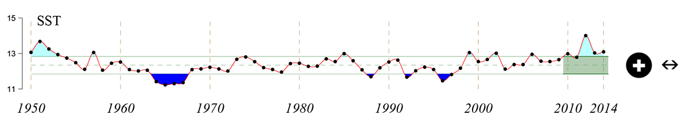
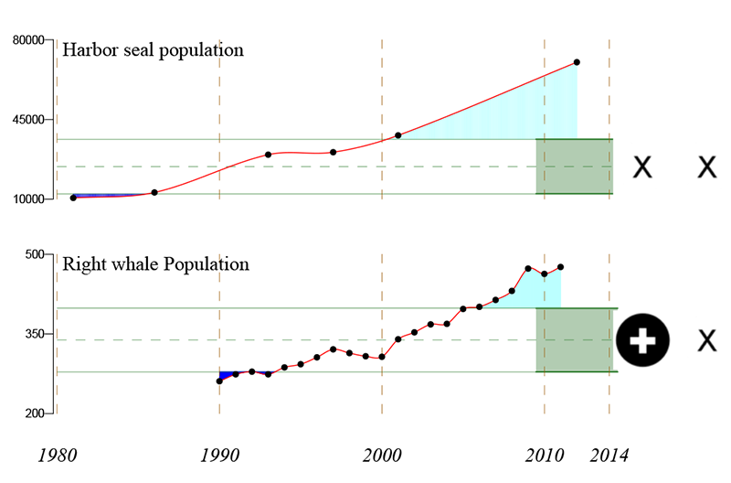
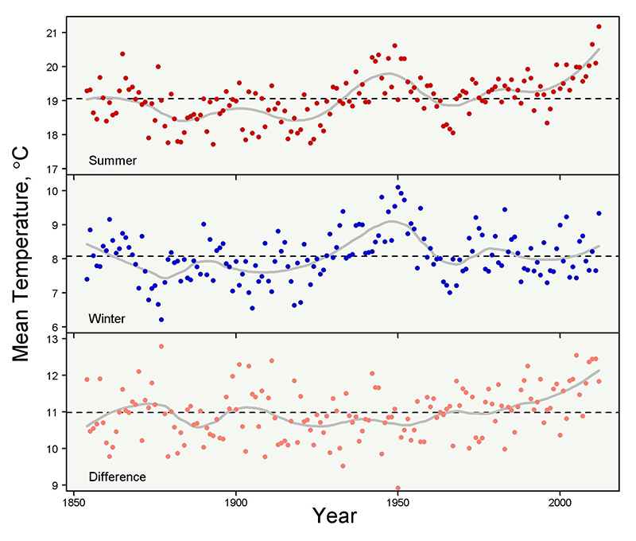
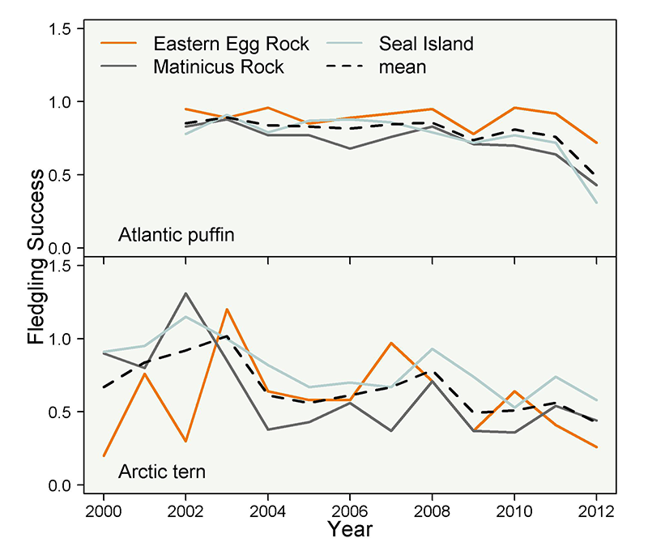
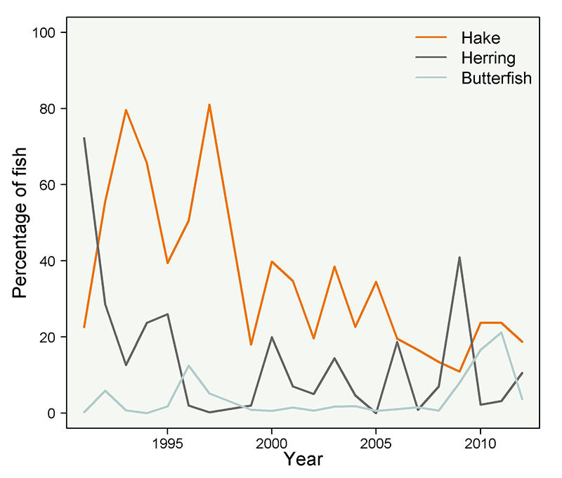

# Ecosystem Status Report for the Northeast Large Marine Ecosystem
## Main Findings 
* The North Atlantic Oscillation, a major ecosystem driver in the North Atlantic Basin, underwent a strong reversal in 2010. We have experienced increased variability in the NAO over the last decade.
* Sea surface temperatures (SST) on the Northeast Continental Shelf reached record levels in 2012 and have remained high. We have observed increased seasonal variability in SST over the last two decades.
* Production of microscopic plants at the base of the food web has declined over the last three years.
* Evidence for changes in the relative abundance of small and large zooplankton species points to decadal-scale regime shifts at the base of the food web.
* Elasmobranch and small pelagic fish biomass has increased over the last several decades.
* Shifts in the center of distribution of many fish species have been documented as environmental conditions change.
* Fish condition (weight at a given length) has declined for a substantial number of species since 2000.
* Coherence in recruitment survival ratios for twenty groundfish stocks has been observed, suggesting the effects of system-wide factor.
* Landings for commercial and recreational fish have declined but commercial scallop and lobster landings remain strong.
* For stocks that can be categorized with respect to both overfishing and overfished status, a total of nine are currently classified as overfished and six continue to experience overfishing.
* Right whale and seal populations continue to increase.
* Environmental stressors such as lead, mercury, and DDT contamination have generally declined.
* Composite indices that integrate many variables from the Ecosystem Status Report point to broad-scale scale shifts in the state of the system.
## Executive Summary
National and international efforts are now underway  to establish an integrated framework  for fisheries management accounting  for ecosystem factors.  A critical element  of this overall approach involves  an assessment of ecosystem status and trends.  The NEFSC Ecosystem  Status Report is intended to meet this need for the Northeast Continental Shelf Ecosystem Large Marine  Ecosystem (NES LME).  Here, we provide a synopsis  of selected sections  of the overall report.

We first provide observations on climate forcing  and hydrographic  conditions. We next document changes  at the base of the food web (including the production of the phytoplankton that fuel the system and the small  planktonic animals  that graze on these  microscopic plants and serve as prey for fish and other species).  We further report on the status of fish and shellfish  of commercial and recreational importance that provide high quality food resources.  Humans are an integral part of marine ecosystems; accordingly we provide metrics related  to human well-being  and the status of certain uses of the ocean in addition  to fishing. Finally, we describe  several pressures and stressors affecting the status of the  system. The highlights of this report are summarized here.

Many figures  in this report describe recent and long-term trends and follow a common format for indicating status and trend.  The data in the most recent five years (the green shaded area) may have a status above (+), below (-), or within (&middot;) the long term variability, and may show an increasing (&#8599;), decreasing (&#8600;),  or no (&harr;) trend. Inadequate recent data to determine  status or trend is indicated by (x).

## Basin-Scale Climate Drivers
 and Atlantic Multidecadal Oscillation (AMO) indices smoothed using a 10-year moving average, and Gulf Stream North Wall index.") Figure 2.1. North Atlantic Oscillation (NAO) and Atlantic Multidecadal Oscillation (AMO) indices smoothed using a 10-year moving average, and Gulf Stream North Wall index.

Weather and climate patterns  off the Northeastern United States are strongly influenced  by processes operating over the entire North Atlantic Basin.  Large-scale atmospheric  pressure cells play a dominant role in these processes.

The North Atlantic  Oscillation (NAO) has been associated with changes in physical and biological components of the North Atlantic, including the U.S. Northeast  Continental Shelf. The NAO index is based on the difference in the strength  of the Icelandic low pressure  atmospheric system and the Bermuda-Azores high pressure system. The NAO has largely  been in a positive phase (indicating a dominance of the high pressure  system) over the last several decades. However, negative  NAO indices have been observed in 3 of the last 5 years (Figure 2.1) with a very low observed NAO value in 2010. During negative NAO conditions, the probability of incursions of the Labrador  Current onto the NES increases, bringing fresher,  less productive waters  into our region.  The NAO has been correlated with changes in recruitment of a number of fish species  on the NES.

The Atlantic Multidecadal Oscillation (AMO) is a second  major basin-scale indicator of climatic conditions in the region,  reflecting patterns of sea surface  temperature (SST). The warm and cool phases of the AMO have been associated with Atlantic hurricane activity, North American and European summer  climate, and changes in the abundance  and distribution of North Atlantic  biota ranging from phytoplankton to fish. The AMO is currently in a positive  (warm) phase, persisting since the shift  from a negative (cool) phase in  the late 1990s (Figure 2.1). While the mean  annual SST for the year 2012 in the U.S. NES LME was the warmest  on record (see Section 3), the 2012 mean AMO index did not reflect  this event.The NES has historically warmed more quickly than the rest of the North Atlantic during positive phasse of the AMO.

Interannual shifts in the position of the Gulf Stream are correlated with atmospheric fluctuations over the North Atlantic,  including the NAO. An index of the position of the North Wall of the Gulf Stream, available since 1966,  reveals a shift in the early 1980s from low to high index values  (Figure 2.1), reaching  a peak in the early-1990s, and characterized by subsequent multiyear  reversals related to changes in the NAO index. The Gulf Stream North Wall index has been related to changes in zooplankton communities in the Northeast Atlantic, but the  connection in the  Northwest Atlantic appears  to be weaker. Interestingly, the relationship between NAO and Gulf Stream  position is not as clear  after year 2000. Around this time, the character of the NAO changes, shifting  away from prolonged  periods of high or low toward a weaker higher-frequency oscillation. 

## Regional Climate Indicators
### Temperature
 Figure 3.1. Long-term sea surface temperatures averaged over the northeast U.S. continental shelf and adjacent waters.

Temperature in the NES has varied substantially over the past 150 years. The late 1800s to the early 1900s was the coolest period on record,  followed by a period of warm temperatures from 1945-1955. There was a rapid drop in temperatures through the 1960s followed by a steady increase to the present. Sea surface temperatures were the warmest  on record in 2012. Temperatures moderated  somewhat in 2013-2014 but remain well above average  (Figure 3.1). The overall seasonal  increase in temperatures has been accompanied by a number of ecosystem  changes including shifts in the distribution patterns of fish populations (see Section 5). A significant number of important  fishery species including  cod, haddock, and yellowtail flounder  are at the southern extent of the range in our area and are projected to experience changes  in recruitment and distribution. Conversely, certain  subtropical-temperate species such as croaker are predicted to increase in abundance and expand their range in the mid-Atlantic Bight if climate  projection scenarios hold.

### Stratification
 of the upper 50m of the water column for the Gulf of Maine (GOM), Georges Bank (GB) and the Mid-Atlantic Bight (MAB).") Figure 3.2. Thermal layering (stratification) of the upper 50m of the water column for the Gulf of Maine (GOM), Georges Bank (GB) and the Mid-Atlantic Bight (MAB).

During much of the year, portions  of the northeast U.S. shelf  are stratified. Stratification refers to the vertical stacking of layers of water having  different densities due to differences in temperature and salinity at different depths  within the water  column. Stratification is important because  surface dwelling primary producers need to stay in sunlit waters,  but deeper waters  are often nutrient  rich. Increased stratification makes it harder  for these nutrient  rich waters to be mixed  to the surface where they are available to primary producers, potentially resulting in lower overall productivity in the systems.  We have experienced increased stratification in the NES overall over the last decade or more (Figure 3.2). These increases are related to increased temperature levels and changes in salinity.  The Mid-Atlantic Bight is the most strongly stratified of the subregions, so there is less scope for further  increases in this area.

## The Base of the Food Web
 Figure 4.1. Annual trends in small and large phytoplankton on the Northeast US shelf.

### Phytoplankton
Ecosystem productivity ultimately depends on the amount of production at the base of the food web. Single-celled algae, known as phytoplankton, are responsible for nearly all of the primary production in marine ecosystems and almost half of the total photosynthesis on the planet.  Measurements of the primary photosynthetic pigment, chlorophyll a (CHL),  taken from satellites, are commonly used as a proxy for phytoplankton biomass. Both smaller  and larger phytoplankton have  shown no long term trend in the NES LME, but have shown a declining trend over the last three years (Figure 4.1).

### Zooplankton
 for the Gulf of Maine (GOM), Georges Bank (GB) and the Mid-Atlantic Bight (MAB) in NEFSC plankton surveys.") Figure 4.2. Total amount of zooplankton (measured as displacement volume) for the Gulf of Maine (GOM), Georges Bank (GB) and the Mid-Atlantic Bight (MAB) in NEFSC plankton surveys.

 Figure 4.3. Trends in copepod species composition measured as the difference in abundance of small and large-bodied species.

Zooplankton (small animals  inhabiting the water column) graze on the phytoplankton and in turn are preyed on  by larger animals. One simple indicator of zooplankton  abundance is the volume (or biovolume) of material collected in specially designed  plankton nets. The time series  of zooplankton biovolume  in the Gulf of Maine, Mid-Atlantic and Georges Bank ecoregions  have been relatively  consistent, suggesting large scale coherence in zooplankton throughout much of NES (Figure 4.2). Data from 2010 to present are low and approaching the minimums observed  in the early 1980s.

The composition of the zooplankton community has changed  over time, which is reflected in changes at higher  ecosystem levels as well. Specifically, small copepods increased in abundance in the  1990s, but shifted to larger bodied  copepod species around  2000 (Figure 4.3). There is evidence of a more recent shift, with smaller zooplankton becoming more abundant  again over the last several  years. The small copeods are most important during the autumn  while the larger species  (including <em>Calanus finmarchicus</em>) dominate early in the year following the spring bloom of large phytoplankton. Adult <em>Calanus </em>is the principal prey of right  whales; any reduction in <em>Calanus </em>populations potentially impacts the most vulnerable protected  species in our region.      

## Fish and Shellfish
### Fish Communities
 in autumn NEFSC bottom trawl surveys for major fish groups including elasmobranchs (dogfish and skates), groundfish, small pelagic fish (herring, mackerel, etc.) and other finfish.") Figure 5.1. Trends in biomass (mean weight per tow) in autumn NEFSC bottom trawl surveys for major fish groups including elasmobranchs (dogfish and skates), groundfish, small pelagic fish (herring, mackerel, etc.) and other finfish.

 Figure 5.2. Estimated forage fish species biomass on the Northeast Shelf.

 Figure 5.3. Trends in biodiversity in NEFSC Spring Bottom Trawl surveys.

Trends in broadly defined  taxonomic groups which are targeted by different  components of the fishing fleet can reveal shifts in community  structure not visible from single species trends.  Here we consider groundfish, small  elasmobranchs, small pelagic  fishes , and other fish. The small  elasmobranchs were primarily caught  incidentally in groundfish fisheries until markets  for these species  were further developed  in the 1980s. The small pelagic fishes have long supported  important commercial fisheries  (including some of the oldest  in the United States). Many of the species included  in the other fish category  are taken as incidental catch but some,  notably monkfish, have emerged  as extremely valuable  components of the overall fishery.

Based on NEFSC autumn bottom trawl surveys,  the small elasmobranch and pelagic fish groups have increased over time. In contrast, an initial decline  and subsequent recovery  is evident for the groundfish category, while other fish have remained  stable or decreased  (Figure 5.1). These patterns are related to harvesting practices that resulted in sharp declines  in bottom-dwelling fish, and subsequent implementation of management measures  in the 1990s which resulted  in recovery of at least  some of the groundfish species.

Forage species trends  were also examined  using stock assessments and, for sand lance, research vessel surveys  (Figure 5.2). Here we focus on four major forage  species&ndash;mackerel, herring, sand lance, and butterfish&ndash;that consistently occur in the diets of piscivorous fish including cod, spiny dogfish, and silver hake. Interestingly, there appear to be inverse relationships among some of these species (e.g., sand lance abundance  has been highest when herring and mackerel were low). 

### Mean Trophic Level
 Figure 5.4. Trends in mean trophic level of fish communities in NEFSC Spring Bottom Trawl surveys.

The trophic level (TL) of a species  (its place in the food web) reflects  its role in ecosystem energy transfer. Trophic level is derived from food habits data for each species. Mean trophic level for the sampled fish community is a biomass  weighted average of the individual species TLs. Reduction  in fishing pressure on top predators  such as cod and silver  hake can contribute to increases in mean trophic  level. The mean trophic level of fish species captured  during the NEFSC autumn bottom trawl surveys  has remained relatively  stable over time (Figure 5.4), and has increased in the Mid Atlantic Bight.

### Fish Distribution Patterns
 Figure 5.5. Average along shelf position for a group of 48 species resident on the Northeast US Continental Shelf. Distance is along a transect running from Cape Hatteras, North Carolina to Cape Sable, Nova Scotia, so increasing distance reflects net movement to the Northeast along the transect.

With a changing ocean  climate on the Northeast US Continental Shelf,  fish populations have responded with time-varying shifts in distribution and regional productivity. Habitats  characterized by a particular community structure  may have lost key species  or have new additions to the community, usually  species associated with regions located  to the south. Many species  have shifted north  or to higher latitude locations on the Northeast  Shelf as a whole. Interestingly, we do see differences on a regional  basis in the direction of movement.  In the Gulf of Maine, the movement is in a southwesterly direction rather than the northeasterly movement we observe  for the coast  as whole.

Here, we use a rotated  axis that roughly parallels the coastline and shelf-break to calculate movements for the coast as a whole. This gives an along coast distance  (running from the southwest to northeast. Increased  along-coast distance for a species  is associated with a displacement in a northeasterly direction. In a composite index of along  coast distance for a group of 48 of the more commonly  encountered species on the Shelf as a whole, spring  distribution of the fish community  has shifted from a center around kilometer 850 to a new center well over kilometer  900 during the period 1968 -2014 (Figure 5.5). In the fall the shift has been more dramatic;  the assemblage was centered on kilometer 775 at the beginning to the time series and has shifted  to a position around kilometer  875.

### Condition Factor
 to low (light blue) condition.") Figure 5.6. Change in condition presented as normalized time series from high (dark blue) to low (light blue) condition.

Declines in condition factor, or individual fish weight at length, have been observed for numerous  fish stocks in the Northeast US. Trends in condition factor were analyzed for 40 finfish stocks  caught in the NEFSC autumn bottom  trawl survey (1992-2010), and sexes were analyzed separately for species whose growth rate differ by sex. Most of fish stocks and sexes (45 of the 64 combinations) were found to have significant trends in condition factor over the time series, and of these, only 10 showed a significant increase in condition factor  (both sexes of Northern silver hake, Southern  silver hake males, GOM haddock, both sexes of Northern red hake, fourspot  flounder, both sexes of Northern windowpane flounder,  and Southern windowpane flounder females)  (Figure &nbsp;5.6). Changes in condition factor can be due to  fishing pressure, competition, or environmental changes, but further analysis  showed that abundance  or bottom temperatures did not appear to be driving the observed decreases  in fish weight. Similar changes  in condition have been noted for fish in Atlantic  Canada. The overall change in fish condition  is important because the productivity of fish stocks and expected  yield depend on growth and condition. Further, the reproductive output of fish stocks is linked to their condition, potentially affecting egg production and recruitment. This view of changes in condition factor  for a large number of species  suggests broad changes  in productivity in the system with important implications for management.

### Groundfish Recruitment
 Figure 5.7. Change in recruits per spawner presented as normalized time series for 20 groundfish stocks 1985-2010 from NEFSC stock assessment reports.

Estimates of groundfish recruitment (the number  of young fish  surviving to a specified age) and the overall weight of the adult population producing this recruitment since 1985 are available for twenty stocks on the Northeast Continental Shelf. We examined the estimated number  of recruits divided  by the spawning stock that produced this recruitment. To compare  this metric for all stocks together,  we standardized each ratio relative to its average  value and its standard deviation (a measure of the variability of the ratio).  We do see periods  of apparently favorable  and unfavorable recruitment levels (Figure 5.7). Many of these stocks had poor recruitment index values starting  in 2000. In addition to environmental drivers  that can affect the recruitment survival  index, it is possible that other factors  such changes in age-structure of the stocks and related changes in egg and larval survival can come into play. There is increasing evidence that the viability  of the progeny from older and larger female  spawners is higher.

### Shellfish
 and the Mid Atlantic Bight (MAB) based on assessments.") Figure 5.8. Trends in sea scallops for Georges Bank (GB) and the Mid Atlantic Bight (MAB) based on assessments.

, Georges Bank (GB) and Southern New England (SNE).") Figure 5.9. Lobster trends in the Gulf of Maine (GOM), Georges Bank (GB) and Southern New England (SNE).

Some of the more prominent benthic biomass trends  throughout the NES LME include  increases in American lobster and sea scallop populations, and  decreases in ocean quahog and Atlantic surf clam populations,  especially in recent years. Sea  scallops are currently the highest valued fishery in the NES LME, and have increased dramatically in biomass over the last decade on both  Georges Bank and in the Mid-Atlantic Bight, as seen in the expanded biomass  estimates from the 2010 assessment (Figure 5.8). This dramatic increase  is related to the implementation of effective  management measures including  reductions in fishing effort, constraints on crew  size, and gear restrictions. Sea scallop  populations have also benefitted from the establishment of long-term closed  areas on Georges Bank in late 1994 and rotational closures in the Mid-Atlantic Bight over the past decade.  During the mid-2000s, biomass trends for sea callops became more variable, with declines on Georges  Bank during the period of increased fishing  access (Figure 5.8). Since then, recruitment has improved, biomass  has accumulated, and sea scallop  biomass is currently  at a high level.        

The NEFSC autumn  bottom trawl survey  indicates that American  lobster biomass has increased dramatically in the Gulf of Maine. The lobster  biomass index for Georges  Bank has also increased somewhat  in recent years,  although the increase  is not of the same magnitude or consistency over time as in the Gulf of Maine (Figure 5.9). In the mid-Atlantic Bight however,  lobster populations have declined precipitously as temperatures have increased and the incidence  of shell disease  has concomitantly increased. Evidence for increasing levels of shell disease in the Gulf of Maine is being carefully monitored.

## Ecosystem Services
Marine ecosystem services  are the benefits human derive  from healthy and productive oceans and coasts. Ecosystem services  can be partitioned according to four major categories: (1) provisioning services  (e.g. food, energy, transportation, natural products), (2) supporting services  (e.g. primary production, habitat, shoreline protection), (3) regulating services  (e.g. carbon storage,  filtration) and (4) cultural services (e.g. recreation, aesthetic appreciation of nature, ecotourism, spiritual connections). Here we will focus on provisioning services  related to capture  fisheries and mariculture.

### Capture Fisheries
, Georges Bank (GB) and the Mid-Atlantic Bight (MAB).") Figure 6.1. Total landings for the Gulf of Maine (GOM), Georges Bank (GB) and the Mid-Atlantic Bight (MAB).

 Figure 6.2. Trends in fishery revenues by gear type on the Northeast Shelf.

The commercial fisheries  of the NES LME have recently displayed  some important trends in landings (Figure 6.1). In the Gulf of Maine, the total biomass  extracted peaked between  the late 1970s and 1990s. However, the maximum annual removal of crustaceans occurred in 2012, driven primarily  by landings of American  lobster and landings  of pelagics are near the time series'  average. Mollusc landings  are also near long-run averages  in Georges Bank. Although  the landings composition has shifted dramatically, the total biomass removed  from the Mid-Atlantic is very close  to the series average. The shift towards  mollusc landings highlights the importance of Atlantic surf clams, ocean quahogs, and Atlantic sea scallops to the Mid-Atlantic, while crustacean landings in  this ecoregion are composed primarily  of blue crab. Recent landings are however  substantially below historical levels.

Since 1990, total U.S. revenues from federally permitted  commercial fishing vessels in the NES LME waters have fluctuated around  an average of $1.66 billion,  ending with a 2012 total revenue of just over $1.46 billion (Figure 6.2).

In 2012 these revenues were dominated by dredge gear, consisting primarily of Atlantic  sea scallop, Atlantic surf clam, and ocean quahog landings,  and pot and trap gears, 87% of which are explained by lobster landings.  These results continue  to highlight the shifting economic  dependence on both lower trophic levels and a less diversified species  mix.

### Recreational Fisheries
 and caught and released fish.") Figure 6.3. Trends in recreational harvest (fish taken for consumption) and caught and released fish.

Providing food is an important  dimension of the recreational fishing  experience, as reflected  in the magnitude of the catch taken  for consumption. Recreational fishing is also an aesthetic pursuit and an important cultural  service as well. Here we focus on recreational catch statistics. Recreational fish harvest is currently below  the time series  average, down from  a peak in the mid-1980s (Figure 6.3). Attributing  the trend to a single cause is problematic, as recreational fisheries are a complex amalgam of for-profit party  and charter vessels  together with private  boat and shore  fishing more purely characterized as leisure and/or subsistence activities. The recent recession, lethargic economic  recovery, and an increase  in real fuel prices likely explain a portion of the recent trend, as individuals slow expenditures on recreational activities or substitute less expensive leisure  activities for fishing.  The recreational fishery  also depends on many of the same depleted fish stocks as some of the most contracted commercial fisheries  in the Northeast, and these depletions likely account for a portion of the longer trends  in landings observed.  It is worth noting that the number  of recreational species  caught and released has increased  over time but has leveled off over the last 5 years. This may reflect changing regulations affecting sizes  and numbers of fish that can be retained.

### Mariculture
.") Figure 6.4. Farmed salmon yield and value in Maine (production and value estimates not available after 2010 due to confidentiality requirements).

Marine aquaculture, or mariculture, conducted  in coastal and estuarine waters in the Northeast region, is a growing  industry. The value of harvests from aquaculture &ndash; primarily oysters  and clams, region wide, and salmon in Maine ($161M) &ndash; is ranked third in dollar  value after scallops  and lobsters and currently exceeds the collective value of all groundfish landings  ($80M). It is difficult to inventory the full spatial  and economic extent of commercial aquaculture in the Northeast region because of inconsistent reporting  among states. Regional  production of Atlantic  salmon in Maine in 2010 was estimated  at $74M dollars (Figure 6.4) and was conducted on approximately 250 ha. Shellfish  aquaculture is conducted on approximately 61 thousand ha (150,000  acres) from Maine through Virginia, with annual production of about 349 million hard clams and 100 million  oysters. This represents an estimated annual value of about US $98 million  dollars. Steady growth  in East Coast oyster culture  has led to a doubling  of production in the last five years. Presently, there are over 1000 farms and 28 bivalve hatcheries  in the region. Growth in leased acreage  and production is projected for the shellfish  aquaculture industry.      

## Status Determinations and Species of Special Concern
### Fishery Resource Status
 relative to Fmsy and Biomass (B) relative to Bmsy for Northeast stocks with known status.") Figure 7.1. Fishing mortality (F) relative to Fmsy and Biomass (B) relative to Bmsy for Northeast stocks with known status.

Currently a total  of 9 NES stocks out of 32 recently assessed are classified as overfished (biomass less than one half of their biomass  at maximum sustainable yield). These include  Southern New England  winter flounder, ocean pout, halibut, Gulf of Maine cod, Northern  windowpane flounder,  Cape Cod-Gulf of Maine yellowtail flounder, witch flounder,  Georges Bank cod, and Georges  Bank yellowtai (Figure 7.1). In addition, overfishing is occurring for 6 species  (Northern windowpane flounder, Cape  Cod-Gulf of Maine yellowtail flounder,  witch flounder, Georges  Bank cod, Georges Bank yellowtail and Gulf of Maine Haddock. The greatest problem  exists in the mixed species  trawl fisheries where bycatch is a significant issue and fishing  rates cannot be fully controlled on all parts  of the species complex simultaneously.

### Protected  Species
Protected species inhabiting the U.S. Northeast Shelf Large Marine Ecosystem include fish, marine  mammals, sea turtles, and seabirds. Human-caused threats to protected  species include accidental commercial and recreational fishery bycatch, boat collisions, exposure  to contaminants, and ocean noise.

#### Marine Mammals
 Figure 7.2. Trends in harbor seal and right whale population size on the Northeast Shelf.

The NES is an important  habitat for a number of marine mammal species. The Gulf of Maine and Georges  Bank shelf regions  in particular are essential summer feeding grounds for large whales including humpback, fin, sei, minke, and  North Atlantic right whales;  smaller toothed whales  including harbor  porpoise, short-beaked common  dolphin, Atlantic  white-sided dolphin, offshore bottlenose dolphin, short-finned and long-finned pilot whales, and seal species including  harbor and gray seals. The numbers of harbor and gray seals on the U.S. NES LME have increased in recent years where some seals are present year-round (Figure 7.2), though they migrate within and outside of the NES. These seal populations eat a wide variety of fish and invertebrates, and despite controversy over consumption of Atlantic cod, they tend to primarily  consume small pelagic  fish, hakes and flatfish. Other seal species  such as the harp and hooded seals  primarily use the region as a feeding  ground during winter months. All of the above species found in the U.S. NES LME are protected  under the Marine Mammal  Protection Act, and all of the large  whales (excluding minke whales) are listed as endangered under the Endangered Species  Act (ESA). The North Atlantic  right whale is one of the most endangered populations  of large whales in the world.  Because of the ESA status of North Atlantic right whales, specific monitoring programs are in place including annual counts of right whale calves. The best estimate of the total North Atlantic right whale population  size shows an increase in the population from 261 in 1990 to 476 in 2011 (Figure 7.2).

#### Sea Turtles
Sea turtles are commonly observed  in the U.S. NES LME in the late spring,  summer, and early fall months when ocean temperatures are warmer. Of the four species that typically  occur in this region, loggerhead turtles  are the most abundant. Other species present  in the region include leatherback, green, and Kemp's ridley  turtles. All sea turtles are protected under the U.S. Endangered Species  Act and those that occur in the U.S. NES LME are listed as threatened (loggerhead and green) and endangered (leatherback and Kemp's ridley). Population  abundances and trends  have typically been estimated using nesting female count data from the primary nesting beaches.  Aerial surveys of in-water turtles are also useful for population estimates  but are subject to a much higher level of uncertainty due to temporal inconsistencies in the survey, variability in turtle surfacing  behavior, perception  bias, and the previous small spatial  coverage of surveys.

#### Seabirds
 Figure 7.3. Trends in fledging success of puffins and arctic terns on nesting colonies on islands in the Gulf of Maine.

Atlantic  Puffins (<em>Fratercula</em><em> fratercula</em>) and Artic terns (<em>Sterna</em><em> paradisaea</em>) have seen a decline in their breeding productivity related to diet change and SST increase (Figure 7.3).  Atlantic puffin was close to extinction in North America until 1980s. A program  of chick translocation was organized by the Audubon  Society (Puffin  Project) and since then the numbers  have increased steadily. In 2012, the lowest  breeding productivity was observed. In 2012, Atlantic puffins fed their juveniles with more butterfish relative  to Atlantic herring.  Chicks have difficulty swallowing the deeper bodied  butterfish. Arctic tern adults also fed their chicks with        more butterfish, and a decline  in their breeding success has also been observed  (Figure 7.3) but Artic terns can feed on a wider range of prey items.

## Other  Human Activities and Stressors
### Contaminants
 Figure 8.1. Trends in mercury, lead, and DDT in two NES ecoregions.

Heavy metals occur naturally in the environment and concentrations vary with the underlying geology. Human use of metals  and their introduction to the environment through urban runoff, industrial effluents and domestic  discharge, results  in excessive releases  into coastal environments.

Large human populations concentrated in coastal regions,  combined with the cumulative effects of shipping traffic and industrial activities along a waterway, can mobilize materials to the marine  environment, creating health hazards for both marine organisms  and human populations who live along the coastline and/or eat contaminated seafood.

The GOM subregion is characterized by an overall  downward trend in lead and mercury (Figure 8.1a). Annual mean lead concentrations have consistently been above the US Food and Drug Administrations (FDA) safety level of 1.7 ppm, with concentrations trending  downward. DDT residues  have also steadily declined in the Gulf of Maine.

Annual mean lead  concentrations in the MAB subregion experienced an overall  downward trend in mussel tissue with spikes generally occurred  in 1997 and 2004 (Figure 8.1b). Trends in mercury  concentration in mussel tissue have varied without clear  trend during the sampling period. In contrast, a general decline in DDT concentrations has been observed.

## Pulling  the Pieces Together
Examination of the individual indicators provided in this  report permits a detailed view  of trajectories of change in climatic, oceanographic, ecological, and social  and economic subsystems of the Northeast U.S. Continental Shelf over the last several decades. However, to identify emergent patterns in this broad suite of indicators, we require ways of synthesizing information from each to discern evidence of systemic change.  Construction of an overall index from a collection of indicators is one strategy  commonly employed to integrate information from a potentially large number  of individual elements. Familiar  examples include the wellknown Dow-Jones Industrial Average constructed by summing stock  prices of 30 major corporations and dividing by an adjustment factor.

 Figure 9.1. Composite index values for the Northeast U.S. Continental Shelf Large Marine Ecosystem. The first composite index is shown in the blue bars. The second composite index is shown in the red lines. The composite indices are based on climate, oceanographic, and ecological indicators but do not include fishery-related indicators.

This analysis reveals some important  changes in the Northeast Continental Shelf over the last several decades (Figure  9.1). Our first composite index, shown in blue bars in the accompanying figure,  suggests that the overall characteristics of the system changed in the late 1980s and remained in a different state until the early 2000s. These change points  are consistent with ones shown in other analyses focusing  on parts of the ecosystem in more restricted geographical areas, principally in the Gulf of Maine. Our system-wide analysis shows that these changes are much broader  in scope and more pervasive  throughout the system. The second  composite index, shown  in the red line, reveals  an additional component  of change indicating  a trend related to factors  such as steadily  increasing temperatures over the last several decades. Understanding that these ecological  changes occur and persist on decadal time scales is important in understanding changes we see in our fisheries over time. In turn, this understanding can help inform management decisions  if we detect persistent increases  or decreases in productivity over time.

Our NES Ecosystem  Index focuses on integrating climate, physical, and ecological indicators. The fishery subsystem responds not only  to drivers and pressures related  to climate, physical,  and ecosystem changes but to management interventions and other factors. Accordingly we conducted a separate  analysis on landings  by major species groupings to construct an NES Fishery  Index. The species categories included (1) principal  groundfish, (2) flatfish,  (3) pelagic fish, (4) elasmobranchs (dogfish  and skates) (5) other fish, (6) molluscs,  and (7) crustaceans. In this case, we could extend the time series back to 1964 to provide a longer term perspective on change in the fishery. We again constructed composite  indices using principal  components analysis as a way to summarize the information in the landings series and to tests  for patterns in the data.

 Figure 9.2. Composite fishery index values for the Northeast U.S. Continental Shelf Large Marine Ecosystem. The first composite index is shown in the blue line. The second composite index is shown in the red bars. The composite indices are based on landings data for species groups.

The first two composite  scores derived from the principal components analysis  are shown in Figure 9.2. In this case, the first composite score is shown  in the blue line. It indicates a positive overall  trend over time. The first composite score reflects increases  in landings of crustaceans and molluscs in particular and, to a lesser extent,  increases in elasmobranch landings. Interestingly, the second composite  score (shown in red bars) shows a more periodic  pattern. Visual inspection of this second  index shows break points in the same locations as the shorter  ecosystem index (1989 and 2002) as well as two additional changes  in the earlier part of the series  (1968 and 1976). However the more formal  test for change  points in the series using  chronological cluster analysis  reveals a more complex picture.  In this case, the analysis  involves not only the information contained in the first and second composite  scores but the complete series of landings  data. The vertical  lines in Figure 9.2 show the change points revealed  by the chronological cluster analysis.  A sequence of changes occurred in 1968,  1976, 1982, 1989,  1994 and 2001. The first change point  corresponds to an escalation of fishing by the distant  water fleet after an initial  developmental phase. The second point in 1976 can be connected to the phasing  out of distant water fleet  operations as extended  jurisdiction under the Magnuson-Stevens Act was  about to be implemented. The change  point in 1982 corresponds to the  switch from the quota-based NEFMC groundfish  management system in place from the inception  of extended jurisdiction to more qualitative management measures based  on mesh size and other  regulations that remained  in place through 1993. In 1994, changes  in the fishery reporting system and further  modifications to groundfish management regulations were implemented. The NEFMC groundfish management system changed  to one incorporating a phased  implementation of reductions in days-at-sea (which  continued to increase  until 2001 and then declined). The final change  point indicated by the cluster  analysis in 2001 appears to be related to the full implementation of the NEFMC groundfish days-at-sea reduction program. The indicated change in 1989 does not correspond to a specific  ground management intervention. The analysis did not detect the change related to the groundfish rebuilding plan initiatives starting in 2004 or the sequence of further reductions in days-at-sea for groundfish vessels  in 2006 and 2008. Because  the data series incorporated in this analysis extended  only until 2012,  the important change  to sector management and catch shares implemented in 2010 was not detected.  Because the landings series is not limited to groundfish  and includes important fishery components from species managed  by the Mid-Atlantic Fishery Management Council  (MAFMC) as well as NEFMC,  the apparent signature of NEFMC groundfish management actions in the overall  landings series is extremely interesting. Considering the indications of system-wide change from the NES Ecosystem  Index and the NES Fishery  Index and the change points observed in the fish condition and recruitment indices  (see Figures 5.6 and 5.7), which were not incorporated in the composite  index values, a convincing case can  be made for the occurrence of ecosystem changes  occurring on decadal  time scales on the Northeast  Continental Shelf. These changes, in concert with management interventions appear to collectively exert strong influence on fishery performance.

## 1. Introduction
## 1.1. Ecosystem Approach
It is widely recognized that the management of ocean  resources needs to be done using an ecosystem based approach, using methods and  strategies that treat the ecosystem as a whole and integrates our knowledge of  all levels of the ecosystem from physical forcing to the behavior of top  predators including man (Belgrano and  Fowler 2011; Christensen  and Maclean 2011; Link 2010). In order to assess the  status and trends of these socio-ecological systems and to evaluate the impact  of different stressors, appropriate metrics must be identified and their  overall utility for management validated. These metrics should be broadly  representative of forcing factors and associated socio-ecological system states  or processes. We designate the most informative and integrative metrics as  indicators. Indicators can be broadly classified into natural and anthropogenic  drivers, resulting pressures, and system states. For our purposes, we identify  drivers as forcing factors such as climate, human population size and economic  value underlying a constellation of pressures exerted on the system. These  pressures include human&#8208;related impacts on the ocean sub-system such as removal  of living marine resources through harvesting, as well as shipping, pollution,  and impacts to the coastal zone such as habitat loss. Climate related pressures  on the ocean ecosystem include changes in atmospheric and oceanographic  processes directly or indirectly affecting marine life. Within the socio-economic  sub-system, ecological impacts include changes in levels of marine species  biomass available for harvest, and resultant impacts on income streams to  harvesters, processers, marine supply companies and communities. These, along  with climate-related impacts on marine species and changes in storm frequency  and intensity, affect communities and industries along the coast and elsewhere  in the region, the US and the world &ndash; given the globalization of marine species  trade. Developing a greater understanding of the feedback loops that exist  between human behavioral responses to a changing ecosystem and to the state of  the socio-ecological system overall is an integral component of this process.  Here, we update our earlier evaluations of the status of the Northeast U.S  Continental Shelf Large Marine Ecosystem (EcoAP 2009; EcoAP 2012) and expand its focus to  include further information on ecological subregions of the shelf and more  details on the socio-economic portion of the system.

## 1.2. Orienting to the Ecosystem
 Figure 1.1 Map of study region on the Northeast continental shelf of the United States, showing the ecological production units. The core of each EPU is bounded by white, and the nearshore and shelf break special considerations areas are to the west or east of the core areas respectively. MAB - Mid-Atlantic Bight; GB - Georges Bank; SS - Scotian Shelf; GoM - Gulf of Maine.

The Northeast U.S. Continental Shelf Large Marine Ecosystem  (NES LME) provides a range of key ecosystem services: supporting (e.g. nutrient  cycling and primary production), provisioning (e.g. food and pharmaceuticals),  regulating (e.g. carbon sequestration and climate regulation) and cultural  (e.g. spiritual inspiration, recreation and scientific research).&nbsp; It supports communities, industries,  ecosystems, and individuals. It has supported important commercial and  recreational fisheries, and recreational activities. This highly productive  region has experienced significant structural changes over the last several  decades, both in bio-ecological and socio-economic terms. Heavy exploitation,  increasing climate variability, increasingly restrictive management measures,  increasingly volatile economic cycles, and urban and coastal population growth  have greatly impacted all aspects of the socio-ecological system of the  Shelf.&nbsp; Emerging evidence for important  changes in physical forcing and ecological response in relation to climate variability  in the North Atlantic further highlights the need to  address the broad suite of natural and anthropogenic drivers at work in the  system.

Within the marine ecosystem, we distinguish external  physical pressures representing large&#8208;scale ocean&#8208;atmospheric processes  affecting this system from internal physical pressures representing local or  regional physical manifestations of these broader pressures. Within the  socio-economic marine-related system we then identify indicators of both  socio-economic and ecological pressures and their impacts. We next describe how  the socio-ecological system state is potentially affected by these drivers and  associated pressures, with a focus on holistic or integrative metrics of system  condition. State variables include metrics such as the abundance of different  species groups, measures of biological and economic productivity and measures  of economic value and community vulnerability. Our objective is to characterize  changes in the system state variables in response to forcing mechanisms  associated with a spatially defined ecosystem. An understanding of the  inter&#8208;relationships among drivers, pressures, and states is an essential  prerequisite to moving toward a place&#8208;based, socio-ecological approach to  management.        

Part of this place&#8208;based approach involves the recognition  that the Northeast U.S. Continental Shelf Large Marine Ecosystem is composed of  different regions with distinct patterns in oceanographic characteristics,  primary production and fish distribution, among other factors. The NES LME has  been divided into a set of Ecological Production Units (EPUs) based on analysis  of physiographic and lower trophic level datasets (Fogarty et  al. in review) (Figure 1.1). Four primary subunits or EPUs  were identified: Gulf of Maine, Scotian Shelf, Georges Bank, and Mid&#8208;Atlantic  Bight. Additionally, primary subunits can be further divided, if appropriate,  into nearshore and shelf break special consideration areas (denoted as white  boundaries in Figure 1.1). The boundaries of the EPUs are open, and in our  model formulations we permit movement of water, organisms and human vessels  across them. These EPUs therefore provide a starting point for spatial  considerations of ecosystem based management in the NES LME and are useful in  framing the analyses presented in this report.

Human  communities also involve place-based components, in terms of residence, port of  landing, and preferred fishing grounds. Within US fisheries management, in  fact, the Magnuson&ndash;Stevens Fishery Conservation and Management Act requires  considerations of place-based communities on land, as well as (when appropriate  to assessing the impacts of regulations) communities based on gear group and  target species. One of the concerns of the ESR will be to connect these human  land and sea-based communities to the processes critical to assessing the  status of the marine socio-ecological system.

## 1.3. Environmental Regimes
.") Figure 1.2 Time series of mean annual sea surface temperature of the Northeast Shelf with the output of the STARS regime shift detection algorithm (red line).

We have seen unprecedented changes in the physical  environment and biological communities of the Northeast Shelf this past year.  The extent of these changes have been so large as to pose the question of  whether the Northeast Shelf ecosystem has entered into a new regime? Many  marine and terrestrial ecosystems have been described as changing between  regimes, changes that carry significant societal consequences (Crepin et al.  2012). A shift in regime is characterized as being a  large, rapid change in the structure and function of a system, and importantly,  a change that persists. North Pacific ecosystems have oscillated between regimes  that control physical conditions and resource species productivity in  concordance with the Pacific Decadal Oscillation (Mantua et al.  1997).&nbsp; Strictly  speaking, the North Atlantic does not have a counterpart system; oscillations  between ecosystem states in the North Atlantic have been more gradual and  associated with basin scale forcing like the North Atlantic Oscillation or  Atlantic Multidecadal Oscillation (Hurrell and  Deser 2009; Nye et al.  2013). However, as will be described in this report,  a number of the properties of the Northeast Shelf ecosystem shifted  dramatically in 2012. Figure 1.2 shows the mean annual sea surface  temperature for the Northeast Shelf with the results of a regime shift  algorithm superimposed on the data (the red line). A shift would appear to be  have been detected in 2012; however, it is premature to call the change in  conditions in 2012 a regime shift. &nbsp;There  are many statistical techniques used to detect the transition between regimes,  and varied opinions on which of these is the appropriate methodology. Not all  these methods would suggest a regime shift occurred in 2012. Furthermore, the  change in conditions only satisfies half the regime shift definition, we do not  know if these conditions will persist. If we are entering a new regime, it will  undoubtedly impact the structure and function of the ecosystem and the goods  and services the ecosystem provides, making monitoring key elements of the  ecosystem that much more important.

## 2. Climate Forcing
### 2.1 Natural Climate Variability
### 2.1.1. Atlantic Multidecadal Oscillation
 and North Atlantic Oscillation (NAO) indices from 1900 to 2014 using a 10-year moving average and annual AMO and NAO indices from 1970 to 2014. The AMO is derived from the Kaplan SST dataset of the North Atlantic (NOAA ESRL). The NAO is derived from the principal component-based index, which is the leading mode of sea-level pressure anomalies in the North Atlantic (Hurrell 2013).") Figure 2.1 Smoothed Atlantic Multidecadal Oscillation (AMO) and North Atlantic Oscillation (NAO) indices from 1900 to 2014 using a 10-year moving average and annual AMO and NAO indices from 1970 to 2014. The AMO is derived from the Kaplan SST dataset of the North Atlantic (NOAA ESRL). The NAO is derived from the principal component-based index, which is the leading mode of sea-level pressure anomalies in the North Atlantic (Hurrell 2013).

The Atlantic Multidecadal Oscillation (AMO) is the coherent  variability of sea surface temperature (SST) in the North Atlantic (0&deg; to 70&deg; N) after removing global mean  SST anomalies (Figure 2.1). The AMO is  associated with the variability of Atlantic Meridional Overturning Circulation  (AMOC; Wyatt et al. 2012), which is an integral driver of the global climate  (Section 3.0). Globally, the AMO  accounts for 5.3% of SST variability and is the second mode of global SST  variability after the Multivariate El Ni&ntilde;o  Southern Oscillation Index (Messi&eacute;  and Chavez 2011). There is disagreement  on the periodicity of the AMO such that the time-scale is suggested to be as  short as about 20 years (Chylek et al. 2011) and as long as 55 to 70 years  (Knudsen et al. 2011). The warm and cool  phases of the AMO have been associated with Atlantic hurricane activity, North  American and European summer climate (Knight et al. 2006), and changes in the  abundance and distribution of North Atlantic living marine resources ranging  from phytoplankton to fish (Nye et al. 2013). 

As of early 2015, the AMO has continued to persist in a&nbsp;positive (warm)   phase&nbsp;since the shift from a negative (cool) phase in the late&nbsp;1990s (Figure 2.1). While the mean&nbsp;annual SST for the year 2012 in the U.S. NES LME was the&nbsp;warmest on record&nbsp;(Section 3.0), the mean AMO index for 2012 (0.23) was&nbsp;not among the highest   on&nbsp;record&nbsp;(0.45 in 1878; 0.38 in 1998).&nbsp;This pattern is&nbsp;consistent   with&nbsp;historical observations such that the&nbsp;U.S. NES LME warms at&nbsp;a   higher&nbsp;rate than the rest of the North Atlantic during&nbsp;the positive   phase of&nbsp;the AMO.

### 2.1.2. North Atlantic Oscillation
The North Atlantic Oscillation (NAO) is another index that has been   associated with changes in physical and biological components of the   North Atlantic, including the U.S. NES LME. Characterized by the   north-south gradient in sea level pressure between Iceland and the   Azores, the NAO fluctuates between positive (stronger wind   circulation) and negative (weaker wind circulation) phases in the   North Atlantic  (Figure 2.1). Whereas the AMO has only recently been   suggested to be a significant factor driving some of the dynamics   within the U.S. NES LME, the NAO has long been linked to ecosystem   change in this region. However, recent studies suggest that the   relationship between the NAO and both the physical and biological   components of the U.S. NES LME, particularly in the Gulf of Maine, is   not consistent an appears to haven broken down since the 1990s (Hare and  Kane 2012; Mountain 2012; Section 3 and Section 4). The most   recent annual index from the year 2014 suggests that the NAO was in a   positive phase (Figure 2.1).In 2011, the annual index was positive   (1.07) but then switched back to negative in 2012 (-0.55) and 2013   (-0.19), then back to positive in 2014 (0.54). 

### 2.1.3. Gulf Stream Path
Between 1992 and 2011, satellite altimetry data showed that the   interannual variability of the Gulf Stream position had periods   between 18 months to 6 years and was typically southernmost in April   and northernmost in September (Lillibridge and Mariano 2013). The   major factors driving the interannual variability of the position and   baroclinic transport of the Gulf Stream are attributed to wind   forcing, slower baroclinic waves, and the position and strength of the   North Atlantic Subpolar Gyre (Lillibridge and  Mariano 2013). This   relationship to the North Atlantic Subpolar Gyre is the main reason   why the NAO has an association with the Gulf Stream Path (Section 3).   However, this relationship is out of phase such that changes in the   NAO can precede changes in the Gulf Stream Path from 6 months to two   years (Section 3). The out of phase relationship with the NAO is   likely due to the fact that the position and strength of the Icelandic   Low are much more influential to the Gulf Stream than the Azores High (Hameed and Piontkovki 2004). When the Icelandic Low strengthens, the   North Atlantic Subpolar Gyre strengthens and increases the flow of the   Labrador Current (Section 3) pushing the Gulf Stream further south (Hameed and Piontkovki 2004).

Since the year 1955, there has been a trend in the Gulf Stream such   that its path has been expanding to the north (Figure 2.2). Although   the record warm year of 2012 was associated with a more northerly Gulf   Stream, it was not the "most northerly" position recorded in the   time-series that goes back to 1955 (Figure 2.2).

### 2.1.4. El Ni&ntilde;o  Southern Oscillation
 from 1950 to 2012 (based on annual means).  Positive (negative) phases correspond to warm El Nino (cool La Nina) phases of the MEI (Wolter and Timlin 2011).") Figure 2.3 The Multivariate ENSO index (MEI) from 1950 to 2012 (based on annual means).  Positive (negative) phases correspond to warm El Nino (cool La Nina) phases of the MEI (Wolter and Timlin 2011).

The El Ni&ntilde;o Southern Oscillation (ENSO) is the primary  interannual climate oscillation in the tropical Pacific Ocean. It is can be discerned via warm (El Ni&ntilde;o)  and cool (La Ni&ntilde;a) phases in the central and eastern tropical Pacific  Ocean. Because of the vast size of the  Pacific Ocean, the ENSO is the predominate ocean-atmosphere fluctuation that  impacts global climate variability and thus has teleconnections to many other  regional climate indices including those affecting the U.S. NES LME. In the northeastern U.S., the ENSO has been  associated with winter air temperature (Yu et al. 2012), precipitation  (Griffiths and Bradley 2007), hurricane activity (NOAA AOML), the phase and  strength of the NAO (Huang et al. 1998), and the position of the GSNW (Taylor  et al. 1998). 

There are many indices of the strength and&nbsp;variability of ENSO but   the&nbsp;Multivariate ENSO&nbsp;index (MEI) has become the more&nbsp;common index   because&nbsp;it is based on six primary&nbsp;variables over the tropical&nbsp;Pacific   Ocean (Wolter and Timlin 2011; Figure 2.3). In 2011, the&nbsp;tropical Pacific was&nbsp;primarily in a La Ni&ntilde;a (cool)&nbsp;phase   and then moved&nbsp;toward an&nbsp;ENSO neutral phase throughout&nbsp;2012 and 2013   followed by an El Ni&ntilde;o phase in 2014 (NOAA NCEP). In the&nbsp;northeastern   U.S., the El Ni&ntilde;o&nbsp;phase is typically associated with   above&nbsp;average&nbsp;winter precipitation while the&nbsp;La Nina phase is   typically&nbsp;associated with above average&nbsp;winter air temperature&nbsp;(NOAA   NCEP).      

### 2.2 Climate Projections
### 2.2.1. Introduction
The impacts of the continued increase in greenhouse gas  emissions on Earth&rsquo;s climate, society, and broad suite of life are assessed  about every seven years by the Intergovernmental Panel on Climate Change (IPCC). The IPCC bases its various reports on global  climate and Earth system models. These  are highly complex, coupled atmosphere-ocean-land-ice models that are based on  the laws of physics. In the most recent  IPCC assessment (fifth report), Earth system models are now being included in  the report. Earth system models couple  complex biogeochemical models with global climate models to project climate  change impacts on primary producers (i.e. trees, phytoplankton) and thus  resolve critical feedbacks to biogeochemical cycles in the land, ocean, and  atmosphere. Here we describe an Earth  system model&rsquo;s projection (up to the year 2100) of SST and surface ocean pH  within the U.S. NES LME. 

The Earth system model developed by the NOAA  Geophysical Fluid Dynamics Laboratory (GFDL ESM2M) is among the suite of models  currently being assessed by the IPCC&rsquo;s fifth effort (Dunne et al. 2012; Dunne 2013). As with all models assessed by the IPCC, GFDL&rsquo;s  ESM2M has an average ocean resolution of about 1&deg; x 1&deg; and thus small, coastal areas such as the U.S. NES  LME are not resolved entirely well (i.e. position and intensity of the Gulf  Stream, Georges Bank, mesoscale eddies).  Therefore, it is important that future climate change research for this  region begins to utilize prototype, high-resolution global models, couple  regional models, and statistical downscaling techniques.      

### 2.2.2. Ocean Warming
![Figure 2.4 NOAA GFDL's ESM2M projection of SST for the US NES LME under the IPCC high emission scenario [representative concentration pathway (RCP) 8.5].  The projection is based on SST anomalies calculated by subtracting the mean value from the historical period (1981 to 2005).  The plot is a smoothed, 10-year running average.](figures/Climate_sst_proj.png "Figure 2.4 NOAA GFDL's ESM2M projection of SST for the US NES LME under the IPCC high emission scenario [representative concentration pathway (RCP) 8.5].  The projection is based on SST anomalies calculated by subtracting the mean value from the historical period (1981 to 2005).  The plot is a smoothed, 10-year running average.") Figure 2.4 NOAA GFDL's ESM2M projection of SST for the US NES LME under the IPCC high emission scenario [representative concentration pathway (RCP) 8.5].  The projection is based on SST anomalies calculated by subtracting the mean value from the historical period (1981 to 2005).  The plot is a smoothed, 10-year running average.

Over the past 100 years, SST in the U.S. NES LME has warmed  at higher rate than any other NMFS management region nationwide (Section 3.0). The higher warming rate of this region is  likely due to its close proximity and influence of the Gulf Stream. Since the year 1900, SST in subtropical  western boundary currents, including the Gulf Stream, have warmed two to three  times faster than the global mean (Wu et al. 2012). The enhanced warming of these currents and  associated ecosystems is associated with a synchronous poleward shift and/or  increase of these currents in conjunction with a change in wind forcing in both  hemispheres (Wu et al. 2012). However,  there is a high level of uncertainty regarding the driver(s) of the enhanced  warming of these systems relative to the global mean (i.e. natural versus  anthropogenic climate forcing). 

Based on NOAA GFDL&rsquo;s ESM2M, the SST projection for the  U.S. NES LME shows a warming of about 2.5&deg; C by the year 2100 under a high emission scenario  (Figure 2.4). This warming is in  addition to the observed ~0.75&deg; C warming between 1900 and 1980 (Section  3.0). The impacts of the observed and  projected warming on the living marine resources of this region are currently  being investigated. A summary of these  results can be found in the NEFSC Ecosystem Assessment Program&rsquo;s climate change  webpage.      

### 2.2.3. Ocean Acidification
![Figure 2.5 NOAA GFDL's ESM2M projection of ocean surface pH for the U.S. NES LME under the IPCC high emission scenario [representative concentration pathway (RCP) 8.5].  The projection is based on pH anomalies calculated by subtracting the mean value from the historical period (1981 to 2005).  The plot is a smoothed, 10-year running average.](figures/Climate_pH_proj.png "Figure 2.5 NOAA GFDL's ESM2M projection of ocean surface pH for the U.S. NES LME under the IPCC high emission scenario [representative concentration pathway (RCP) 8.5].  The projection is based on pH anomalies calculated by subtracting the mean value from the historical period (1981 to 2005).  The plot is a smoothed, 10-year running average.") Figure 2.5 NOAA GFDL's ESM2M projection of ocean surface pH for the U.S. NES LME under the IPCC high emission scenario [representative concentration pathway (RCP) 8.5].  The projection is based on pH anomalies calculated by subtracting the mean value from the historical period (1981 to 2005).  The plot is a smoothed, 10-year running average.

The  increase in atmospheric carbon dioxide not only warms the planet, but also  reduces ocean pH due to shifts in carbonate chemistry as the ocean uptakes a  portion of the increasing carbon. The  reduction in ocean pH is referred to as ocean acidification. A major impact of ocean acidification on the  living marine resources of the U.S. NES LME may derive from the effects of  lower pH on shell-forming organisms including mollucs, corals, echinoderms and  some types of plankton (i.e. coccolithophores).  The ability of these organisms to adapt to reduced pH is poorly  understood and is a high priority for future research (Doney et al. 2009). The pH projection from NOAA GFDL&rsquo;s ESM2M for  the U.S. NES LME suggests a decrease of about -0.33 pH units by the year 2100  under a high emission scenario (Figure 2.5).

&nbsp;

## 3. Physical Pressures
Oceanographically, the  NES LME is located on the western boundary of two large oceanic gyres, which  span the North Atlantic Basin.&nbsp; The  source waters feeding the NES LME include contrasting water masses carried by  the converging currents from these two gyres: the Gulf Stream carrying warm and  salty water from the south and the Labrador Current carrying cold and fresh  water from the north.&nbsp; Climate  oscillations (e.g. NAO, AMO) and long-term trends (e.g. warming, acidification)  can lead to changes in the intensity of these currents, their position relative  to the NES LME, and the water masses that they carry  (Curry and  McCartney 2001; H&auml;kkinen and Rhines 2004; Joyce et al. 2000; Marsh  2000), ultimately influencing  the physical environment of the NES region.

Climate drivers impact  the physical environment of the NES LME through a combination of external  pressures at its boundaries and direct effects on internal conditions. External  influences on the NES include the Gulf Stream at the southern and offshore  boundary, the Labrador Current at the northern boundary, river discharges at  the coastal boundary and winds and atmospheric fluxes at the sea surface. In  addition to these external pressures, climate processes also directly influence  the internal physical environment of the NES, altering the horizontal and  vertical distribution of temperature and salinity.&nbsp; The combination of these physical pressures  can cause significant ecosystem changes, which are discussed in sections 4-6.

## 3.1. Gulf Stream
 Figure 3.1:  Index expressing the position of the north wall of the Gulf Stream and the wintertime North Atlantic Oscillation index, both expressed as standardized anomalies.  A positive Gulf Stream anomaly indicates a northward shift in position.

The Gulf Stream system  is an important component of global climate and an important physical pressure  on ecosystems in the North Atlantic. The Gulf Stream and its extension  transport a significant amount of heat from the tropics to higher  latitudes.&nbsp; Vigorous cooling along the  Gulf Stream's path returns a considerable amount of this heat to the  atmosphere, influencing storm tracks in the North Atlantic and resulting in  milder climates in Europe compared to similar latitudes in North America (e.g.  Ireland vs. Labrador). At high latitudes, the cooled water sinks and ultimately  returns southward in deep-reaching currents beneath the warmer tropical and  subtropical waters. This so-called Atlantic Meridional Overturning Circulation  (AMOC) plays an important role in regulating earth's climate and the Gulf  Stream is a dominant component of its vertical circulation.

Measurements of the  Atlantic Meridional Overturning Circulation have only recently become available  from estimates of the meridional flow integrated across the width of the North  Atlantic (Cunningham et al. 2007). However, studies suggest  that fluctuations in the strength of the AMOC are associated with changes in  the basin-scale circulation in the North Atlantic, including shifts in the Gulf  Stream path (Joyce and Zhang 2010).  Furthermore, shifts in  the north-south position of the Gulf Stream are strongly correlated with  temperature changes in the slope region offshore of the NES (Pe&ntilde;a-Molino and Joyce 2008) and are a reliable indicator of bottom water  temperature on the shelf (Nye et al. 2011): a northward shift in the  Gulf Stream is associated with warmer shelf temperatures.&nbsp; Shifts in the position of the north wall of  the Gulf Stream are a leading indicator of conditions on the shelf and  indirectly related to the distribution of some commercially important fish  species (Nye et al. 2011) as well as changes in plankton community  composition (Taylor, 1995).

Interannual shifts in  the position of the Gulf Stream are correlated with atmospheric fluctuations  over the North Atlantic, including the changes in wind stress and buoyancy  forcing that are associated with the NAO.&nbsp;  The latitude of the Gulf Stream north wall is positively correlated with  the NAO with a lag of 1-2 years   (Frankignoul et al. 2001). An index of the position  of the North Wall of the Gulf Stream, available since 1966, reveals a shift in  the early 1980s from low to high index values (Figure 3.1),  reaching a peak in the early 1990s, and characterized by  subsequent multiyear reversals related to changes in the NAO index.&nbsp; Interestingly, the relationship between NAO  and Gulf Stream position is not as clear after year 2000.&nbsp; Around this time, the character of the NAO  changes, shifting away from prolonged periods of high or low toward a weaker  higher-frequency oscillation.        

## 3.2. Labrador Current
 and Atlantic Temperate Slope Water (ATSW, red) in the deep northeast Channel of the Gulf of Maine.  The wintertime North Atlantic Oscillation index is also shown, shifted forward in time by two years (gray bars).") Figure 3.2:  Relative proportion of water mass derived from Labrador Subarctic Slope Water (LSSW, blue) and Atlantic Temperate Slope Water (ATSW, red) in the deep northeast Channel of the Gulf of Maine.  The wintertime North Atlantic Oscillation index is also shown, shifted forward in time by two years (gray bars).

 together with the Labrador Current volume transport computed from satellite altimetry along the southwestern flank of the Grand Banks of Newfoundland (red; courtesy of G. Han, DFO Canada).  Positive transport is associated with equatorward flow.") Figure 3.3:  Relative proportion of water mass derived from Labrador Subarctic Slope Water in the deep northeast Channel of the Gulf of Maine (LSSW, blue) together with the Labrador Current volume transport computed from satellite altimetry along the southwestern flank of the Grand Banks of Newfoundland (red; courtesy of G. Han, DFO Canada).  Positive transport is associated with equatorward flow.

The northeast U.S. shelf ecosystem is  located at the downstream end of an extensive interconnected coastal boundary  current system that carries a combination of cold/fresh arctic-origin water,  accumulated coastal discharge, and ice melt thousands of kilometers around the  boundary of the subpolar North Atlantic. The Labrador Current is one regional  component of this boundary current system that flows southward along the  western boundary of the Labrador Sea and whose shallow and deep branches are  parts of the larger basin-wide gyre circulation in the northern North  Atlantic.&nbsp; Together with the  southward-flowing Deep Western Boundary Current, the deeper Labrador Current is  also considered part of the returning cold/fresh half of the northern  AMOC.&nbsp; Ultimately, a portion of these  cold/fresh waters carried by the Labrador Current feeds into the northeast U.S.  shelf ecosystem via the Gulf of Maine. 

The Labrador Current provides two of the  three main sources of water entering the NES ecosystem:&nbsp; Labrador Shelf Water is the coldest and  freshest water and is confined to the shelf, while Labrador-Subarctic Slope  Water (LSSW) is a deeper cold/fresh water mass that arrives along the  continental slope.&nbsp;&nbsp;These  northern-source waters combine with the deep warm/salty southern-origin  Atlantic Temperate Slope Water (ATSW) to define the temperature, salinity,  stratification and nutrient content of the shelf water within the NES  ecosystem.&nbsp; Variations in the properties  and/or relative proportion of the source waters can lead to significant changes  in stratification, nutrient loads, and community composition within the  ecosystem.

## 3.3. River Flow
 Figure 3.4:  Trends in river flow from 25 rivers in the Middle Atlantic, southern New England and Gulf of Maine regions.  Data are presented as a sum of monthly stream flows.

The amount of freshwater  entering the ocean is another important pressure that responds to climatic  drivers. Freshwater run-off transports pollutants and nutrients to the  continental shelf, which can affect coastal ecosystems. Nutrient  over-enrichment &ndash; termed eutrophication &ndash; is a major problem in many coastal  systems and has been linked to increased algal biomass, including harmful algae  species, hypoxia/anoxia, and increased water turbidity. Increased freshwater  run-off can also affect coastal circulation through the influx of less dense  water on the continental shelves. Most freshwater enters marine systems through  rivers, rather than direct precipitation or runoff. River flow is tightly  correlated in the Gulf of Maine and Southern New England regions, resulting in  coherent freshwater forcing in the northern portion of the region. River flow  into the Mid-Atlantic region is somewhat different than for the Gulf of Maine  and southern New England (Figure 3.4). Complex long-term patterns have been  identified for river flow in the region. Tootle et al. (2005)  found interactions among different climate drivers  affecting river flow; for example, the AMO and ENSO (El Nin&otilde; Southern  Oscillation) signals combine to affect river flow in the Mid-Atlantic part of  the NES LME. Earlier work by Visbeck et al. (2001)  found links between river flow in the northeast and  the NAO. A time series of river flow suggests the effect of multiple factors  (Figure 3.4). Prior to 1970, river flow appears to fluctuate on longer time  scales, while the period decreases later in the record. In general, stream flow into all three  regions has increased over the past decade, with the largest increases  occurring in the Middle Atlantic and Gulf of Maine regions. However, in 2012  riverflows were somewhat lower resulting from decreased precipitation and warm  temperatures leading to increased evaporation.

## 3.4. Winds
, New York (green) and Georges Bank (red).  The magnitude (top panel), east-west component (middle panel) and north-south component (bottom panel) of wind stress are shown.") Figure 3.5:  Annual averages of monthly mean wind stress near Cape Hatteras (blue), New York (green) and Georges Bank (red).  The magnitude (top panel), east-west component (middle panel) and north-south component (bottom panel) of wind stress are shown.

Winds are an important  pressure on shelf ecosystems. Wind stress (the force of the wind on the surface  of the ocean) acts to vertically mix the water column and drive horizontal  currents. The greater the wind stress, the more vertical mixing and the more  force for driving horizontal currents. In the NES LME, winds are responsible  for breaking down seasonal stratification in the fall and for causing reversals  in the generally southwestward surface currents during summer. In addition, winds blowing along a coastal  boundary will drive a vertical circulation in the water column near shore,  drawing deeper waters upwards toward the surface where they are carried away  from the coast (upwelling) or driving surface waters downward toward the bottom  where they are carried offshore (downwelling).  Because of the shape of the coastline in the NES, north-south winds have  the greatest impact on the along shelf flow in the southern Middle Atlantic  Bight, while east-west winds are more important along the inner shelf of New  England. Long-term records from NOAA  Pacific Fisheries Environmental Group indicate substantial inter-annual  variability in the magnitude and direction of the wind stress over the NES LME  (Figure 3.5). Total annual wind stress has been variable over the period with  relatively high winds in the late 1970s-early 1980s and again in the late  1990s-early 2000s. In recent years total annual wind stress has been low but  increasing in 2010 and 2012. Winds over the NES are consistently directed out  of the northwest (blowing eastward and southward). There is considerable inter-annual  variability in the magnitude of the winds. As an example winds near Cape  Hatteras in 2011 were northward while in 2012 they were strongly southward.  Mean winds have remained fairly consistent over time, but there has been a  shift from northwest winds (southeastward) to more west winds (eastward),  particularly in the vicinity of Cape Hatteras.  These changes in wind stress may be linked to the NAO, as well as a  northward shift in the location of the jet stream (Archer and Caldeira 2008). Despite the uncertainty as to the cause of the  inter-annual variability, these changes in wind will impact local physical  conditions and local marine resources.

## 3.5. Temperature
 Figure 3.6:  Long-term summer and winter sea surface temperatures averaged over the northeast U.S. continental shelf and adjacent waters from the ERSSTv3b dataset.

 and bottom (blue) water temperatures from the NEFSC survey programs from the four Ecological Production Units.") Figure 3.7:  Annual mean surface (red) and bottom (blue) water temperatures from the NEFSC survey programs from the four Ecological Production Units.

Temperature is one of  the most important governing environmental factors for marine organisms. Marine  organisms have minimum and maximum temperatures beyond which they cannot  survive. Additionally, they have preferred temperature ranges and within these  bounds, temperature influences many processes including metabolism, growth,  consumption, and maturity. Thus, changes in temperature will have far-reaching  impacts on species in the ecosystem and on the ecosystem itself. Temperature in  the NES LME has varied substantially over the past 150 years (Figure 3.6). The  late 1800s and early 1900s were the coolest in the 150 year record. This  relatively cool period was followed by a period of warm temperatures from  1945-1955. There was a rapid drop in temperatures through the 1960s followed by  a steady increase to the present. Summer temperatures over the past 5 years are  comparable to the warm period in the late-1940s/early 1950s and the summer 2012  surface temperature was the highest in the 158-year record. Winter temperatures  in recent years, however, remain near the long-term mean indicating that the  seasonal range in temperature has increased (Friedland and Hare, 2007).

Regional water column  temperatures measured by the Northeast Fisheries Science Center (NEFSC) give  spatial context to the shelf-wide trends in sea-surface temperature (Figure  3.7). Surveys began in the late 1970s,  so the time series are shorter than sea-surface temperature records shown in Figure 3.6. Time series constructed  within each region reveal interannual temperature fluctuations larger than 2&deg;C  near the surface and bottom. Long-term  warming trends are observed at the surface and bottom in the Mid-Atlantic Bight,  Gulf of Maine, and Georges Bank regions and at the surface in  the Scotian Shelf region,with  waters warming by 1&deg;-1.5&deg;C over the length of the records. Even larger warming  trends have been observed in recent years, with the surface and bottom waters  warming by more than 2 degrees since 2004 within all regions except the  Mid-Atlantic Bight. Perhaps most  notable, 2012 temperatures were the warmest observed in the 35-year record at  the surface and bottom over all regions of the NES, exceeding long-term annual  mean values by up to 2 degrees at the surface and 1 degree at the bottom.

## 3.6. Salinity
 and bottom (blue) salinities from the NEFSC survey programs from the four Ecological Production Units.") Figure 3.8: Annual mean surface (red) and bottom (blue) salinities from the NEFSC survey programs from the four Ecological Production Units.

Most aquatic organisms  are also affected by salinity &ndash; the amount of salt in the water. Organisms in  nearshore environments are adapted to wide ranging salinities owing to the  interaction between freshwater (salinities of 0) and oceanic-water (salinities  greater than 30). However, many organisms found on the continental shelf, slope  and deep-sea are sensitive to small changes in salinity because they are  adapted to more constant conditions. The NEFSC measures salinity in combination  with the temperature measurements described above (Figure 3.8). Regionally,  time series show interannual salinity fluctuations as large as 1.6 salinity  units near the surface and 1.5 units near the bottom, with the largest  fluctuations in the Mid-Atlantic Bight.  A trend of long-term freshening is observed at both the surface and at  depth in the Georges Bank region, equivalent to roughly 0.3 units of freshening  over the length of the record. However,  during the last 2-3 years waters were in fact saltier everywhere on the NES relative to the  long-term annual mean. Interannual  fluctuations occur coherently between the surface and bottom in both the  Mid-Atlantic Bight and Georges Bank regions, having a distinct 5-year cycle in  the latter. By contrast, fluctuations in  the Gulf of Maine and Scotian Shelf regions are not as coherent between the  surface and bottom. This is likely due  to the fact that deep and shallow layers in the Gulf of Maine are fed by  different sources whose properties and volume may vary independently from one  another: Bottom waters are fed by deep  slope waters entering through the Northeast Channel, varying in response to the  relative proportion of LSSW to ATSW, while surface waters are fed by northern  shelf waters and the discharge of local rivers. The Scotian Shelf records  indicate that the salinity of near-bottom waters has remained higher than the  long term mean during the past 6 years.  This ecological production unit encompasses the eastern Gulf of Maine,  including the deep Northeast Channel. The salinification of near-bottom waters here reflects the dominance of ATSW in  the slope water mixture entering the Gulf of Maine during recent years (Figure 3.2). 

## 3.7. Stratification
 Figure 3.9: Annual mean density stratification calculated between the surface and 50 meters depth from the NEFSC survey programs from the four Ecological Production Units.

Density is determined by the temperature and  salinity of the water: Warm/fresh water is less dense than cold/salty water.  Therefore, the observations of temperature and salinity collected by the NEFSC  (Figure  3.7 and Figure 3.8) can be used to determine density, and hence  stratification. Stratification is strongest in the Mid-Atlantic Bight  with large fluctuations about the record-long  average, although there is no  significant trend over time in this region  (Figure 3.9). By contrast,  stratification in the Georges Bank region increased between 1995-2007 and has remained  at or above normal throughout the current decade. While temperature  fluctuations are vertically coherent in this region, warming is larger at the  surface making waters less dense than at depth (Figure 3.8 and Figure 3.9). In general, vertical  temperature differences (warm water overlaying cold water) tend to be more  important than vertical salinity difference (fresh water over salty water) in  determining stratification almost everywhere on the NEUS shelf.&nbsp; The exception is the Scotian Shelf region  where the coldest/freshest Labrador Shelf water first enters the Gulf of Maine  and temperature and salinity contribute equally to the stratification.

## 4. Primary and Secondary Production
### 4.1 Primary Production
### 4.1.1. Introduction
Ecosystem  productivity ultimately depends on the amount of production at the base of the  food web.  Such production is determined by the amount of photosynthesis  from plants, algae and other photosynthetic organisms.  Single-celled  microscopic algae, collectively known as phytoplankton, are responsible for  nearly all of the primary production in marine ecosystems and almost half of  the total photosynthesis on the planet (Falkowski et al. 1998; Morel and Antoine 2002).   Measurements of the primary photosynthetic pigment, chlorophyll <em>a</em> (CHL), are commonly used as a proxy for phytoplankton biomass.  Pigment  concentrations can be extracted and measured directly from water samples or  measured remotely by observing the &lsquo;color&rsquo; of the water.  Ocean color  remote sensors on satellites measure the spectrum (color) of the water, or  rather the water-leaving radiances, at a number of visible and near-infrared  wavelengths.  These radiance measurements are then used to estimate the  near-surface concentration of CHL primarily by comparing the reflectance from  the blue and green wavelengths.  Satellite estimates of CHL complement  those obtained by <em>in situ </em>shipboard sampling and provide increased  spatial and temporal coverage of phytoplankton dynamics that are not attainable  by ship-based sampling alone.  Satellite measurements of CHL and other  parameters such as photosynthetic available radiation (PAR) and sea surface  temperature (SST) can also be incorporated into integrated primary productivity  (PP) models at the same scale and resolution as the CHL data.

In addition to being a primary  food source for marine food webs, phytoplankton are also a fundamental  biological component of the global carbon cycle and can significantly influence  trophic food-web dynamics and ecosystem health (Falkowski et al. 1998; Morel and Antoine 2002).  Furthermore, the amount of phytoplankton  biomass in the water column, particularly during seasonal bloom events, can be  a useful indicator of the amount of organic carbon exported from the pelagic  zone to the benthos.  In the NES LME, the annual mean surface CHL concentration  is 0.75 (mg m-3) and the mean daily integrated PP rate is 0.55 (gC m-2  d-1) (Figure 4.1).  Note, the satellite CHL values were derived  from a regionally tuned algorithm (Pan et al., 2008), which results in lower  CHL concentrations and PP rates compared to previous editions of the Ecosystem  Status Report.

### 4.1.2. Spatial Distributions
 Figure 4.2 The 'span' represents difference between the maximum and a minimum chlorophyll and primary production values in 2012 from MODIS-Aqua data.

.") Figure 4.3 The first spatial mode of chlorophyll derived from an Empirical Orthogonal Function (EOF).

 Figure 4.4 Phytoplankton color index anomalies for the Gulf of Maine and Mid-Atlantic Bight continuous plankton recorder transects.

There are large regional differences in PP and CHL in the NES LME  (Figure 4.1). The most obvious pattern is the general onshore-offshore decrease  in both PP and CHL, from the coast to the shelf break.  This pattern, as  well as the seasonal changes derived from the satellite data and model  estimates of PP, agrees well with patterns revealed during earlier shipboard  surveys (O'Reilly et al. 1987; O'Reilly and Zetlin 1998), which found that  the overall high levels of PP in the NES LME place it among the most productive  continental shelf systems in the world.

The highest levels of PP  are found on Georges Bank and in the immediate near-shore areas (particularly  in the Mid-Atlantic Bight) and in the major estuaries where terrestrial derived  nutrient concentrations are high. Elevated levels of PP (1-2 gCm-2d-1)  are evident in the coastal waters adjacent to and generally south of the mouths  of the Hudson, Delaware and Chesapeake Bays. Intermediate levels are found on  the mid-shelf region of the Mid-Atlantic Bight, and in coastal areas of the  Gulf of Maine. The lowest production rates in the NES LME (approximately 0.35  gCm-2d-1) are over the deep basins in the Gulf of Maine.   PP in the deep outer shelf Georges Bank and Mid-Atlantic Bight water is  low and similar to the levels in the deep basins of the Gulf of Maine. Note,  however, that along the outer shelf the mean PP decreases along the 100m  isobath from the southern flank of Georges Bank through the Mid-Atlantic Bight  to Cape Hatteras.  Of the four eco-regions, Georges Bank has the greatest  mean annual CHL concentration, whereas the highest PP rates are found in the  Mid-Atlantic Bight.  The major temporal trends evident in both the CHL and  PP time series are the minimums in 2004 and an increase in primary production  over the past eight years.   

In addition to the mean and anomalies,  the span is a good indicator of how much the phytoplankton biomass and  production rates vary throughout the year in a given location.  For  example, in 2012 the CHL concentration was highly variable in the Mid-Atlantic  bight, yet there was a small range of PP in the same region (Figure 4.2). The  large PP span in the Gulf of Maine compared to the Mid-Atlantic Bight is due to  the greater variability in photosynthetic available solar radiation in the Gulf  of Maine.

Interannual variability of CHL in the NES is also quite substantial.    The first spatial mode of interannual CHL variability during the  spring in the NES shows that part of the northern flank of Georges Bank, the  Great South Channel, and the southern Gulf of Maine have synchronous  interannual variability of CHL as opposed to the rest of the NES (Figure 4.3) (. 2015. Physical associations to spring phytoplankton biomass interannual variability in the U.S. Northeast Continental Shelf. J Geophys Res. DOI: 10.1002/2014JG002770.">Saba et al. 2015).  This is based on an  empirical orthogonal function analysis of satellite derived CHL from the MODIS  sensor from 2002 to 2012.

In  addition to the satellite time series that begins in September, 1997, the NEFSC  also uses volunteer merchant ships to collect phytoplankton data using the Continuous  Plankton Recorder (CPR).  These monthly  transects, one of which crosses the Gulf of Maine from Cape Sable Island, NS to  Boston, MA and the second crosses the Mid-Atlantic Bight from New York toward  Bermuda, help extend the phytoplankton record back to the late 1970s.   The CPR is a mechanical device that is towed behind a vessel. Water  passing through an opening in the nose as it is towed is filtered by a silk  sampling mesh that is continuously wound onto a spool where it is preserved for  later analysis.  The phytoplankton cells  are identified and enumerated in the laboratory. The relative greenness of the silk  is also recorded to generate a phytoplankton color index (PCI), which serves as  an indicator of overall phytoplankton abundance.

The annual mean of  the monthly standardized anomalies for the CPR phytoplankton color index were  calculated for the continental shelf along both CPR transects (Figure 4.4). The  PCI in the Gulf of Maine were generally higher in the late 1980s and late  1990s, while values were lower in the 2000s driving an overall long term  decreasing trend. There was also a decline in the PCI in the Mid-Atlantic  Bight, with the highest values generally occurring prior to 1985. The declines  in PCI suggest a decrease in the abundance of the larger phytoplankton cells  that are sampled more effectively by the CPR filtering mesh. 

### 4.1.3. Seasonal and Interannual Variability
Your browser doesn't support HTML5 video.

The  abundance of phytoplankton and the rates of productivity change seasonally and  vary from year to year in response to the physical environment, the  availability of nutrients and sunlight, and grazing pressures.  In  general, CHL concentrations are greatest in the spring (March, April and May)  and the fall (September, October and November) and lowest in winter (December,  January and February) and summer (June, July and August).  In contrast,  the highest rates of primary productivity are during the summer months when  solar radiation is at its maximum.  The annual cycle of PP differs from  CHL in that PP reflects changes in phytoplankton photosynthesis rather than  changes in phytoplankton biomass. 

 Figure 4.6 Interpolated chlorophyll time series for each ecological production unit.  Note the data are displayed on a log10 scale

In the NES LME, there are regional differences in the timing and  magnitude of the spring and fall blooms in additional to inter-annual  variability (10 scale">Figure 4.6).  The spring and fall phytoplankton blooms  typically consist of larger phytoplankton species (microplankton, &gt; 20 &micro;m)  and can be quite variable in the initiation, peak concentration, duration, and  species composition.  This variability can affect the food availability  for zooplankton grazers and the trophic transfer efficiency from phytoplankton  to pelagic and benthic resources. The spring bloom period is a dominant feature  of the phytoplankton cycle over most of the NES LME.  Though the duration  is short (~1-2 months), the timing of the bloom provides a major food resource  for marine grazers.  Furthermore, the bloom often produces phytoplankton  concentrations in excess of what can be used in the water column, thus  providing surplus material that can be exported to the benthos.

The summer period is characterized by relatively low phytoplankton  biomass, but high photosynthetic rates.  The summer has the greatest  amount of available sunlight, so despite lower chlorophyll concentrations, it  is the period of highest PP.  The fall bloom period is an important and  sometimes overlooked part of the phytoplankton cycle that is affected by many  factors, including weather events that mix nutrients into the well lit euphotic  zone.  There is considerable inter-annual variability in the timing,  duration and magnitude of the fall bloom and in some years, the fall bloom is a  distinct event of equal or greater magnitude than the spring bloom.  In  other years, however, the physical drivers do not produce favorable conditions  for rapid phytoplankton growth and the fall bloom does not fully develop. 

### 4.1.4. Phytoplankton Groups
 and nano+picoplankton (< 20 &micro;m) chlorophyll concentrations.  Winter - December, January and February; Spring - March, April and May; Summer - June, July and August; Fall - September, October and November") Figure 4.7 Seasonal total, microplankton (> 20 &micro;m) and nano+picoplankton (< 20 &micro;m) chlorophyll concentrations.  Winter - December, January and February; Spring - March, April and May; Summer - June, July and August; Fall - September, October and November

 Figure 4.8 Diatom and dinoflagellate to total phytoplankton ratio anomalies for the Gulf of Maine and Mid-Atlantic Bight continuous plankton recorder transects

Phytoplankton communities in the NES LME are highly diverse and  variable, changing at diel, seasonal, annual and inter-decadal timescales.   Within a  community, individual phytoplankton species vary  considerably in size (&lt;1 &micro;m  to &gt;100 &micro;m) and include a broad suite  of taxa, from prokaryotic cyanobacteria to eukaryotic protists, each of which  differentially affect biogeochemical cycling, export flux, and secondary production.   Among the common taxa in the NES LME are diatoms, dinoflagellates,  microflagellates and cyanobacteria.  Phytoplankton are commonly grouped  into size classes (PSCs) because several physiological and ecological  processes, including nutrient uptake, light absorption, sinking, and export are  related to cell size (Brewin et al. 2011  and references within).  Microplankton (&gt; 20 &micro;m), represented primarily by diatoms and  dinoflagellates, are more common in nutrient-rich waters in the NES LME and  dominate during the spring and fall blooms ( 20 &micro;m) and nano+picoplankton (< 20 &micro;m) chlorophyll concentrations.  Winter - December, January and February; Spring - March, April and May; Summer - June, July and August; Fall - September, October and November">Figure 4.7) (Aiken et al. 2008).  Microplankton are  grazed on by larger zooplankton or sink to the benthos, often providing a  direct transfer of energy up the food chain.  In contrast, smaller  nanoplankton (2-20  &micro;m) and picoplankton (&lt; 20  &micro;m) (Sieburth et al.  1978) dominate the community composition in the summer months when nutrient  concentrations are low.  The production generated by the smaller nano- and  picoplankton is primarily consumed within the microbial community and  remineralization within the euphotic zone before it can reach higher trophic  levels (Calbet and Landry 2004).

Using the Continuous Plankton Recorder (CPR) phytoplankton abundance for  the Gulf of Maine and Mid-Atlantic Bight shelf regions, the ratio of diatoms to  total phytoplankton and ratio of dinoflagellates to total phytoplankton were  calculated for both regions (Figure 4.8).  The ratio of total diatoms to  total phytoplankton in the Gulf of Maine has generally decreased, while the  ratio of dinoflagellates to total phytoplankton has generally increased. This  suggests an ecological shift favoring dinoflagellates relative to diatoms  within the Gulf of Maine. This same pattern is not evident in the Mid-Atlantic  Bight, with diatoms increasing and dinoflagellates decreasing as a fraction of  total phytoplankton in the 2000s relative to the 1990s. The long-term trend  in the relative diatom abundance is also not well-defined due to significant  inter-annual variability.      

### 4.2. Secondary Production
### 4.2.1. Introduction
### 4.2.2. Trends in Zooplankton Abundance
 Figure 4.9. Time series of zooplankton biovolume. Anomaly values are presented, which represent the annual average of monthly anomalies.

 Figure 4.10  Total zooplankton abundance anomaly for the Gulf of Maine and Mid-Atlantic Bight continuous plankton recorder transects.

One simple indicator of zooplankton biomass/abundance is the volume of material  collected in the net, termed zooplankton biovolume. The time series of  zooplankton biovolume among the Georges Bank, Mid-Atlantic, and western Gulf of  Maine ecoregions are relatively consistent suggesting large&#8208;scale coherence in  zooplankton throughout much of NES LME (Figure 4.9). The trends in the eastern  Gulf of Maine/western Scotian Shelf are somewhat different with lower  biovolumes through the 1990s. In the early years of the time series, there was  a marked drop and recovery in zooplankton abundance, with variable but near constant  values through the late 1980s, 1990s, and 2000s.  Data from 2010 to  present are low and approaching the minimums observed in the early 1980s.

Another indicator of zooplankton abundance is the total zooplankton  along repeated continuous plankton recorder (CPR) transects. The NEFSC  conducts two Continuous Plankton Recorder (CPR) transects in the United States  Northeast Shelf Ecosystem: One crossing the Gulf of Maine and one crossing the  Mid-Atlantic Bight from New York toward Bermuda using volunteer merchant  vessels. The CPR is a mechanical device that is towed behind a vessel. Water  passing through an opening in the nose as it is towed is filtered by a silk  sampling mesh that is continuously wound onto a spool where it is preserved for  later analysis. Zooplankton on the CPR silk are then identified and enumerated  in the laboratory. The total CPR mesozooplankton abundance in the Gulf of  Maine had generally higher values in the 1990s and lower values in the 2000s.  The lowest values of the time series occurred in the late 1970s and early  1980s so overall there has been an increase in mesozooplankton since 1978.  Similarly, the lowest mesozooplankton abundance in the Mid-Atlantic Bight  occurred in the 1970s and 1980s and has been generally higher since (Figure  4.10).        

### 4.2.3. Community Structure
### Copepods
 Figure 4.11 Time series of total copepod abundance.  Annual averages are presented.

 and large copepods (C. finmarchichus). This relatively simple indicator shows changes in community structure that is consistent with more statistically rigorous methods (see Fig 4.13).") Figure 4.12 Zooplankton size index comparing the abundance of small (<em>C. typicus, C. hamatus, T. longicornis</em>, and Pseudocalanus) and large copepods (C. finmarchichus). This relatively simple indicator shows changes in community structure that is consistent with more statistically rigorous methods (see Fig 4.13).

 Figure 4.13 Time series of abundance the dominant trend in phytoplankton species composition and zooplankton species composition. The phytoplankton data is from the Continuous Plankton Recorder in the Gulf of Maine eco-region and the zooplankton data is from the net survey in the Georges Bank ecoregion.

 as a function of year for Georges Bank, Gulf of Maine, Scotian Shelf (A), and the Middle Atlantic Bight (B).  Note different scales between A and B.") Figure 4.14  Siphonophore and salp abundance anomaly (per 100 m3) as a function of year for Georges Bank, Gulf of Maine, Scotian Shelf (A), and the Middle Atlantic Bight (B).  Note different scales between A and B.

 Figure 4.15 - Percent frequency of occurrence of ctenophores across the Northeast Continental Shelf as a function of year as indicated by gut content analysis of the spiny dogfish, Squalus acanthias.  The dotted line indicates time series mean of 11.9%.

 Figure 4.16 Time series of other zooplankton species for each of the Ecological Production Units. Anomaly values are presented, which represent the annual average of monthly anomalies.

Another measure  related to secondary production is the number of copepods in the ecosystem. Copepods  are microscopic animals related to lobsters and crabs and are the primary  grazers of phytoplankton and microzooplankton. These small animals are the primary  food source for forage fishes (e.g. herring and mackerel) and young  groundfishes (e.g., cod, haddock). They are also an important food source  for many baleen whales including the endangered North Atlantic right whale (<em>Eubalaena  japonica</em>), which feeds primarily on a lipid rich copepod species &ndash; <em>Calanus  finmarchicus</em>. The relative number of nine copepod species in the NES  LME is largely coherent across the 4 EPUs, with the Mid-Atlantic the most  different (Figure 4.11). There are some similarities with the biovolume  estimates, but also some important differences. Similarities include low values  in the mid-1980s, high values in the 1990s, and decreasing values in the  early 2000s. Differences include low values at the beginning of the time  series and increasing value later in the 2000s. The recent uptick in copepod abundance  is more pronounced in the Gulf of Maine compared to Georges Bank and the  Mid-Atlantic.        

Recent work has found that the composition of the zooplankton  community has changed over time.  Specifically, several species of small  copepods increased in abundance in the 1990s resulting in an increase in  total copepod abundance. The community composition changed  again around 2000, consistent with the drop in total copepod abundance.  Individual copepod species can serve as indicators of these  broader changes in overall species composition. As an example, in  the Gulf of Maine, <em>Pseudocalanus spp</em>., <em>Temora longicornis</em>, <em>Centropages  typicus</em>, and <em>Centropages hamatus</em> were all more abundant in the 1990s  compared to the 1980s and the 2000s. <em>Calanus finmarchicus</em> was more abundant during the 1980s and 2000s compared to the 1990s (C. typicus, C. hamatus, T. longicornis</em>, and Pseudocalanus) and large copepods (C. finmarchichus). This relatively simple indicator shows changes in community structure that is consistent with more statistically rigorous methods (see Fig 4.13).">Figure  4.12). There is evidence of a changing community, with smaller zooplankton  becoming more abundant in recent years. These changes in community composition  are also represented in more statistical analyses of the zooplankton community  composition. A multivariate statistical measure of zooplankton community  composition shows a similar trend as the difference between small and large  zooplankton (Figure 4.13). Interestingly, a similar analysis of phytoplankton  community composition derived from the Continuous Plankton Recorder (CPR) shows  very similar trends to zooplankton community composition indicating that there  were marked changes in lower-trophic levels in the 1990s compared to the  1980s and 2000s (Figure  4.10). 

### Gelatinous plankton
Zooplankton sampling conducted by  the NEFSC includes gelatinous zooplankton (including salps, siphonophores, and  ctenophores).  Salps and siphonophores,  filter-feeding gelatinous zooplankton, were caught most frequently during  sampling with bongo nets.  Ctenophore  occurrence on the shelf can be estimated by gut content analysis of the top  predator for ctenophores, the spiny dogfish, <em>Squalus acanthias </em>(Link and Ford 2006).  Salp, siphonophore, and ctenophore  populations can react quickly to changes in food availability such as when  water masses intrude on the shelf.  When  concentrations are high, increased grazing can reduce copepod populations and fishing  nets can become clogged with gelatinous plankton (Mills 1995; Madin et al. 2006).  These gelatinous zooplankton metrics allow  tracking of three zooplankton groups with significant potential to alter  mesozooplankton populations and interact with larval fish.

In the Georges Bank, Gulf of Maine, and the  Scotian Shelf ecoregions the siphonophore and salp populations have remained  below the historical mean for the last three years (Figure 4.14).  This follows a period between 2007 and 2008  where this region experienced the largest increase in salp population from this  survey (Figure 4.14A).  In the Middle  Atlantic Bight ecoregion, salps and siphonophores return to levels close to the  historical mean after a salp increase in 2010 (Figure 4.14B). The percent  frequency of occurrence of ctenophores across all ecoregions held at  approximately 6.5% in 2012, down slightly from 7.9% in 2011.  Both of these recent observations are lower  than the historical average of 11.9%, which peaked in 1996 (Figure 4.15). 

### Other zooplankton
Other  species of macrozooplankton are routinely monitored by NEFSC.  Trends in  abundance of arrow worms (chaetognaths),  krill (euphausiids), sand fleas  (amphipods),  and  planktonic sea squirts (appendicularians or  larvaceans), indicate generally increasing trends over time (Figure 4.16). Of  note are the large increases in the eastern and western Gulf of Maine over the  last few years. Chaetognaths are predators of other zooplankton species  (including some fish larvae) while euphausiids and amphipods are important prey  of a number of species including fish, marine mammals, and seabirds.          

## 5. Benthic Invertebrates
Benthic organisms primarily live on the ocean  floor or within the bottom sediments.&nbsp; As  noted earlier, these animals play an important role in energy transfer within  marine systems by consuming a broad range of benthic biomass and subsequently becoming  important prey items for fish and other upper trophic level animals.&nbsp; Benthic invertebrates such as mollusks and  corals filter phytoplankton and suspended detritus from the water column, while  other groups, including many crustaceans and certain species of marine worms,  scavenge on the organic content of sediments and detritus that fall to the  seafloor.&nbsp; As such, many benthic  organisms serve as important conduits to couple the pelagia to the benthic  habitats.&nbsp; Other benthic organisms such  as sea stars are predators on mollusks and other benthic species.&nbsp; In total, over two thousand species of  benthic invertebrates have been identified on the Northeast Continental shelf,  although most are relatively rare.&nbsp; Benthic  invertebrates such as lobsters, crabs, scallops, clams and sea urchins support important  commercial and recreational fisheries, including some of the highest valued fisheries  in the region.

## 5.1. Temporal  Trends by Eco Region
 American lobster from NEFSC autumn bottomtrawl surveys on the Scotian Shelf, Gulf of Maine and Georges Bank, (b) Northern shrimp from R/V Gloria Michelle summer surveys, (c) crab species based on NEFSC bottom trawl surveys, and (d) Cancer crabs and selected echinoderm genera based on NEFSC scallop surveys.") Figure 5.1 Biomass indices for (a) American lobster from NEFSC autumn bottomtrawl surveys on the Scotian Shelf, Gulf of Maine and Georges Bank, (b) Northern shrimp from R/V Gloria Michelle summer surveys, (c) crab species based on NEFSC bottom trawl surveys, and (d) Cancer crabs and selected echinoderm genera based on NEFSC scallop surveys.

![Figure 5.2 Biomass trends of sea scallops, ocean quahogs and Atlantic surfclamsfrom stock assessment model output (see [NEFSC 2014; NEFSC 2009; NEFSC 2013] respectively).](figures/Benthic_scallop_clam.png "Figure 5.2 Biomass trends of sea scallops, ocean quahogs and Atlantic surfclamsfrom stock assessment model output (see [NEFSC 2014; NEFSC 2009; NEFSC 2013] respectively).") Figure 5.2 Biomass trends of sea scallops, ocean quahogs and Atlantic surfclamsfrom stock assessment model output (see [NEFSC 2014; NEFSC 2009; NEFSC 2013] respectively).

Time series of population trends are available only for  selected commercially and recreationally important benthic species based on  directed research vessel surveys and related stock assessments.&nbsp; Additionally, a few ecologically important species  that have been specifically sampled on NEFSC scallop surveys also have extant  time series.&nbsp; Some of the more prominent  benthic biomass trends throughout the NES LME include increases in American  lobster,<em> Homarus americanus,</em> sea  scallop, <em>Placopectin magellanicus,</em> and <em>Astropecten americanus</em> populations, and decreases in ocean quahog, <em>Arcitca  islandica, </em>and Atlantic surfclam, <em>Spisula  solidissima,</em> populations, especially in recent years.&nbsp;

The  NEFSC autumn bottom trawl survey indicates that American lobster biomass has  increased dramatically in the Gulf of Maine and on the Scotian Shelf, although  indices for the Scotian Shelf have been highly variable in recent years (Figure 5.1a). The lobster biomass index for Georges Bank has  also increased somewhat in recent years, although the increase is not of the  same magnitude or consistency over time as in the Gulf of Maine.&nbsp; These increases are likely due to high  recruitment and low commercial fishing exploitation rates (Xue et al. 2008; ASMFC 2009). 

Northern shrimp, <em>Pandalus borealis,</em> have undergone dramatic population fluctuations  in the Gulf of Maine due to variability in recruitment and regulatory changes  in fishing effort (Figure 5.1b). Based on a recent assessment (ASMFC 2014), northern shrimp biomass decreased sharply in the  1990s, quickly rebounded to a high in 2006, and have decreased to historic lows  in recent years, due to exceptionally low recruitment events.&nbsp; The  period of sharp biomass increase from 2002 to 2007 was likely due to strong  2001 and 2004 year classes, as well as moderate 2003, 2005 and 2007 year classes (ASMFC 2014). Recruitment  in the Gulf of Maine population is related to both spawning stock biomass and  to temperature during the pelagic larval stage (Richards 2012). Colder  temperatures (as seen in 2004) favor higher early life survival. Predation may  be a factor in a sudden drop in biomass that occurred in 2012 (NEFSC 2014).

The NEFSC autumn bottom trawl survey biomass  indices of an aggregated assemblage of crab species, including the commercially  harvested deepsea red crab <em>(Chaceon  quinquedens), </em>jonah crab <em>(Cancer  borealis), </em>rock crab <em>(Cancer  irroratus),</em> and lady crabs <em>(Ovalipes  spp.) </em>have shown increases in biomass during the early 2000s, declines in all  four regions in the mid 2000s, and dramatic increases in biomass for all  regions except for the Scotian Shelf in recent years  (Figure 5.1c). The decline in aggregated crab biomass in the  mid 2000s agrees with trends from special samples taken on NEFSC scallop  surveys from 2000-2010, which indicate that Cancer crab biomass in the  Mid-Atlantic Bight may have declined during those years (Figure 5.1d).

Two groups of sea stars were also sampled in the  Mid-Atlantic Bight on the NEFSC scallop surveys: <em>Astropecten</em> and <em>Asterias</em> (including <em>A. forbesi, A. Vulgaris,</em> and <em>Leptasterias tenera</em>).&nbsp; Between 2000 and 2010, it appears that <em>Astropecten</em> generally increased in  density and expanded into shallower water on the continental shelf while <em>Asterias</em> densities fluctuated with lows  in 2002 and 2007 to a high in 2005  (Figure 5.1d). These sea stars are known to prey on benthic  invertebrates, especially bivalves, and are thought to limit the range of sea  scallops to waters less than 80 m depth in the Mid-Atlantic Bight (Hart 2006). Therefore, the increases seen in <em>Astropecten</em> populations could impact sea  scallop abundance in areas of overlap or prohibit further expansion of sea  scallop distributions. Furthermore, <em>Astropecten</em> are generalist predators so the observed increases in density and range  expansion may have unknown impacts on other benthic species and associated food  webs.

## 5.2. Fish Diets as Benthos Indicators
.  Indices are based on using fish predators as samplers, representing how often one of these organism groups occurs in stomachs of fish sampled in this ecosystem.") Figure 5.3 Index of relative abundance for macrobenthos species groups (3 yr blocks).  Indices are based on using fish predators as samplers, representing how often one of these organism groups occurs in stomachs of fish sampled in this ecosystem.

Some species are known or suspected to be  important in the dynamics of the food web  (Link et al. 2006) but are not routinely surveyed to assess changes  in their abundance.&nbsp; One way to  compensate for this is to use fish as 'samplers' (Link 2004; Link and Ford 2006) for groups that are understudied, under-sampled  or otherwise under-estimated.&nbsp; We can  calculate an index of relative abundance from the percent frequency of  occurrence of these organisms in the stomachs of major predators in the food web.&nbsp; Many fish species consume food items in  proportion to the abundance of the prey although other factors such as the  availability of alternative prey can sometimes also be important.&nbsp; Examples of the representation of some  important macrobenthic groups in the diets of selected fish 'samplers' are  provided in Figure 5.3. The estimates derived in this way exhibit  substantial variability but also demonstrate a broad coherence among the fish  species used as samplers.&nbsp; Sea stars show  increases during the late 1990s and early 2000s in a number of predators,  although recent trends are variable.&nbsp; Sea  cucumbers show declines until the 1990s, but may have increased during the mid-2000s.&nbsp; Sand dollars, brittle stars and sea urchins  have generally varied without trend, whereas hermit crab occurrence has  dramatically declined in stomachs for most predators until the early 1990s,  from which point it may have stabilized at a low level (Figure 5.3). The importance of monitoring change in benthic  communities is well recognized (Link and Ford 2006) and the direct and indirect sampling methods  described here for benthos of the NES LME meet a critical need.

## 6. Fish Communities
Here  we provide a community-level perspective on changes in fish populations over  time to complement existing single species-based approaches.  We focus on species groups aggregated in different ways including taxonomic  affinities, fishing practices, habitat, and diet or trophic level. Integrative measures  can provide insights into how an ecosystem responds to a wide range of  pressures and drivers. This &ldquo;big picture&rdquo; view of the biotic components of the  food web provides a better sense of relationships among its component species  and processes of energy flow within this ecosystem. 

## 6.1. Trends for Aggregate Species Groups
 of aggregate species groups caught during NEFSC autumn bottom trawl surveys.") Figure 6.1 Survey indices (mean catch per tow) of aggregate species groups caught during NEFSC autumn bottom trawl surveys.

 Figure 6.2 Total fish biomass estimates from NEFSC autumn bottom trawl surveys disaggregated by each ecological production unit.

 Figure 6.3. Ratio of pelagic to demersal fish biomasses caught in NEFSC autumn bottom trawl surveys disaggregated by each ecological production unit.

Often,  broadly defined taxonomic groups are targeted by different components of the  fishing fleet. Here we consider four such groups including groundfish (the traditional  target species for the bottom-trawl and gillnet fleets), small elasmobranchs (skates  and dogfish), small pelagic fishes (principally Atlantic herring and Atlantic mackerel),  and other fish. The small elasmobranchs were primarily caught incidentally in  groundfish fisheries until markets for these species were further developed in  the 1980&rsquo;s. The small pelagic fishes have long supported important commercial  fisheries (including some of the oldest in the United States) and are often  targeted using specialized gear. Many of the species included in the other fish  category are taken as incidental catch but some, notably monkfish, have emerged  as extremely valuable components of the overall fishery.

### Catch per tow by functional group
An examination of trends in each of these groups  over the entire shelf region based on NEFSC autumn bottom trawl surveys points  to dramatic increases over time in the small elasmobranch and pelagic fish  components. In contrast, an initial decline and subsequent recovery is evident  for the groundfish category, while other fish have remained stable or increased  (Figure 6.1). These patterns are related to harvesting practices that resulted  in sharp declines in bottom-dwelling fish, and subsequent implementation of management  measures in the 1990s which resulted in recovery of at least some of the  groundfish species.

### Total biomass of all functional groups by ecological production  unit
Total biomass can be estimated using all  functional groups for each of the four ecological production units. Partitioning total biomass this way shows  differences among the regions (Figure 6.2). Fall biomass on Georges Bank has gradually  increased over time while the biomass in the Gulf of Maine has increased  rapidly in the past decade. The other  two regions have been relatively more consistent with biomass in the  Mid-Atlantic Bight decreasing in recent years.  Biomass levels in the Scotian Shelf are generally less than the other  three regions.

### Pelagic to Demersal ratio by ecological production unit
The species comprising a community and those targeted  by a fishery can be characterized by how they are partitioned into different  habitats. For example, demersal fish species such as cod, haddock, and  flounders are found in near-bottom waters or are associated with the seabed. In  contrast, pelagic fish species such as herring and mackerel are typically found  higher in the water column. An index of the ratio of pelagic to demersal fishes  provides important insights into relative changes in these two major groups of  fishes and, therefore, pathways of energy flow (Link 2005; Methratta &amp; Link 2006). In the early part of the time series, the  demersals were dominant throughout the northeast continental shelf (aside from  the Mid-Atlantic Bight) as shown by low ratios across three regions. Starting  in the late 1980s, a shift occurred from a demersal dominated system to a  pelagic dominated one. This shift occurred  later in the Gulf of Maine. In contrast, the Mid-Atlantic was generally dominanted  by pelagics (Fogarty &amp;  Murawski 1998; Link et al. 2011; Figure 6.3). Recently the trend of increasing pelagic to  demersal ratios has leveled off and even reversed on the Scotian Shelf. Conversely, the Mid-Atlantic is now dominated  by demersal species albeit near the 1:1 mark.

## 6.2. Biodiversity
 Figure 6.4 The mean expected number of species from the NEFSC autumn bottom trawl survey by ecological production units.  Tows were standardized using 100 individuals.

Biodiversity,  the mix of species within the ecosystem, provides a range of ecological  services and increases the stability of ecosystem functions (Cardinale et al.  2012). It is  therefore a secondary goal of fisheries management. However, this can be difficult to do with  traditional single species management but can be addressed more explicitly within  an EBFM context. There are a number of  different metrics that can be used to measure the biodiversity of an area. One of the more robust metrics is Hurlbert&rsquo;s  expected number of species which standardizes the sample size between tows (Hurlbert 1971). This is  necessary because the more individuals within a catch, the higher the  probability of encountering a rare species. Changes in biodiversity can be attributed  directly to fishing but also indirectly to other human impacts. It may be impossible to fully comprehend the human  impact on biodiversity. For the NES LME,  trends in the expended number of species follow one of two patterns; expected numbers  either increased during the middle of the time series with recent slight declines  or vice versa (Figure 6.4). The biggest  change in biodiversity has been in the Mid-Atlantic which went from around 9.5 species  to a low of 6.0 species before rebounding to levels similar to the beginning of  the time series.

## 6.3. Average Size
 of all finfish species caught in NEFSC autumn bottom trawl surveys disaggregated by each ecological production unit.") Figure 6.5 Average length (cm) of all finfish species caught in NEFSC autumn bottom trawl surveys disaggregated by each ecological production unit.

We can also characterize the fish community and species of commercial  and ecological significance with respect to their average size (Link 2005, Methratta &amp; Link  2006).  An indicator of overall mean length, taken from the lengths of all finfish  species caught in fishery-independent surveys, reflects changes in the size  composition of the entire fish community. Georges Bank has remained relatively  stable in terms of the average fish size over four decades, with some evidence  of a slight recent decline (Figure 6.5).

Decreases in average size are evident in the  other ecological production units but with different timing in the onset of the  declines (Figure 6.5). The decrease in mean size has been relatively continuous  in the Gulf of Maine since the inception of the NEFSC surveys. In contrast, the  Scotian Shelf exhibited an increase until the early 1990s after which sharp  declines were evident. The Mid-Atlantic region showed initial declines followed  by a stabilization at low mean size, with a recent increase in this area. How  these general patterns may change as fishes continue to shift their  distribution (Nye et al. 2009) will remain an intriguing factor to evaluate.      

## 6.4. Mean Trophic Level
 Figure 6.6 Mean trophic level of all finfish species caught in NEFSC autumn bottom trawl surveys disaggregated by each ecological production unit.

The  &ldquo;trophic level&rdquo; (TL) of a species (its place in the food web) is an important  aspect of understanding not only the implied size of species in an ecosystem,  but also the transfer of energy in the system (Pauly et al. 1998). We can determine the trophic level of a  species from examining its diet. It is then possible to determine the mean  trophic level in the sampled fish community by weighting the trophic levels of  individual species by their abundance (biomass) and averaging over all species.  The mean trophic level is an indicator of how much energy is transferred to  species feeding higher up in the food web. The mean trophic level of fish  species captured during the NEFSC autumn bottom trawl surveys has remained  relatively stable over time for three of the four ecological production units  (Figure 6.6). The mean trophic level of  the Scotian Shelf has declined in recent years while the Mid-Atlantic declined  through the early 90s, rebounded, and is experiencing another decline.

## 6.5. Condition Factor
 to low (light blue) condition, and sorted by species/stock group using principal components.") Figure 6.7 Change in condition presented as normalized time series from high (dark blue) to low (light blue) condition, and sorted by species/stock group using principal components.

We  note that declines in condition factor, or individual fish weight in relation  to fish length, have been observed for numerous fish stocks in the Northeast  US. Recently, trends in condition factor were analyzed for 40 finfish stocks  caught in the NEFSC autumn bottom trawl survey (1992-2010), and sexes were  analyzed separately for species whose growth rate differ by sex. Most of fish stocks  and sexes (47 of the 66 combinations) were found to have significant trends in  condition factor over the time series, and of these, only 5 showed a  significant increase in condition factor (Northern silver hake females,  Southern silver hake males, both sexes of Northern windowpane flounder, and  Southern windowpane flounder females) (Figure 6.7). Changes in condition factor  can be due to fishing pressure, competition, or environmental changes. However,  further analysis showed that abundance or bottom temperatures did not appear to  be driving the observed decreases in fish weight. Similar changes in condition  have been noted for fish in Atlantic Canada. The overall change in fish condition  is important because the productivity of fish stocks and expected yield depend  on growth and condition. Further, the reproductive output of fish stocks is  linked to their condition, potentially affecting egg production and  recruitment.

## 6.6. Groundfish Recruitment
 Figure 6.8 Change in recruits per spawner presented as normalized time series for 20 groundfish stocks 1985-2007 from NEFSC stock assessment reports.

Estimates of groundfish recruitment (the number  of young fish  surviving to a specified age) and the overall weight of the adult population producing this recruitment since 1985 are available for fourteen stocks  on the Northeast Continental Shelf. We examined  the estimated number  of recruits divided  by the spawning stock that produced this recruitment. To compare this metric for all stocks together, we standardized each ratio relative  to its average value and its standard  deviation (a measure  of the variability of the ratio). We do see periods of apparently favorable  and unfavorable recruitment levels (Figure &nbsp;6.8).  &nbsp;Many of these  stocks had poor recruitment index values  during 2001-2003 and 2008-2009 in particular. In addition to environmental drivers  that can affect  the recruitment survival  index, it is possible that other factors  such changes in age-structure of the stocks  and related changes  in egg and larval survival  can come into play. There is increasing  evidence that the viability of the progeny from older and larger female spawners  is higher.      

## 7. Protected Species
Protected  species inhabiting the U.S. Northeast Shelf Large Marine Ecosystem include  fish, marine mammals, sea turtles, and seabirds. Multiple laws are in effect to protect and  rebuild the populations of these species: the Marine Mammal Protection Act  (MMPA) which applies to all cetaceans and seals, the Endangered Species Act  (ESA) which applies to large whales, sea turtles and fish, and the Migratory  Bird Treaty Act (MBTA) and Executive Order 13186 <em>Responsibilities of Federal Agencies To Protect Migratory Birds</em> (2001), which apply to seabirds. Human-caused  threats to these protected species include accidental fishery bycatch (both  commercial and recreational), boat collisions, exposure to contaminants, and increasing  ocean noise. Death and serious injury  rates caused by these interactions depend on the species and interaction type.

## 7.1. Marine Mammals
.") Figure 7.1 Best estimate of total North Atlantic right whale population size from NEFSC right whale surveys (Waring et al. 2013).

The U.S. Northeast Shelf Large Marine Ecosystem (NES LME) is  an important habitat for a number of marine mammal species. The Gulf of Maine and Georges Bank shelf regions  in particular are essential summer feeding grounds for a number of migratory large  whales including humpback, fin, sei, minke, and North Atlantic right whales; smaller  toothed whales including harbor porpoise, short-beaked common dolphin, Atlantic  white-sided dolphin, offshore bottlenose dolphin, short-finned and long-finned  pilot whales, and seal species including harbor and gray seals. These animals benefit from the strong spring  phytoplankton bloom and feed on the resulting high abundance of zooplankton,  krill, and fish species on the shelf. The  distributions of these species are generally influenced by oceanographic  features including temperature, depth and currents, and how these features  relate to each animal&rsquo;s physiology, behavior, and ecology. 

Many of the marine mammal species that can be found  in the U.S. NES LME only visit the region during part of the year or only use part  of the region. During winter, most of  the large whales migrate south from the Gulf of Maine along the Mid-Atlantic  shelf to warmer water breeding grounds as far south as the Caribbean Sea. Blue and sperm whales occasionally use the  U.S. NES LME shelf regions although they are more commonly found in deeper  water off of the shelf. Other toothed  whales that occasionally use the shelf waters include killer whale, Northern  bottlenose whale, Cuvier&rsquo;s beaked whale, Blainville&rsquo;s beaked whale, Gervais  beaked whale, Sowerby&rsquo;s beaked whale, True&rsquo;s beaked whale, Risso&rsquo;s dolphin,  white-beaked dolphin, spotted dolphin and striped dolphin, although these  species are more commonly found in off-shelf waters.

The  numbers of harbor and gray seals on the U.S. NES LME have increased in recent  years where some seals are present year-round, though they migrate within and  outside of the U.S. NES LME  (Wood 2009).   These seal  populations eat a wide variety of fish and invertebrates, and despite  controversy over consumption of Atlantic cod (Savenkoff et al. 2008), they  tend to primarily consume small pelagic fish, hakes and flatfish (Col et al. 2012).  Other  seal species such as the harp and hooded seals primarily use the region as a  feeding ground during winter months.

All of  the above species found in the U.S. NES LME are protected under the Marine  Mammal Protection Act, and all of the large whales (excluding minke whales) are  listed as endangered under the Endangered Species Act (ESA). The North Atlantic right whale is one of the  most critically endangered populations of large whales in the world. Because of the ESA status of North Atlantic  right whales, specific monitoring programs are in place including annual counts  of right whale calves. The best estimate  of the total North Atlantic right whale population size shows an increase in  the population from 261 in 1990 to 455 in 2010 (Figure 7.1). More  general NEFSC aerial and shipboard marine mammal surveys occur as funding and  time permit, and further details on current status and distributions of marine  mammal species can be found in the annual assessments (Waring et al. 2013). 

## 7.2. Sea Turtles
.") Figure 7.2 Location of loggerhead, leatherback, green, and Kemp's ridley turtle groups based on a summer 2010 aerial survey (NEFSC 2011).

Sea turtles are commonly  observed in the U.S. NES LME in the late spring, summer, and early fall months  when ocean temperatures are warmer. Of the four species that typically occur in  this region, loggerhead turtles are the most abundant.  Other species present in the region include  leatherback, green, and Kemp&rsquo;s ridley turtles. Loggerheads foraging in the U.S.  NES LME typically nest on beaches from Florida to North Carolina. Leatherbacks  nest on beaches throughout the Caribbean Sea, Florida, and Central and South  America. Kemp&rsquo;s ridley turtles primarily nest at a single nesting location in  Mexico, while green turtles mostly likely derive from Florida beaches. While  leatherbacks are exclusive foragers of gelatinous zooplankton, loggerheads  primarily feed on benthic invertebrates. 

All sea turtles are protected under the U.S. Endangered Species Act and  those that occur in the U.S. NES LME are listed as threatened (loggerhead and  green) and endangered (leatherback and Kemp&rsquo;s ridley). Population abundances  and trends have typically been estimated using nesting female count data from  the primary nesting beaches. Aerial surveys of in-water turtles are also useful  for population estimates but are subject to a much higher level of uncertainty  due to temporal inconsistencies in the survey, variability in turtle surfacing  behavior, perception bias, and the previous small spatial coverage of surveys.

Figure 7.2 shows the location of  juvenile and adult turtles based on the summer of 2010 aerial survey along U.S.  NES LME waters and shelf waters south of Cape Hatteras. Preliminary abundance  estimates for juvenile and adult loggerheads in the summer of 2010 ranged from  521,000 to 1,111,000 individuals in the shelf waters between Cape Canaveral,  Florida and the Gulf of St. Lawrence, Canada (NEFSC 2011). 

## 7.3. Seabirds
.") Figure 7.3 Annual mean SST for May, June, July, August based on three NDBC buoys in the Gulf of Maine (1984-2012).

 Figure 7.4 Arctic tern fledging success on Matinicus Rock, Maine from 1984 to 2012.

 Figure 7.5 Atlantic puffin and Arctic tern fledgling success in three Maine colonies from 2002 to 2012.

 Figure 7.6 Fish proportions in Atlantic puffin diet on Seal Island, Maine between 2006 and 2012.

 Figure 7.7 Fish proportions in Arctic tern diet on Seal Island, Maine between 1991 and 2012.

 Figure 7.8 Amphipod and Euphausiid proportions in Arctic tern diet on Seal Island, Maine.

Changes  in sea surface temperature (SST) can influence marine prey distribution and abundance  (Perry et al. 2005). Seabirds are considered &ldquo;<em>ecological indicators</em>&rdquo; or &ldquo;<em>sentinels  of the sea</em>&rdquo; since they are easily visible, and feed on fish and  zooplankton. Changes in abundance and prey distributions might negatively or  positively impact migrating or breeding seabird populations along the Northeast  continental shelf. As waters warm, many species might shift northward, reducing  the range for species that are adapted to cold water (Righton et al. 2010).  For example, in the Pacific Ocean, between 1987 and 1994, sooty shearwaters  declined 94 percent over the California Current (Veit et al. 1997). This  decline was negatively correlated with warming SST and consistent with increase  of sooty shearwaters in the northern part of the California Current, suggesting  a shift in their foraging range (Ainley et al. 1995; Spear and Ainley 1999; Oedekoven et al. 2001). A temperature increase of less than 1&deg;C of the upper  500 meters between 1950 and 1982 was the main reason (Roemmich 1992). Sooty  shearwaters feed principally on <em>Euphausia  Pacifica </em>and warming temperatures have been accompanied by a 70% decline in  zooplankton abundance (Roemmich and McGowan 1995; Veit et al. 1996). Some  seabirds adapt effortlessly to new scenarios while others may be affected by a  changing ecosystem (&ldquo;<em>Winners</em>&rdquo; versus  &ldquo;<em>Losers</em>&rdquo;). Migratory species can be  vulnerable to fast environmental changes, but might show variation in their  capacity to respond to these changes (Berteaux et al. 2004). Northern gannets (<em>Sula bassana</em>) are the largest seabirds in the Northwest Atlantic,  breeding in Newfoundland. They are generalist, opportunist, and travel where  resources are generally predictable due to higher productivity (Montevecchi et  al. 2009; Pettex et al. 2010). Their breeding population and distribution  have been increasing since 1900 in Canada (Montevecchi and Myers 1997). They  have been able to adapt their diet to new conditions over the past 100 years.  In 2012, Razorbills (<em>Alca torda</em>) were  observed in large number along the southeast continental shelf during the  winter. This seabird was considered primarily as a species associated to  Arctic, subarctic waters (Huettmann et  al. 2005); Exceptional large aggregations of these Alcids were spotted  offshore Florida, around Tampa Bay or even Gulf of Mexico during the past  winter. Simultaneously, their breeding population has been slowly increasing in  Maine since 1970s.

Atlantic  Puffin (<em>Fratercula Fratercula</em>) and  Artic tern (<em>Sterna paradisaea</em>) have  seen a decline in their breeding productivity negatively correlated to diet  change and SST increase (Figure 7.3 and Figure 7.4). Atlantic puffin was close to extinction in  North America until 1980s. A program of  chick translocation was organized by the Audubon Society (Puffin Project) and  since then the numbers have increased steadily. Since 2002, a serious decline  in productivity has been noticed on two islands (Figure 7.5). In 2012, the  lowest breeding productivity result was observed. Atlantic puffins now feed  their juveniles with more butterfish (<em>Peprilus  triacanthus</em>) relative to Atlantic herring (<em>Clupea harengus</em>) (Figure 7.6). Chicks are unable to swallow the  rounder fish and can result in choking. Artic tern adults also now feed their  chicks with more butterfish, and a decline in their breeding success has also been  observed (Figure 7.5 and Figure 7.7) but Artic terns can feed on a wider range  of prey items (Figure 7.8). Butterfish are pelagic fishes forming loose schools  at the surface (Brodziak 1995). Butterfish grow quickly; their life span is  relatively short (1-3 years); and they are adapted physiologically to a wide  thermal range (eurythermal) or salinity (euryalin). Juvenile butterfish are  found along the northeast continental shelf in waters between 4.5&deg;C and almost  30&deg;C and adults are found in waters between 4.5&deg;C and 26&deg;C . These fish  reproduce in waters up to 15&deg;C (Murawski et al. 1978). Oceanographic conditions  in the Gulf of Maine have become extremely favorable for the spawning and fast  development of this species during the summer months before they migrate south  in the winter (Fritz 1965). We interpolated data points from three buoys  (including the summer months) around Puffin nesting sites and found an almost  2&deg;C increase between 1984 and 2012.

In the  Northwest Atlantic, the diet of northern fulmar (<em>Fulmarus glacialis</em>), great shearwater (<em>Puffinus major</em>) and sooty shearwater (<em>Puffinus griseus</em>) is primarily composed of species considered cold  water fish species such as Capelin or mackerel (Brown et al. 1981; Cherel et al. 2001; Ronconi et al. 2010). Capelin is distributed in northern oceans where  temperatures range from -1&deg;C to 14&deg;C. Spawning sites, migration, and feeding  areas can shift with water temperature (Rose 2005). Atlantic herring or  mackerel abundance is also negatively correlated to water temperature. Cory&rsquo;s  shearwater (<em>Calonectris diomedea</em>)  density has been increasing abruptly in 2009 along the northeast continental  shelf and southeastern Canada. This  large seabird breeds in the Azores and Mediterranean islands (Granadeiro et al. 1998). Stomach contents analyses collected in 1994 during the breeding period  suggested that they feed on small schooling fish such as saury (<em>Scomberesox  saurus</em>), trumpet fish (<em>macrorhamphosus sp.)</em>, boarfish (<em>Capros  aper</em>) (Granadeiro et al. 1998). A similar field study conducted in 2005  showed that adult breeders fed mostly on Blue Jack mackerel (<em>Trachurus  picturatus</em>), trumpet fish and boarfish (Xavier  et al. 2011). There appears  to be variation in Cory&rsquo;s shearwater diet as a function of their location,  environmental conditions, and fishery activity (Granadeiro et al. 1998; Paiva et al. 2010). The abundance of warm water fish species has been increasing in  the Northwest Atlantic (Montevecchi and Myers 1997; Mallotus villosus</em>) distribution and climate: a sea &quot;canary&quot; for marine ecosystem change. ICES J Mar Sci. 62: 1524-1530.">Rose 2005b). Saury  abundance has been increasing in southeastern Canadian waters and the Gulf of  Maine (Pohle et al. 1992). They are mostly found in temperate to warmer waters  in the Atlantic Ocean, and range from Newfoundland to North Carolina. Cory&rsquo;s  shearwater may benefit from the proliferation of warm water fish species in the  study area. Consequently, seabird species adapted to colder waters, a  distributional shift or change in foraging movements might lead to spatio-temporal  overlapping with fisheries. Fishing boats can increase food availability, but  can also be lethal to many seabird species (bycatch). 

## 7.4. Fish
 for Atlantic salmon, American eel, and Atlantic sturgeon in the Northeast United States. Trends are based on: total return of salmon to New England states; eel landings in northeast states; and, juvenile sturgeon CPUE in the Hudson River (ASMFC). Trends are filtered with a 10-point adjacent averaging smoother.") Figure 7.9 Trends in normalized abundance indices (Z scores) for Atlantic salmon, American eel, and Atlantic sturgeon in the Northeast United States. Trends are based on: total return of salmon to New England states; eel landings in northeast states; and, juvenile sturgeon CPUE in the Hudson River (ASMFC). Trends are filtered with a 10-point adjacent averaging smoother.

A number of diadromous species utilize the Northeast Shelf for feeding and reproductive migrations. These species are impacted by stressors in both freshwater and marine habitats, which have resulted in population declines that have put distinct population segments for these species in endangered status or have made them species of concern. Atlantic salmon transit the Gulf of Maine as juveniles and adults on feeding migrations. The cumulative impacts of changes in freshwater habitats and marine survival during the early marine phase have resulted in a loss in salmon populations and lower abundances among the surviving populations (see Figure 7.9).  Sturgeon has been similarly impacted by habitat changes in freshwater; however, the greatest stressor in the marine environments appears to be related to fishery impacts. Unlike salmon and sturgeon which spawn in freshwater habitats, American eel spawn in the Sargasso Sea after a long and highly precise oceanic migration. Both the American and European eel migrate to the Sargasso Sea for spawning and both appear to have been impacted by changes in subtropical climate conditions.

## 8. Human Dimensions
Central to EBM is  an understanding of coupled socio-ecological systems (human and natural  environment) which reflects the interface and  reciprocal interactions that link human (e.g., economic, social, cultural) and  natural (e.g., oceanographic, atmospheric, geological, biological) sub-systems.  Coastal communities of the NES LME (and  around the U.S.) depend on the ocean for meeting economic, social, and cultural  needs. Fishing (commercial,  recreational, and subsistence), coastal tourism and recreation, shipping, and  spiritual or cultural practices centered on marine locations or species are but  a few examples. In turn, human activities  shape the marine environment, generating a feedback mechanism between the  coupled systems. The following overview  highlights some indicators of these dependencies, and new avenues by which our  scientific understanding of the underlying processes are being bolstered.

It also provides an initial understanding of the  potential tradeoffs that must be made under both EBM and MSP, as we analyze the nation&rsquo;s  use of the marine environment and understand: 1) how marine resources are  utilized; and 2) potential user conflicts inherent in access to these  resources. As technology allows new  development in and uses of ocean waters, traditional uses of marine resources  (e.g., boating, fishing, shipping, spiritual practices) must be considered in  the planning process for evolving new activities such as renewable energy in  the form of wind farms or tidal generators. MSP is utilized by ocean resource managers, in conjunction with EBM, to  better determine how resources may be sustainably used and/or protected.

## 8.1. Coastal Population Densities and Per Capita Income Trends
.") Figure 8.1 Northeast Region coastal population and per capita income, 1969-2012 (Income measured in 2012 dollars).

Approximately half of the  population of the conterminous United States resides within coastal counties  (Crosset et al. 2004) with population and per capita income levels along the  Northeast coast increasing sharply since 1969 (Figure 8.1). These trends  highlight increasing user competition for and pressure on coastal and estuarine  ecosystems, and changes to human community dynamics. Increased human population  density in coastal areas is related to factors such as nitrogen loading and  destruction of habitat (including wetland nursery areas) as coastal development  expands. This development, often fueled by rising incomes, can also lead to  coastal gentrification (see Colburn and Jepson 2012 and the <em>Community Vulnerability</em> section on this page). All of this  underscores the need for the analytical tools and information to help manage  the myriad competing interests represented within a growing regional economy.

## 8.2. Revenue &amp; Employment
, by gear types.") Figure 8.2 Gross revenue from federally-permitted commercial vessels (2014 dollars), by gear types.

, seafood (blue), and shipping (yellow) sectors of the economy, which are directly dependent on the marine ecosystem and correspond to the left y-axis. The red line indicates total employment in states abutting the NES LME, and corresponds to the right y-axis.") Figure 8.3 Bar graph indicating employment in boating (green), seafood (blue), and shipping (yellow) sectors of the economy, which are directly dependent on the marine ecosystem and correspond to the left y-axis. The red line indicates total employment in states abutting the NES LME, and corresponds to the right y-axis.

Since 1990, total U.S. revenues from federally  permitted commercial fishing vessels in the NES LME waters have fluctuated  around an average of $1.66 billion, ending with a 2012 total revenue of just  over $1.46 billion (Figure 8.2). In 2012  these revenues were dominated by dredge gear, consisting primarily of Atlantic  sea scallop, Atlantic surf clam, and ocean quahog landings, and pot and trap  gears (87% of which are explained by lobster landings). These results continue to highlight the  shifting economic dependence on both lower trophic levels and a less  diversified species mix (see 2011 Ecosystem Status Report).

Marine related  employment in the Northeast has mirrored the general downward employment trend  in the economy, with the boating-related sector (boat dealers and builders,  marinas, tourism, and recreation, including party/charter boat fishing)  accounting for the majority of the marine contraction (Figure 8.3). The seafood sector (commercial fisheries,  dealers, processors, and markets) has remained steady at around 41,000 jobs  since 2008, and shipping (ship building, shipping, harbor operations, and other  shipping-related services) employment is near pre-recession numbers.

## 8.3. Community Vulnerability
.") Table 8.1 The indices and the variables within each index, as of 2013 (Source: Jepson and Colburn 2013: Tables 1, 2, and 3).

Coastal communities are currently  experiencing impacts of multiple stressors: economic, social, and ecological.  Factors affecting vulnerability include levels of access to resources and power  (political, cultural, economic, and social) and of susceptibility to harm or  loss. Existing levels of social vulnerability affect the level of impact that a  community experiences from stressors.  Therefore, identification and monitoring of socially vulnerable  communities in the coastal zone is a critical aspect of EBM. Similarly, levels of dependence on and use of  ocean-related resources and conditions create greater or lesser likelihood of  specific kinds of impacts. Further, coastal gentrification trends may be an  indication of community vulnerability to development that can transform the coastal  zone and increase coastal community vulnerability to the impacts of disruptive  events (Jepson and Colburn 2013), such as extreme weather conditions.

The NMFS Community Social Vulnerability  Indicators (CSVIs; Jepson and Colburn 2013) are statistical measures of the  vulnerability of communities to events such as regulatory changes to fisheries,  wind farms, and other ocean-based businesses, as well as to natural hazards,  disasters, and climate change. The CSVIs currently serve as indicators of  social vulnerability, gentrification pressure vulnerability, and commercial and  recreational fishing dependence (with dependence being a function of both  reliance and engagement, explained in more detail below). These indicators are based on the indices  shown in Table 8.1.

The CSVIs are constructed annually, using  demographic data from the U.S. Census&rsquo; American Community Survey (ACS)  five-year rolling estimates, NOAA Fisheries annual commercial fisheries data and  annual Marine Recreational Information Program (MRIP) data, as well as a small  number of publically available but non-government online databases. Ongoing  data collection will allow the CSVIs to be continually updated to show long  term trends. The baseline ACS data cover  the years 2005 to 2009 and will be compared to 2010 to 2014 estimates once  those are available. The 2006 to 2010  ACS data were used to construct the social and gentrification pressure  vulnerability indicators found in Figure 8.4 and Figure 8.5. NOAA Fisheries and MRIP  data from 2010 were used to construct the recreational and commercial fishing  reliance and engagement indicators found in Figure 8.6, Figure 8.7, Figure 8.8, and Figure 8.9. Combined, the  reliance and engagement indicators show overall dependence. Recreational  fishing reliance (Figure 8.6) is based on <em>per  capita</em> shore, private vessel and for-hire fishing activity, while  recreational fishing engagement (Figure 8.7) is based on the <em>absolute</em> value of the same measures.  Commercial fishing reliance (Figure 8.8) is based on <em>per capita</em> value landed, number of commercial fishing permits and  dealers and the % of the population identified in the U.S. Census as employed  in agriculture, forestry and fishing, while commercial fishing engagement (Figure 8.9) is the <em>absolute</em> value of  a similar set of measures (see Table 8.1 for details). As an example, both Stonington, ME and New  Bedford, MA are highly involved in commercial fishing. However, due to  Stonington&rsquo;s comparatively small population size it is considered more reliant  on commercial fishing than New Bedford. 

Communities in the Northeastern U.S. are ranked  as high, moderate, or low relative to the respective indicator. Figure 8.4 shows a high concentration of socially vulnerable communities in the  Mid-Atlantic, while Figure 8.5 shows a high to moderate concentration of  communities that may be vulnerable to gentrification pressure in Massachusetts,  New York, and New Jersey. Community dependence on recreational and commercial fishing  is mixed, with notably more communities in the Mid-Atlantic engaged in than reliant  on recreational fishing (Figures 8.6 to Figure 8.7). This is in contrast to northern  New England were there are notably more communities reliant on than engaged in  commercial fishing (Figures 8.8 to Figure 8.9).

Figure 8.9 Commercial fisheries reliance ranking for the Northeast U.S.

## 8.4. Communities-at-Sea
 Figure 8.10 Fishing patterns of area-dependent and mobile fishermen.

Analysis  of fishing patterns has demonstrated clear &ldquo;discrete clusters&rdquo;  of communities at sea in the Northeast based on common ports of origin and  common gears used (St. Martin and Hall-Arber 2008). Moreover, these groups of  fishermen can reinforce clustering behavior through greater tendencies to share  information and cooperate, which can create community-type groups and restrict  resource access (Acheson and Gardner 2004; St. Martin 2001: 132). Long-held  distinctions between inshore and offshore fishing (e.g. Miller and Van Maanen  1979; Pollnac and Poggie 1988) also continue to show salience in the Northeast.  A comparison between vessels dependent on one statistical area for the majority  of their fishing with vessels that are highly mobile demonstrates another  dimension to inshore versus offshore in the Northeast (Figure 8.10). Fixed area  fishermen (who may use mobile or fixed gear) tended to be inshore and close to  their homeports, but were composed of both small and larger boats; mobile  fishermen fished offshore as well as closer to shore but landed a considerably  higher volume of fish than fixed area fishermen (Olson 2011). Such variations  demonstrate the importance of particular fishing grounds to different kinds of  fishing (see also Holland and Sutinen 1999: 259). Many of these participants  feel this diversity&mdash;in vessels, gear, species, and grounds&mdash;is essential to  resilience in their occupation and in fishing communities (Charles et al 2009; Boyd and Charles 2006).

## 8.5. New Avenues: Local Ecological Knowledge (LEK)
.") Figure 8.11 Historical cod and haddock spawning areas in relation to Maine territorial waters (Source: Ames 1998:56).

The  terms Local Ecological Knowledge (LEK), Traditional Ecological Knowledge (TEK),  and several variants are becoming more prominent in fisheries management  circles (re. Sepez 2005). Though each has a slightly different focus, all refer  generally to knowledge acquired by resource users in the course of pursuing  their livelihoods and/or their subsistence practices. This type of knowledge is  different from scientific knowledge in that it is more niche-based,  concentrated in particular areas. However, it is like science in its meticulous  observations of flora and fauna and their interactions, habitat and general  environment, and seasonal and temporal changes. Participatory and collaborative  research of fishermen with scientists can allow for both avenues of research  and research design that benefit from these complementary knowledge sets (Lam 2014; Johannes and Neis 2007; Wiber et al. 2004). 

When  seeking to integrate Western scientific and local ecological knowledge, a  number of factors must be kept in mind. It is important to choose local experts  wisely, for example by choosing fishermen recognized as experts by their peers  (Davis and Wagner 2003; Garc&iacute;a-Quijano 2007), to use appropriate data  collection methods (Huntington 2000; Garc&iacute;a-Quijano 2007), and to remember to  involve local experts in all steps of the scientific process &ndash; true  collaboration, or participation, as opposed to simple cooperation (Brook and  McLachlan 2005; Yochum et al. 2011).

In the Northeast  Region, work on LEK of Atlantic cod (<em>Gadus  morhua</em>), for instance, has shown that detailed sub-stocks, often based in  niche spawning grounds (Figure 8.11), were once more prevalent than they are  today (Ames 1998, 2003, 2004, 2007, 2010; Ames et al. 2000; re. Neis, Schneider et al. 1999, Neis, Felt et al. 1999, working on cod in Atlantic Canada). In  contrast to the rich spawning ground structure of cod and haddock throughout  the Gulf of Maine evident in Figure 8.11, over the last four decades we have  seen a progressive diminution in abundance in the eastern Gulf, particularly of  cod (see Movies 6.1 and 6.2 in <em>Fish Communities</em> section of this report), suggesting the possibility  that the importance of the eastern spawning grounds has declined sharply. Neis (1998) showed that Canadian fishermen have  complex taxonomies for cod that, though localized, can together provide a  broader overview of a region and its stock structure through careful  organization of interview locations (re. Garc&iacute;a-Quijano 2007, 2009, on  sub-tropical assemblages in Puerto Rico), providing niche-level data that larger  scientific studies can miss.

## 9. Ecosystem Services
Ecosystem  services are the benefits humans derive from different aspects of ecosystem  structure and function. These can be  partitioned into (1) Provisioning Services, (2) Supporting Services, (3)  Regulating Services and (4) Cultural Services.  Ecosystem-based management is intended to ensure the sustainable flow of  these services that are so vital to human well-being.

Ocean-related industries provide over  $50 billion to the GDP in the Northeast (National Ocean Economics Program [NOEP]  data available at http://www.oceaneconomics.org/Market).  and are therefore important elements of the fabric of coastal economies in the  region.

In  the following, we provide an overview to some of the critically important ecosystem  services now being tracked in the Northeast.  In subsequent sections, we describe the threats and impacts to the  sustainable delivery of these services and some of the resulting impacts on  human communities of impaired ecosystem structure and function.   

### 9.1 Provisioning Services
Provisioning services of current or  potential importance for the Northeast Continental Shelf include production of  seafood from capture fisheries and aquaculture, energy from renewable (wind and  tides) and non-renewable (oil, gas) sources, natural products such as seaweeds  used in pharmaceuticals, cosmetics and food products

### 9.1.1. Capture Fisheries
![Figure 9.1 Landings (live weight) by EPU for the NES LME. The groups represented are: principal groundfish (Atlantic cod, haddock, pollock, silver hake, red hake, white hake, red fish, and monkfish), flatfish (i.e. summer flounder, winter flounder, yellowtail flounder), pelagics (i.e. Atlantic herring, Atlantic mackerel), elasmobranchs (i.e. spiny dogfish, winter skates), crustaceans (i.e. American lobsters, red crab), molluscs (i.e. Atlantic scallops, ocean quahogs, surfclams), and other. Note: landings of lobster are underrepresented in the time series.](figures/es9-1-1.png "Figure 9.1 Landings (live weight) by EPU for the NES LME. The groups represented are: principal groundfish (Atlantic cod, haddock, pollock, silver hake, red hake, white hake, red fish, and monkfish), flatfish (i.e. summer flounder, winter flounder, yellowtail flounder), pelagics (i.e. Atlantic herring, Atlantic mackerel), elasmobranchs (i.e. spiny dogfish, winter skates), crustaceans (i.e. American lobsters, red crab), molluscs (i.e. Atlantic scallops, ocean quahogs, surfclams), and other. Note: landings of lobster are underrepresented in the time series.") Figure 9.1 Landings (live weight) by EPU for the NES LME. The groups represented are: principal groundfish (Atlantic cod, haddock, pollock, silver hake, red hake, white hake, red fish, and monkfish), flatfish (i.e. summer flounder, winter flounder, yellowtail flounder), pelagics (i.e. Atlantic herring, Atlantic mackerel), elasmobranchs (i.e. spiny dogfish, winter skates), crustaceans (i.e. American lobsters, red crab), molluscs (i.e. Atlantic scallops, ocean quahogs, surfclams), and other. Note: landings of lobster are underrepresented in the time series.

The commercial  fisheries of the NES LME have historically played a critical role in the  economy of coastal communities throughout the region. Fishing has been called  America&rsquo;s First Industry and the lure of unexploited resources was a major  catalyst in the exploration and colonization of eastern North America by  European fishing nations. In the Gulf of Maine (GOM), the total biomass  extracted peaked between the late 1970s and 1990s (Figure 9.1). However, the maximum annual removal of  crustaceans occurred in 2012, driven primarily by landings of American lobster  (<em>Homarus americanus</em>), and landings of  pelagics are near the time series&rsquo; average.  Crustacean landings in the Scotian Shelf are likewise at a series high,  while mollusc landings are on par with the series average. Mollusc landings are also near long-run  averages in Georges Bank. Although the  landings composition has shifted dramatically, the total biomass removed from  the Mid-Atlantic is very close to the series average [note that these estimates  differ from previous Ecosystem Status Reports in using live weight rather than processed  weight (e.g. scallop meat weight) to reflect more fully the biological dynamics  of the systems]. The shift towards mollusc landings highlights the importance  of Atlantic surf clams (<em>Spisula  solidissima</em>), ocean quahogs (<em>Arctica  islandica</em>), and Atlantic sea scallops (<em>Placopecten  magellanicus</em>) to the Mid-Atlantic, while crustacean landings in this  Ecosystem Production Unit are composed primarily of blue crab (<em>Callinectes sapidus</em>). Notwithstanding the above, recent landings  are by and large substantially below historical levels.       

### 9.1.2. Recreational Fisheries
 Figure 9.2 Recreational fishing harvest and releases for the NES LME.

Providing food is an important dimension of the  recreational fishing experience, as reflected in the magnitude of the catch  taken for consumption. It is however  also an aesthetic pursuit and must also be considered as an important Cultural  Service as well. Here we focus on recreational catch statistics.

The downward trend in  recreational fishing effort and landings noted in the 2011 ESR has continued over  the last few years (Figure 9.2).  Attributing the trend to a single cause is problematic, as recreational  fisheries are a complex amalgam of for-profit party and charter vessels  together with private boat and shore fishing more purely characterized as  leisure and/or subsistence (Steinback et al. 2009) activities. The recent recession, lethargic economic  recovery, and an increase in real fuel prices likely explain a portion of the  recent trend, as individuals slow expenditures on recreational activities or  substitute less expensive leisure activities for fishing (Gentner 2008). The recreational fishery also depends on many  of the same depleted fish stocks as some of the most contracted commercial  fisheries in the Northeast, and these depletions likely account for a portion  of the longer trends in landings observed. 

### 9.1.3. Mariculture
. Information not available after 2010 due to confidentiality constraints.") Figure 9.3. Production of farmed Atlantic salmon and value in the state of Maine (Courtesy Maine Dept. of Marine Resources). Information not available after 2010 due to confidentiality constraints.

 Figure 9.4.  Production of oysters and hard and soft clams and associated value for the most recent information available for each state.

Marine aquaculture, or mariculture, conducted in  coastal and estuarine waters in the Northeast region, is a growing  industry. The value of harvests from  aquaculture &ndash; primarily oysters and clams, region wide, and salmon in Maine  ($161M) &ndash; is ranked third in dollar value after scallops and lobsters and  exceeds the collective value of all groundfish landings ($80M). It is difficult  to inventory the full spatial and economic extent of commercial aquaculture in  the Northeast region because of inconsistent reporting among states. Regional production of Atlantic salmon in  Maine in 2010 was estimated at $74M dollars (Figure 9.3) and was conducted on  approximately 250 ha (600 acres) (see http://www.maine.gov/dmr/aquaculture/). Shellfish aquaculture  is conducted on approximately 61 thousand ha (150,000 acres) from Maine through  Virginia, with annual production of about 349 million hard clams (<em>Mercenaria mercenaria</em>) and 100 million  oysters (<em>Crassostrea virginica</em>)  (pers. comm. R. Rheault, 2012; Figure 9.4).  This represents an estimated annual value of about US $98 million  dollars (Figure 9.4). Steady growth in  East Coast oyster culture has led to a doubling of production in the last five  years. Presently, there are over 1000  farms and 28 bivalve hatcheries in the region.  Growth in leased acreage and production is projected for the shellfish  aquaculture industry.           

A primary obstacle in the expansion of aquaculture  is the complexity of the permitting process.  Numerous and in some cases overlapping permits are required to culture  food in federal waters, and obtaining them typically takes a huge investment  over several years. The first permit for  aquaculture in federal waters was approved in southern California for a blue  mussel production effort  (http://www.catalinasearanch.com/Catalinasearanch.com/Home.html). Mussels have been cultured successfully near  the Isles of Shoals in New Hampshire state waters, and permits are pending for  a mussel production operation in federal waters (Maney et al. 2013). 

Mariculture is  emerging as means of meeting increasing demand for secure food production and  for other ecosystem services, such as the removal of excess nutrients from  eutrophied estuaries (reviewed by Rose et al. 2014). The economic benefits of this industry are of  great importance to coastal communities. For these reasons, bivalve aquaculture  is seen as an important component of healthy coastal ecosystems.       

### 9.1.4. Natural Products
.") Figure 9.5 Production and value of seaweed harvest in the State of Maine (Courtesy of Maine Department of Natural Resources).

Commercial harvesting of seaweed is practiced in Maine which currently  supports four large rockweed companies.  Rockweed harvests are principally used in pharmaceutical products,  nutritional supplements, cosmetics, fertilizers, animal feed and horticultural  additives. In addition, some smaller operations harvest and market edible  seaweeds and for use in clambakes and shipping/packing. A kelp aquaculture  business is now in operation in Casco Bay and  some experimental kelp aquaculture projects being conducted at mussel  farms. The total number of seaweed  harvester licenses/year of all types is currently approximately 120 licenses.

The number of licensed rockweed harvesters in  Maine climbed from 29 to 59 between 2004 and 2012, when harvesters gathered  about 14 million pounds of rockweed. Rockweed, which clings to rocks in the  intertidal zone, sells for only 3 cents a pound at the dock. But the harvest  was worth $20 million after it was processed for use in a range of products  (Figure 9.5). Note that in 2001, harvester reporting was voluntary, and  not until 2008 did mandatory dealer reporting begin. 

### 9.1.5. Renewable Energy
.  Open polygon shows the locations of interest for the proposed Atlantic energy transmission corridor to connect possible offshore energy installations to shore-side  facilities.  Symbols indicate location of tidal energy projects).") Figure 9.6. Location of east coast renewable energy lease sites and installations.  Blue-shaded polygons show potential lease site locations by state (Cape Wind Project in dark blue).  Open polygon shows the locations of interest for the proposed Atlantic energy transmission corridor to connect possible offshore energy installations to shore-side  facilities.  Symbols indicate location of tidal energy projects).

Interest in the development of offshore  renewable energy sources as part of an overall national strategy for energy  independence has dramatically changed the seascape for ocean use patterns in  the United States. Significantly, it has  also generated considerable interest in development of comprehensive marine  spatial planning to deal with competing uses of ocean space. National  assessments of the energy production potential for offshore wind resources in  the U.S. indicate that up to 20% of the electricity needs of coastal states  could be met (MMS 2009). Current  technologies and engineering constraints restrict consideration to water depths  less than 30m. Prospects for floating  installations and other approaches however are currently under active  investigation to remove these constraints.

The first offshore windfarm (the Cape Windproject; see Figure 9.6) in the United States was proposed in 2001. The Cape Windproject has passed several levels of regulatory  review (Rodgers and Olmsted 2010) and test towers are now slated for  installation. The proposal entails  placement of 130 wind turbines distributed over approximately 7,500 ha in federal waters off Massachusetts (see also http://offshorewinddc.org/).

Other renewable marine energy sources under  consideration include wave, ocean current, and tidal energy. Options for  harvesting these untapped resources are in varying but still nascent degrees of  development in the United States. High  tidal amplitudes in the Gulf of Maine in proximity to the Bay of Fundy have  focused interest in potential tidal power installations in the Gulf of  Maine. In Cobscook Bay, ME, the first  grid-connected ocean energy project in the nation has recently begun operation  using tidal energy (Figure 9.6). A 5  MW pilot installation, (the Muskeget Tidal Energy Project) is currently in  development off the coast of Martha&rsquo;s Vineyard, MA (Figure 9.6).

### 9.1.6. Marine Transportation
 Figure 9.7. Ship traffic over the NESLME in 2011 for all vessels required to carry an AIS transponder.

The ocean is a critical  resource for supporting domestic waterborne commerce and international  transportation and trade.  The Maritime  Administration within the U.S. Department of Transportation deals with  waterborne transportation, working to promote the use of the 29,000 nautical  miles comprising America&rsquo;s Marine Highway System.  Additionally, the administration works to  further incorporate these waterways into the greater U.S. transportation system[1].

The NES LME is a significant corridor for marine  transportation, encompassing several of the nation&rsquo;s most heavily trafficked  ports.  In 2011, four of the top ten U.S.  ports (based on the cumulative number of vessel calls across all vessel types)  were located in the NES LME.  In 2011 the  top 10 U.S. ports accounted for 56% of oceangoing vessel calls, while North  Atlantic ports accounted for 15.8% of all U.S. port calls.

Historically, the top five trafficked ports of the  NES LME have included the ports of Baltimore, Boston, Philadelphia, New York,  and Virginia[2].  Of these locations, New York ports have  consistently received significantly higher vessel calls than all other ports  from 2002 &ndash; 2012.  Annual vessel calls at  the five highest trafficked ports in the NES LME are shown in Figure 9.7. 

### 9.2 Supporting and Regulatory Services
Supporting Services are vital to ecosystem structure  and function.  Supporting Services  include factors such as habitat, primary production, and nutrient cycling.  Regulating Services include climate regulation,  carbon sequestration, filtration and detoxification, nutrient regulation, and  shoreline stabilization.  Many ecosystem  components provide a constellation of services.   For example,  phytoplankton  provide most (~95%) of the primary production in the sea but also synthesize  and emit dimethyl sulfate, a compound that plays an important role in  regulating climate climate through its effect on backscattering solar radiation  and in cloud formation.   In estuaries, bays, and other nearshore  environments,  macroalgae and vascular  plants such as seagrasses provide habitat for other organisms and also are  important primary producers.  Biogenic  habitats such as oyster reefs  provide structural  complexity and shelter for a broad spectrum of fish and invertebrate species as  well economically important food resources and filtration services with  important implications for water quality. 

### 9.2.1. Coastal Wetlands
.") Figure 9.13 Estimates of coastal wetland extent from Maine to New York for the period 1906-1978 (adapted from Gosselink and Baumann 1980).

 Figure 9.14 Changes in estuarine scrub/shrub, estuarine emergent and unconsolidated shore wetland classifications for the Gulf of Maine subregion, for the periods 1996-2001, and 2001-2006, expressed as percent change.  Estimates based on C-CAP data.

 Figure 9.15 Changes in estuarine scrub/shrub, estuarine emergent and unconsolidated shore wetland classifications for the Mid-Atlantic Bight subregion, for the periods 1996 &ndash; 2001, and 2001 &ndash; 2006 expressed as percent change.  Estimates based on C-CAP data.

Coastal  wetlands provide a multitude of ecosystem services.  Coastal wetlands provide important habitat for  juvenile fish which sustain coastal fisheries dependent on nursery areas for  recruitment.   Additionally, these important habitats provide feeding grounds and  shelter for many animals thus playing an important role in coastal food webs. These  habitats also play an important role along coastal shorelines, helping to  lessen the impacts of coastal erosion, providing flood protection, improving  water quality, providing opportunities for coastal recreation, and acting as  sinks for carbon sequestration (Carter 1997, Murray et al. 2001).

Despite  their importance to coastal wildlife, coastal economies, and human health and  safety, these areas are under significant pressure from both natural and  anthropogenic sources.  Anthropogenic  stressors such as siltation, nutrient uploading, and dredging and filling for  development attack coastal wetlands from the landward side, while natural  forces such as climate change and sea-level rise affect them from the sea (Dahl  and Stedman 2013).  As coastal  populations and the demand for coastal resources continue to grow, these  pressures are likely to increase as well.   As such, there have been numerous studies to examine both anthropogenic  and natural causes of coastal wetlands loss, as well as coastal wetlands and  shoreline restoration efforts.

Historical estimates of overall wetland loss for the  Northeastern United States indicate  that  approximately 45%  of combined freshwater  and coastal wetlands were lost during the period 1790~1985 (Mitsch and Gosselink 2000).  The estimated loss in total wetland area  ranged from 9-74% for the states of Maine to North Carolina.  Further estimates for coastal wetlands alone  from Maine to New York for the period 1906-1978 suggest a loss rate of  approximately 50% during this time period  (Figure 9.13; Gosselink and Baumann 1980).  The sharpest decline occurred during 1922-1956  in response to extensive public work projects undertaken during the Great Depression,  construction related to defense installations  during the Second World War, and the post-war housing boom (Gosselink and Baumann 1980).  Overall, the historical  loss in potential buffering capacity against rising CO2  levels in the atmosphere and protection  against storm surge other coastal hazards, and pollution is significant.

More recent estimates of loss of wetland habitats  are available through the NOAA Coastal Change Analysis Program (C-CAP) for the  period 1996-2010.  The estimates are presented in terms of change during each of three time  blocks: 1996-2001, 2001-2006, and 2006-2010 and for the entire time period

Total coastal  wetlands coverage for the GOM subregion remained relatively stable over the  entire time period with an estimated increase of just of 0.62% in total  coverage.  

Estimated  overall losses occured for the estuarine scrub/shrub (-2.6%) and estuarine  emergent (-0.07%) subclasses  during the 1999 &ndash; 2010 block.  During  this timeframe, an overall gain in total coverage was estimated for the  unconsolidated shores subclass (+6.92%).  Figure 9.14 provides a breakdown of subclass trends over each of the  five year blocks during the study period, for the GOM. 

Total coastal  wetlands coverage decreased in the MAB subregion by an estimated 4,981 acres from  1996 &ndash; 2010.  This represents a decrease  of 0.61% in total coverage.  Total  wetland area remained relatively stable with 0.82% decline in total coverage  during the entire time period. The largest losses were observed in the emergent  wetland (-0.74%) and unconsolidated shore (-10.0%) subclasses during this time.  

Overall losses  for the estuarine emergent (-0.85%) and unconsolidated shore subclasses (-3.0%)  were estimated during the entire time period, while an overall gain in total  coverage for the estuarine scrub/shrub subclass (+28.06%) was recorded.  Figure 9.15 provides a breakdown of subclass  gains and losses over each of the five year blocks during the study period, for  the MAB.

### 9.2.2. Submerged Aquatic Vegetation
 for the Chesapeake Bay, reproduced from Orth et al. 2013.") Figure 9.16 Annual mapped SAV area (ha) for the Chesapeake Bay, reproduced from Orth et al. 2013.

The  value of submerged aquatic vegetation (SAV) to wildlife, coastal fisheries,  conservation and management efforts is well documented.  SAV serves as valuable habitat for diverse  fish and invertebrate populations, and studies have shown higher abundance and  productivity of these populations in areas containing SAV than neighboring  unvegetated areas (Heck et al. 1995).   SAV also plays a key role in sustaining waterfowl and is a crucial  component to sediment and shoreline stabilization (Costello and Kenworthy 2011).  SAV species are viewed as  important indicator species due to their sensitivity to anthropogenic sources  of pollution or perturbations (Kemp 1983), and international attention to SAV  decline was first raised during the 1930's when a wide-spread die off of  seagrass was observed in the North Atlantic.   Decline is still prevalent today along highly populated coastlines  around the world, as SAV communities face shifting environmental conditions and  increasing anthropogenic perturbations. Light attenuation in the water column  is a key component to SAV growth, therefore both natural and anthropogenic  activities such as erosion, agricultural runoff, nutrient enrichment, dredging  for waterway navigation, shellfishing, the building of recreational docks and  piers, and the discharge of silt into the coastal waterbodies can all have  limiting and or damaging effects. SAV inventories are conducted in coastal  states to understand the cumulative impact and availability of these resources  on biotic populations in estuarine and open waters.  Due to its ephemeral nature, SAV coverage can  vary significantly from one year to the next (Bortone et al. 1999).  A comprehensive SAV database for Atlantic  coast states currently does not exist, although NOAA, The Nature Conservancy,  and other federal and state agencies, and non-profit organizations are actively  involved in these efforts.   The most  consistently monitored sea grass beds in the Northeast are in Chesapeake  Bay.  Accordingly, here we will focus on  trends in Chesapeake Bay.

The Chesapeake Bay Program has a long history of  mapping SAV resources in the Bay and its tributaries, as well as in coastal  bays, and represents the most extensive SAV database for the study area.  SAV data dates back to 1971, with yearly  mapping coverage classified as either: fully mapped; sparsely mapped; not fully mapped; or  not mapped.  The level of mapping varies annually based on  aerial photo availability, water turbidity and other naturally occurring  factors.  Earlier years of the Program&rsquo;s  mapping inventories frequently do not have full mapping coverage of the Bay and  its tributaries, however starting in 2002 the frequency with which the entire  Bay is mapped increases significantly.  Because  of the discrepancy in mapped area, the overall trend for SAV coverage in the  Chesapeake is inconclusive.  Since 1990,  the mean annual mapped SAV area is approximately 27,724 ha with a range of  approximately 16,800 ha in annual coverage.   The variability in coverage increases in later years, coinciding with  the increased ability of the program to map all areas of the Bay and its  tributaries.  For example, between 1990  and 2000, mean annual mapped SAV area is approximately 26,580 ha with a range  of approximately 5,340 ha compared to a mean of 28,770 ha and a range of 16,780  ha from 2001 &ndash; 2012.  Prior to 2001, nine  of eleven annual SAV calculations are depicted as &ldquo;not fully mapped,&rdquo; whereas  eight of twelve annual calculations are fully mapped from 2001 &ndash; 2012.  Based on analyses performed by the Chesapeake  Bay program, notable changes in SAV distribution were measured between 2012 and  2011, where &ldquo;SAV decreased 21% from 23,346 ha to 18,477 ha in regions mapped  for both years&rdquo; (Orth et al. 2013).   Significant decreases are reported in baywide SAV coverage for the years  2011 and 2012, which are attributed to the effects of Hurricane Irene and  Tropical Storm Lee that kept turbidity high in the Bay and deposited a large  amount of sediment in the system.  While  these loses appear significant, the Chesapeake Bay Program also reports several  resilient SAV beds, as well as areas that continue to increase in coverage over  time (Orth et al. 2013).  Figure 9.16 shows  trends for annual mapped SAV resources in the Chesapeake Bay and its  tributaries.

### 9.2.3. Oyster Reefs
.") Figure 9.17 Estimates of the loss in the areal extent of oyster reefs and in biomass of oysters estimates relative to ~1885-1915 levels (data from Ermgassen et al. 2012).

The  American oyster (<em>Crassostrea virginica</em>)  is the dominant reef-building organism in the Northeastern United States.  Historical reports document the occurrence of  extensive reef structures throughout the region and archeological evidence  indicate the importance of oysters as a staple food item for native peoples  along the coast (Kurlansky 2007).  Laws enacted  as early as 1658 in New York regulating   fishing intensity on oyster reefs suggest that the vulnerability of these  biogenic structures to destruction has long been recognized. The structural  complexity of these reefs provides important habitat for a diverse assemblage  of fish and invertebrate species. In addition to the supporting service  provided by reef habitat, the filtering capacity of oysters provides a  critically important regulating service in maintenance of water quality and  clarity in estuaries and embayments.  It  has been estimated that the American oyster can filter up to 190 <em>l</em> (50 gallons) of water per day.  Healthy oyster reefs also provide shoreline  protection by attenuating wave action. Grabowski et al. (2012)  document the high value of oyster reefs with  respect to ecosystem services.

Loss of oyster reefs  through destructive fishing practices (principally dredging, pollution and  disease has resulted in large-scale changes in ecosystem structure in estuaries  and bays. Estimates of the loss in the areal extent of oyster reefs and in  biomass of oysters over the last century for a number of locations in the  Northeast suggest that some oyster reef communities are now functionally  extinct and most other locations for which estimates are available now support  less than half of the extent and biomass estimates relative to @1885-1915  levels (zu Ermgassen et al. 2014). 

Restoration efforts are now underway in many areas in the Northeast to rebuild oyster reef structures in recognition of their importance to food provisioning, supporting, and regulating services.

### 9.2.4. Deepwater Corals
 Figure 9.18 Known distributions of hard corals, soft corals and sea fans in the northeastern U.S. and Canadian Gulf of Maine waters.  Sea pens and black corals are not included. Canadian data.

Deep corals are sessile animals that are  important in certain deep sea benthic communities, providing structure for fish  and invertebrates of higher trophic levels. Although there are no known coral  reefs in the northeast U.S. waters, deep corals can be found from shallow  waters to 6,000 m depth, and are most common at depths of 50&#8208;1,000 m on hard substrate. The current status of  deep coral populations is generally unknown because population trends are not  available. However, concerns have been raised about the damage that mobile,  bottom&#8208;tending fishing gear, especially bottom trawls,  may cause to these fragile, slow growing and low recruitment animals. Other potential  threats to deep corals include offshore oil and gas drilling, wind farm or  other alternative energy installations, as well as ocean acidification due to  global warming. To help ensure the protection of deep corals, the New England  Fishery Management Council led the development of a new Habitat Closed Area  south of Georges Bank, which prohibits the use of bottom trawls and bottom  gillnets in the area. Stony corals most often inhabit deep, rocky substrate and  are often found on sea mounts and along the continental margin from the outer  edges of Georges Bank south to Cape Hatteras (Figure 9.18). Most soft corals and  sea fans are primarily deepwater species that occur at depths greater than 500  m in submarine canyons and on seamounts, although certain species occur  throughout shelf waters to the continental slope (Figure 9.18). Sea pens are  generally found on the continental slope between 200 and 4,300 m, although two  species have been found at depths of less than 30 m off of the North Carolina  shelf. Overall, deep corals likely provide important habitat, however more  research is needed to determine population trends and ensure the conservation  of these species.

### 9.2.5. Pelagic Habitat
Pelagic or water column habitats are defined in three-dimensional space  by a range of water column properties such as temperature, salinity, and  patterns of primary production (Christie and Regier 1988; Shackell et al. 2014).  Surface water temperatures on the Northeast Shelf range over approximately 30&deg;C,  thus encompassing most of the temperatures found in the world&rsquo;s oceans (Table  1). The water column can stratify with warm water at the surface and cool water  at the bottom, which is considered a stable water column configuration. However,  the water column can be inverted with cooler water at the surface. Salinities  found on the shelf reflect the presence of oceanic water masses, but it is also  common to find low salinity water associated with terrestrial sources.  Chlorophyll concentration, which reflects the potential for biological  productivity, can be so low that they are at detectable limits ranging upwards to  the bloom levels associated with highly productive waters. The variability of  these and other parameters creates a complex, dynamic matrix of habitats on the  Shelf accommodating both resident and transient species. This section considers  factors that create pelagic habitats including thermal regime, frontal  boundaries, and upwelling events.

### Thermal Habitat
Temperature is a key determinant of marine finfish and invertebrate  habitats, owning in large part to the dominant effect temperature has on the  physiology of organisms (McMahon and Hays 2006; Portner 2002).  Because species have markedly different responses to temperature, variation in  the thermal regime of an ecosystem has consequences for the assemblages of  species found there (Attrill and Power 2002). Climate change is expected  to impact the composition of fish assemblages and biodiversity over time (Cheung et al. 2009; Rijnsdorp et al. 2009)  and of greater concern in context to the needs of society, these changes will  likely alter patterns of fishery yields (Arnason, R. 2012. Global warming: New challenges for the common fisheries policy? Ocean Coast Manage 70: 4-9.">Arnason 2012).

 for the Northeast Shelf as a whole, Middle Atlantic Bight, Georges Bank, Gulf of Maine, and Scotian Shelf (NES, MAB, GBK, GOM, and SCS, respectively, columns left to right). Lines are linear regression models with regression p-values in the upper right of each plot.") Figure 9.19. Time series of thermal habitat area for three habitat ranges (rows top to bottom, cold water 1-4&deg;C, midrange 5-15&deg;C, and warm habitat 16-27&deg;C) for the Northeast Shelf as a whole, Middle Atlantic Bight, Georges Bank, Gulf of Maine, and Scotian Shelf (NES, MAB, GBK, GOM, and SCS, respectively, columns left to right). Lines are linear regression models with regression p-values in the upper right of each plot.

The US Northeast Shelf has warmed on the order of one degree centigrade  over the past three decades. This warming has been characterized in a number of  different ways and what has emerged is a complex picture of change in  temperature that has not been uniform over seasons or sub-components of the  ecosystem (Friedland et al. 2013).  These nuanced differences in temporal and spatial change in thermal regime can  be characterized by change in thermal habitat. In this case, thermal habitat is  defined as the amount of the ocean surface that falls within a specified  thermal range. As measured temperature increases, it would be natural to expect  that the amount of warm water thermal habitat would also increase; this is the  case for the Northeast Shelf as a whole and for the constituent production units  of the ecosystem where trend analysis for 16-27&deg;C thermal habitats indicates  increasing trends in all segment of the ecosystem (Figure 9.19). Since the total  amount of habitat is finite, it is also natural to expect that a concomitant decrease  in colder water habitat would also occur, and we see that in the trends for  5-15&deg;C habitats in all areas except for the northern part of the ecosystem or  the Scotian Shelf production unit. However, cold water habitats have not declined  in the ecosystem as seen by the absence of trends in the 1-4&deg;C analyses.&nbsp; Since temperature of the Shelf ecosystem is  determined by continental and oceanic effects, it would appear these forcing  factors are working in a differential fashion that maintains cold water column habitats  despite a warming of the ecosystem as a whole.

 for the Northeast Shelf as a whole, Middle Atlantic Bight, Georges Bank, Gulf of Maine, and Scotian Shelf (NES, MAB, GBK, GOM, and SCS, respectively, columns left to right). Lines are linear regression models with regression p-values in the upper right of each plot.") Figure 9.20. Time series of number of days thermal habitat persisted in an area for three habitat ranges (rows top to bottom, cold water 1-4&deg;C, midrange 5-15&deg;C, and warm habitat 16-27&deg;C) for the Northeast Shelf as a whole, Middle Atlantic Bight, Georges Bank, Gulf of Maine, and Scotian Shelf (NES, MAB, GBK, GOM, and SCS, respectively, columns left to right). Lines are linear regression models with regression p-values in the upper right of each plot.

Thermal habitats have changed in size and so has the timing in which  these habitats are formed and dissolved during the time course of the year.  Warm water habitats, which have increased in size, have also increased in the duration  during which they can be found. These habitats were only detected during a few  days of the year in the Gulf of Maine and Scotian Shelf at the beginning of the  time series compared to 60 and 30 days annually at the end of the time series, in  their respective areas (Figure 9.20). In the southern production units, the warm  water habitat duration has nearly doubled over the time series. Midrange  thermal habitat duration has declined with the decline in habitat area, but  where most production units showed a significant decline in habitat area, most  units do not show a significant decline in habitat duration. Cold water habitat  duration is without time series trend, so like habit area, the duration of cold  water habitat has remained relatively constant each year. Taken together, the  statistics on thermal habitat area and duration suggest an increasing role of  warm water habitats as they are present for significant periods of time in all  part of the Northeast Shelf ecosystem.

### Frontal Zones
Oceanic fronts are boundaries between two distinct water masses with  sharp gradients in temperature, salinity, light irradiance, hydrostatic  pressure and/or other physical-chemical and biological factors (Belkin et al. 2014).&nbsp; A  variety of fronts formed from vastly different physical processes, including  water mass convergences, river outflows, tidal mixing and coastal upwelling,  are present in the NES and can be detected in surface temperature and ocean  color satellite remote sensing imagery (Belkin and O'Reilly 2009).&nbsp; At some fronts, vertical mixing and  convergence increase the nutrient supply to the upper mixed layer and fuel  primary production, creating foraging and biogeochemical cycling hotspots (Scales et al. 2014; Woodson and Litvin 2015).&nbsp; These unique habitats can affect every  trophic level at varying life stages across a wide range of spatio-temporal  scales (Belkin et al. 2014).&nbsp; For many  species, specific life stages and behaviors, such as spawning, ontogenetic  development, migration and feeding are associated with one or more frontal  regions (Belkin et al. 2014).&nbsp; 

 and chlorophyll (right) gradients highlighting the Gulf Stream, Shelf Slope Front and Georges Bank tidal mixing fronts.  The chlorophyll gradients are a ratio because the gradient magnitude analysis was performed on log-transformed chlorophyll images.") Figure 9.21. Maps of annual sea surface temperature (left) and chlorophyll (right) gradients highlighting the Gulf Stream, Shelf Slope Front and Georges Bank tidal mixing fronts.  The chlorophyll gradients are a ratio because the gradient magnitude analysis was performed on log-transformed chlorophyll images.

In the NES, the sharp change of bathymetry at the shelf break results  in the stable Shelf-Slope Front (SSF), which is a continuous shelf-break front  running from Cape Hatteras, NC to the Tail of the Grand Banks (Figure 9.21) (Bisagni et al. 2009).&nbsp; The  front separates cold, fresh shelf water from the warmer and more saline Slope  Sea water (He et al. 2011).&nbsp; Primary  production at the frontal region can be an order of magnitude greater than on  either side of the front due to upwelling of nutrient rich deep waters up the  continental slope (. 1987.  Primary Production. <em>In</em> Georges Bank,  pp. 220-233. Ed. by R. H. Backus. MIT Press, Cambridge, MA.">O'Reilly et al. 1987; Townsend et al. 2006).&nbsp; Plankton and small nekton are aggregated in  the frontal zone and as a result, the shelf-edge front becomes an important  foraging habitat for several fish species, marine mammals and sea birds (He et al. 2011; Scales et al. 2014; Waring et al. 2001).&nbsp; 

Seasonal tidal mixing fronts on Georges Bank separate the well-mixed  shallow portions of the bank from the deeper, thermally stratified northern  flank of the bank (Ullman et al. 2003).&nbsp; Vigorous  tidal mixing injects deep nutrient-rich shelf waters onto the northern flank of  the bank, and advection distributes the nutrients in a clockwise flow to the  southern flank creating a &ldquo;donut&rdquo; of primary production (Figure 9.21) (Hu et al. 2008; Townsend et al. 2006).&nbsp; In addition to the high rates of primary  production feeding the ecosystem, the inner well-mixed zone of Georges Bank is  considered to be a relatively large retention area for Atlantic herring, cod,  haddock, hake, flounder and other commercially important species.&nbsp; Atlantic cod and haddock have peak spawning  in the spring on northeastern Georges Bank, and their pelagic eggs and larvae  are advected along the flank so that the highest concentrations of larvae are  found between the Georges Bank tidal front at ~ 60 m isobaths and the  Shelf-Slope front near the 100 m isobaths (Lough and Manning 2001). 

### Coastal Upwelling
Coastal upwelling is a physical dynamic in marine ecosystems that is  known to be a primary driver of some of the most productive fisheries in the  world.&nbsp; Coastal upwelling occurs when  winds force surface ocean currents to the right (left) of the wind direction in  the Northern (Southern) Hemisphere.&nbsp; This  geophysical fluid dynamic is known as Ekman transport.&nbsp; Along coastlines, Ekman transport can move  warm, nutrient-poor surface waters away from the coast that are then replaced  by nutrient-rich and colder deep waters.&nbsp;  These nutrient-rich deeper waters can stimulate massive phytoplankton  blooms that ultimately support the entire marine ecosystem, including fish and  fisheries.

 SST image showing multiple upwelling centers along the New Jersey Coast. Two contours showing chlorophyll-a values derived from a SeaWiFS image on the same day are superimposed on the SST. The peak chlorophyll-a values correlate with the low-temperature water in the SST image.  Reproduced from Glenn et al. (2004)") Figure 9.22. Satellite (AVHRR) SST image showing multiple upwelling centers along the New Jersey Coast. Two contours showing chlorophyll-a values derived from a SeaWiFS image on the same day are superimposed on the SST. The peak chlorophyll-a values correlate with the low-temperature water in the SST image.  Reproduced from Glenn et al. (2004)

Upwelling in coastal marine ecosystems is a predominant feature in  eastern boundary current systems such as the California Current (U.S. Western  Coast) and Benguela Current (African Southwestern Coast) because winds  typically derive from the north (south) in the Northern (Southern) Hemisphere  and thus surface waters can be pushed away from the coastlines.&nbsp; In western boundary systems like the U.S.  NES, coastal upwelling is not as common because winds that typically derive  from the north do not push water away from the coasts.&nbsp; Moreover, the U.S. NES has a broad shelf and  thus its coastlines are more distant from deeper, off-shelf water intrusions  than regions like the California coast that have a much narrower shelf.&nbsp; However, during the summer, winds shift from  northerly to southerly in the U.S. NES causing coastal upwelling, predominately  in the New Jersey coastline (Figure 9.22).&nbsp;  Unique topographic variations associated with ancient river deltas along  the coast of New Jersey force the upwelled water into an alongshore structure  of recurrent upwelling centers (Glenn et al. 2004).&nbsp; 

 Figure 9.23. Average bottom temperatures during the month of September from 1995-2008.  The Cold Pool is the band of 6-9&deg;C water surrounded on all sides by warmer temperatures. Locations marked on the map: CB: Chesapeake Bay, CM: Cape May, HC: Hudson Canyon, MP: Montauk Point and NS: Nantucket Shoals.

The source of the deeper cold, nutrient-rich water that upwells in the  summer in coastal New Jersey is from the Middle-Atlantic Bight Cold Pool, an 8 oC or less bottom water body  that is formed seasonally after each winter and remains below the thermocline  in the summer every year (Figure 9.23).&nbsp; The  shoreward position of the Cold Pool is variable and it is suggested that the  position and strength of the Cold Pool may be the main driver of the strength  and frequency of the summertime coastal upwelling events in coastal New Jersey (Glenn et al. 2004).&nbsp; 

Your browser doesn't support HTML5 video.

These episodic summertime upwelling events in coastal New Jersey can  result in substantial phytoplankton blooms that are thought to predominately  comprise dinoflagellates.&nbsp; In the  summer of 2011, an anomalously large phytoplankton bloom occurred in coastal  New Jersey in late July and early- to mid-August, just before Hurricane Irene  struck the New Jersey shore on August 28th.&nbsp; Satellite measurements of surface temperature  and surface chlorophyll show cooling of coastal ocean temperature in early July  that was followed by an enormous phytoplankton bloom that started in July and persisted  throughout August and part of September (Movie 9.1).&nbsp; On August 28th, the widespread sudden  drop in surface ocean temperature was due to the rapid vertical mixing from  Hurricane Irene (Movie 9.1). 

## 10. Stressors and Impacts
Marine  ecosystems are subject to a broad array of anthropogenic and natural  stressors. In the following we document trends  in pressures affecting systems in the Northeast including contaminants,  chemical and oil spill events, eutrophication, hypoxia, nuisance and harmful  algal blooms, loss of waterways and riparian systems due to damming of streams  and rivers, climate change (specifically sea level rise, ocean acidification and  ocean warming), fishing effects on habitat, introduction of exotic species, and  underwater noise pollution. We have focused on issues that are directly or  indirectly related to anthropogenic stressors.  Ultimately, our interest centers on the cumulative impacts of these  stressors on the state of the system.

### 10.1 Contaminants and Water Quality
The Northeastern United States is heavily  industrialized and populated, resulting in substantial impacts on sea life,  water quality, and natural resources. In this section, we address issues  related to pollution and water quality in the region.  Specifically, we consider contaminants (heavy metals, pesticides, and  bacterial loads), chemical and oil spill events, eutrophication, hypoxia, and  nuisance and harmful algal blooms.

### 10.1.1. Heavy Metals and Pesticides
 concentrations in blue mussel tissue in the Gulf of Maine expressed as standardized anomalies. Darker colors indicate higher concentrations. Boxes with a bold border represent years when the annual mean concentration for the subregion exceeds the FDA safety level for that parameter.") Figure 10.1 Heavy metal and total DDT (TDDT) concentrations in blue mussel tissue in the Gulf of Maine expressed as standardized anomalies. Darker colors indicate higher concentrations. Boxes with a bold border represent years when the annual mean concentration for the subregion exceeds the FDA safety level for that parameter.

 for arsenic, cadmium, lead, mercury nickel, and total DDT (all forms of DDT) to the FDA established safety level for that parameter; Gulf of Maine.  Polygons extending outside a radius of 1.0 represent an exceedance of the FDA safety level for this parameter.  Bivalve samples are averaged across the entire subregion.") Figure 10.2 Ratio of the five year mean concentrations (2004 - 2008) for arsenic, cadmium, lead, mercury nickel, and total DDT (all forms of DDT) to the FDA established safety level for that parameter; Gulf of Maine.  Polygons extending outside a radius of 1.0 represent an exceedance of the FDA safety level for this parameter.  Bivalve samples are averaged across the entire subregion.

 concentrations in blue mussel and oyster tissue in the Mid-Atlantic Bight expressed as standardized anomalies. Darker colors indicate higher concentrations  Boxes with a bold border represent years when the annual mean concentration for the subregion exceeds the FDA safety level for that parameter.") Figure 10.3 Heavy metal and total DDT (TDDT) concentrations in blue mussel and oyster tissue in the Mid-Atlantic Bight expressed as standardized anomalies. Darker colors indicate higher concentrations  Boxes with a bold border represent years when the annual mean concentration for the subregion exceeds the FDA safety level for that parameter.

 for arsenic, cadmium, lead, mercury nickel, and total DDT (all forms of DDT) to the FDA established safety level in the Mid-Atlantic Bight. Polygons extending outside a radius of 1.0 represent an exceedance of the FDA safety level for this parameter.  Bivalve samples are averaged across the entire subregion.") Figure 10.4 Ratio of the five year mean concentrations (2004 - 2008) for arsenic, cadmium, lead, mercury nickel, and total DDT (all forms of DDT) to the FDA established safety level in the Mid-Atlantic Bight. Polygons extending outside a radius of 1.0 represent an exceedance of the FDA safety level for this parameter.  Bivalve samples are averaged across the entire subregion.

Heavy  metals occur naturally in the environment and concentrations vary with the  underlying geology.  Human use of metals  and their introduction to the environment through urban runoff, industrial  effluents and domestic discharge, results in releases into coastal environments.  Large populations concentrated in coastal  regions, combined with the cumulative effects of shipping traffic and  industrial activities along a waterway, can mobilize materials in the marine  environment.  

Here, we also provide information on tissue  concentrations of the pesticide DDT, banned in 1972 in the United States but  still present in sediments throughout the region. Pesticide levels were determined from blue mussel samples  in the GOM subregion and in  oyster and blue mussel inthe MAB subregion.  

NOAA  Mussel Watch data was analyzed for two subregions within the NES LME; the Gulf  of Maine (GOM) and the Mid-Atlantic Bight (MAB).  Trace metal concentrations for arsenic (As),  cadmium (Cd), copper (Cu),lead (Pb), mercury (Hg), nickel (Ni) , and zinc (Zn) were  analysed in blue mussel (<em>Mytilus edulis</em>)  tissue in the Gulf of Maine and the northern MAB.  Tissue samples were also analyzed for oysters  (<em>Crassostrea virginica). </em>Because the  uptake kinetics of contaminants differs among these bivalve species, we report  results for each individually. For both the GOM and MAB subregions, data  analyzed for contaminant trends was obtained from a number of stations and  averaged over each ecological production unit (GoM and MAB over a wide  geographic range.  The  Mussel Watch samples were in taken throughout the region during 1986 &ndash; 2007;  restricted sampling in the MAB also took place in 2012.  

Annual mean heavy metal concentrations for  blue mussels (<em>Mytilus</em> <em>edulis</em>) in the GOM subregion are characterized  by overall downward trends in cadmium, copper, lead, mercury and zinc, an  upward trend in arsenic, and a relatively stable pattern for nickel during the  study period.

While annual mean lead concentrations have trended  downward in the subregion, they are all above the FDA safety level of 1.7 ppm,  ranging from 3.03 (2003) to 8.46ppm (1987).   Of the 194 individual station samples taken within the subregion 144  (74.2%) are above the safety level with an average of 5.9ppm.  Concentrations of total DDT decreased in blue mussel tissue samples throughout the study period.  Annual mean concentrations have consistently  been below the FDA safety level of 5.0 ppm (Figure 10.1).

Ratios of the five year mean concentration for five  metals (As, Cd, Pb, Hg &amp; Ni) and total DDT to the FDA safety level for that parameter  during the last five years of the study (2003 &ndash; 2007) are shown in Figure 10.2.  Polygons extending outside a radius of 1.0  represent an exceedance of the FDA safety level for the parameter.  Copper and zinc are not  depicted as there is no FDA safety level established for these parameters.

Overall downward trends in cadmium, lead and mercury  were observed in blue mussel tissue during the study period in the Mid-Atlantic  Bight (Figure 10.3).  In contrast,  copper, nickel and zinc, increased and  arsenic remained relatively steady during 1986 &ndash; 2012. Of the analyzed metals,  annual mean lead levels exhibit elevated concentrations.  While annual mean lead concentrations have  trended downward in the subregion, all annual mean values are above the FDA  safety level of 1.7ppm, ranging from 2.1 (2000) to 8.21ppm (2004).  The annual means for all other parameters are  below FDA safety levels during the study period.

An overall downward trend in annual mean concentrations  for nickel in oyster tissue in the MAB, while increases were noted for arsenic,  cadmium, copper, lead, mercury and zinc concentrations during the study period (Figure 10.3) Of the analyzed metals, annual mean cadmium levels consistently exhibit  elevated concentrations above the FDA safety level of 4.0ppm.  

The MAB subregion is characterized by an  overall downward trend in DDT for blue mussel samples.   Annual mean concentrations for the subregion are all below the FDA  safety level of 5.0ppm, with the highest concentration (0.17ppm) occurring in  1986.  DDT  concentrations in oyster tissue also declined in the MAB subregion over the  study period.  Annual mean concentrations  for the subregion are all below the FDA safety level of 5.0ppm, with the  highest concentration (0.13ppm) occurring in 1987.  

Five year mean concentration for five  metals (As, Cd, Pb, Hg &amp; Ni) relative to the FDA safety level during the last five  years of the study (2008 &ndash; 2012 are provided in Figure 10.4 for <em>Mytilus edulis</em> and <em>Crassostrea virginica</em>. Polygons extending outside a radius of 1.0  excede the FDA safety level for the parameter.   Copper  and zinc are not shown because there is no FDA safety level established for  these metals.

### 10.1.2. Oil and Chemical Spills
. Note that reporting and case resolution delays affect the most recent years.") Figure 10.5 Total annual gallons of chemical and oil spills during 2000-2011 (Source U.S. Coast Guard Marine Casualty and Pollutant Database). Note that reporting and case resolution delays affect the most recent years.

The  Marine Casualty and Pollution Database provides detailed incident reports for  the analysis of coastal spills.  This  database is being utilized by the NEFSC to understand potential trends  associated with spills from marine vessel and coastal facilities.  In the following, three spill categories  are used including those from coastal  facilities, vessels and other sources.

Total discharge  (gallons) from facility, vessel and other sources are shown in Figure 10.5 for  each of the four subregions located within the NES LME.  The plots characterize the total volume of  all spills for all contaminants reported by the USCG.  Spill volumes range from 1 &ndash; 5,000,000  gallons and the magnitude of spills associated with each source type varies considerably,  with the largest incidents being associated with either marine vessels or  coastal facilities.

A spatial representation of the density of  spills within the NES LME during 2001 and 2010 is provided in Figures 10.6 - 10.8. Larger circles represent larger spills.

.")Figure 10.8 Location of  reported chemical and oil spills from other sources (Source U.S. Coast Guard Marine Casualty and Pollutant Database).

&nbsp;

### 10.1.3. Eutrophication
.") Figure 10.9 Eutrophication status for the Northeastern United States (source NOAA National Fish Habitat Partnership, coastal spatial framework and indicator datasets).

Eutrophication,  the process by which excessive  plant and algal growth is caused from the addition of  increased nutrients (largely nitrogen and phosphorus) to water bodies resulting in the  depletion of dissolved oxygen  affects coastal water quality and marine  organisms, as well as on coastal industries dependent on estuarine aesthetics  and resources.  Eutrophication  may also cause risks to human health,  resulting from consumption of shellfish and finfish contaminated with algal  toxins, or direct exposure to waterborne toxins at recreational beaches.  Widespread coastal eutrophication is a  serious issue affecting the Nation&rsquo;s beaches (see below) and as coastal  populations continue to increase concerns exist that eutrophication and  associated symptoms are also increasing as a result of increased anthropogenic nutrient  inputs from agriculture, wastewater treatment, urban runoff, and consumption of  fossil fuels (Figure 10.9). 

The most commonly  reported eutrophication-related problems included hypoxia, nuisance and toxic  harmful algal blooms (HABs), and losses of submerged aquatic vegetation  (Bricker et al. 2007).  Additional  impacts may include reduced coastal water quality, beach closures, and loses to  coastal fisheries due to changes in target species behavior and closures of  shellfishing waters.

### 10.1.4. Hypoxia
") Figure 10.10 Hypoxia indicators in the Northeastern United States (source NOAA National Fish Habitat Partnership, coastal spatial framework and indicator datasets)

Hypoxic areas are often termed &ldquo;dead zones&rdquo;  since few organisms can tolerate areas with little or no oxygen.  Hypoxia has been recognized as one of the  most important water quality problems worldwide due to the effects it has on  both natural systems and economic dependence on coastal resources.  In the U.S. hypoxia is evident along all of  the Nation&rsquo;s coasts and in the Great Lakes, with incidences increasing almost  thirty-fold since 1960.  An estimated 300  U.S. coastal systems experienced documented hypoxia in 2008 (Diaz et al. 2008).  As the number of people living and working by  the coast continues to grow, the number of hypoxic coastal systems is also  anticipated to grow.  Bricker et al.  identified the mid-Atlantic as the subregion most impacted by eutrophication, with  60% of assessed estuaries highly influenced by human sources of nutrient  loading (Figure 10.10).  

Under hypoxic  conditions, immobile species can succumb to mass mortality; mobile species may  experience increased energy expenditures to avoid these areas, reduced foraging  grounds, and fish kills when dissolved oxygen concentrations drop rapidly.  Habitat loss and community composition  changes as a result of hypoxia can also disrupt linkages between algal  producers and tertiary predators, alter food web pathways and affect fisheries  yields (Diaz et al. 2008).  Coastal bays  and estuaries undergoing seasonal hypoxia, experience a loss in total benthic  secondary production.

### 10.1.5. Algal Blooms
.") Figure 10.11 Alexandrium cyst counts in the Gulf of Maine (J. Kleindinst, WHOI, personal communication).

.") Figure 10.12 Red tide associated shellfish closures in the Gulf of Maine expressed as kilometer days of closure (product of length of shoreline closed and duration of closure (derived from Kleindinst et al. 2014).

 Figure 10.13 Standardized anomalies of Phaeocystis density in the Gulf of Maine based on Continuous Plankton Recorder observations.

While high abundances  of phytoplankton typically provide increased food for secondary production,  some phytoplankton species in sufficiently dense populations can negatively  impact human activities and other higher trophic levels.  Collectively these occurrences are called  Harmful Algal Blooms (HABs) and they vary widely in their causes and  consequences.  HABs are also known by the  colloquial term &ldquo;red tide&rdquo; as some harmful species contain the red pigments  that can discolor waters at high populations. 

In the Gulf of Maine and on Georges Bank, toxic  dinoflagellates of the genus <em>Alexandrium </em>blooms  annually with direct impacts on secondary production and fisheries.  Within the Gulf of Maine, <em>A. fundyense</em> and <em>A. tamarense</em> are morphologically similar varies of the same species  (Anderson et al. 1994; Scholin  et al. 1995).   Both <em>A. fundyense</em> and <em>A. tamarense</em> naturally produce saxitoxins  that can cause Paralytic Shellfish Poisoning (PSP).   		

<em>Alexandrium </em>commonly occurs throughout the Gulf of Maine (Figure 10.11).  PSP toxicity has been recorded infrequently in  Narragansett Bay, and <em>Alexandrium</em> cells  have been observed in Long Island Sound and off the New Jersey coast (Anderson et al. 1982; Cohn  et al. 1988).  Typically, population densities do not reach  harmful concentrations south of Cape Cod, however potentially hazardous cell  densities may exist within localized embayments.  While typically comprising a small proportion  of the overall phytoplankton community across its geographic range, <em>A. fundyense</em> can form nearly  monospecific blooms in the Bay of Fundy and eastern Maine with densities  reaching 1x105 cells L-1 (Martin et al. 2005).  The timing of significant blooms of <em>Alexandrium </em>is dependent on the  &ldquo;endogenous clock&rdquo; of overwintering benthic cysts (Anderson and Keafer  1987) and the local growth environment.  While populations within estuaries and  embayments seem to be dominated by the former (Anderson 1997), offshore populations have an inverse  relationship with spring diatom blooms and are rarely found in areas of high  chlorophyll concentration.

Outbreaks of red tide hold important economic  consequences as a result of closures of natural shellfish beds and impacts on  mariculture facilities.  Kleindinst et  al. (2014) provide statistics on the duration of closures and the amount of  coastline closed due to red tide in the western and eastern Gulf of Maine.  Here we present a combined indicator  expressed as the product of the length of the closure period and the length of  coastline affected (km days closed).  In  general, the closures have been more extensive in the western Gulf of Maine and  there are clear decadal and multidecadal periodicities (Figure 10.12) with notably  lower closure periods during 1992-2002.

Another potentially  harmful species is the diatom<em> Psuedo-nitzschia</em> multiseries/pungens, which produces the neurotoxin domoic  acid.   While little is known about the  toxin potency or direct impacts of this species to the NES LME, <em>Pseudo-nitzschia spp.</em> is widespread and  common through the Gulf of Maine, and likely the entire shelf.

In the Mid-Atlantic  region, nearly homogenous monocultures of <em>Aureococcus  anaphogefferens</em> cause &ldquo;brown tides,&rdquo; as the abundance of cells can discolor  the water and block light penetration.    These brown tides are responsible for the collapse of the Long Island  Sound bay scallop fishery and significant declines in other shellfish  populations as well (Bricelj and Lonsdale 1997).

Phytoplankton species  of the genus<em> Phaeocystis</em> cause  nuisance algal blooms that can affect fishing activities and water quality (Figure 10.13). <em>Phaeocystis</em> is a polymorphic species,  alternating between a colonial stage and a solitary stage.  Solitary cells are approximately 3-9 &micro;m in  size, while colonies containing up to several thousand cells can be several millimeters  in diameter (Colijn 1998; Verity  and Medlin 2003) .  <em>P.  pouchetii</em>, a species sometimes found during the spring in the northern  parts of the NES LME, forms organized colonies within a gelatinous matrix  surrounded by a distinct colonial skin.   The tough and pliable skin protects colonies from viruses and bacteria,  while the size of the colony makes it more difficult for larger zooplankton to  graze (Hamm 2000).  <em>Phaeocystis</em> can outcompete diatoms for  nutrients during the spring bloom (Tungaraza et al.  2003) and can grow faster than diatoms in culture  experiments (Hegarty and  Villareal 1998).  These  competitive advantages help promote large blooms of <em>Phaeocystis</em> with the potential to impact the organic particle flux,  trophic transfer efficiency and the ecological function of the spring bloom (Verity 2000).       

### 10.1.6. Bacteria
 and the Mid-Atlantic Bight.") Figure 10.14 Beach closure metrics (total number of beaches affected, number of beach actions, and total number of days under a beach action for the Gulf of Maine (upper) and the Mid-Atlantic Bight.

Beach  and shellfish water closures are common occurrences in coastal states.  Open  shellfish harvesting areas and beaches along the coast are subject to closures  based on regulations in place by state health and fisheries management  authorities.  Closures are  often linked to an increased presence of bacteria in coastal waters from  stormwater pollution, untreated sewage spills and sewage overflows, harmful  algal blooms (see above) and the introduction of animal feces.  Elevated  bacteria levels may indicate the presence of disease-causing organisms that can  cause human illnesses.  Shellfish  are particularly susceptible to higher bacteria concentration due to their role  as filter-feeders (Shimshon  and Colwell 2005).   Stormwater  pollution can be difficult to manage as rainfall events will trigger a closure when threshold amounts are reached for a given  area.  Rainfall acts as a conduit for  pollution to coastal waterbodies, picking up pollutants, bacteria and nutrients  as it travels across agricultural lands, through sewers, and along roadways and  other surfaces.  Rainfall levels required  to trigger a closure vary from state to state, as well as within states, and  have a variety of factors considered in management decision such as the amount  of development and/or impervious surface surrounding receiving waters.  Areas under a rainfall closure often cannot  be reopened until high bacteria levels have been flushed from coastal systems  by tidal cycles, or until shellfish have had enough time to purge themselves of  contaminants.  The amount of time  required for these processes to occur varies seasonally along with water  temperature, salinity, tidal height, and other factors affecting shellfish  filtering rates. [1]

Beach  closures have a direct impact on recreational use of beaches and tourism.  Pathogens, bacteria and viruses pose a hazard  to swimmers who may come in direct contact with them.  Beach closures and advisories are issued by  state health departments, and the U.S. Environmental Protection Agency (EPA),  through the Beaches Environmental Assessment and Coastal Health Act of 2000, provide grants to monitor coastal beaches for bacteria that  indicate the possible presence of disease-causing pathogens and to notify the  public when there is a potential risk to public health. Grant recipients report  coastal beach monitoring and notification data to the EPA, which maintains a  database of that data to support state efforts to reduce the risk of exposure  to disease-causing pathogens at recreational beaches. [2]   		  

Commercial and recreational shellfishing areas  are also impacted by bacterial contamination.   Often, shellfish beds are permanently closed when they are located in  close proximity to wastewater treatment plant outfalls and marinas, while other  areas are closed based on rainfall events or exposure to sewage overflows.  The amount of time for a shellfish bed  closure varies by state but is generally around 14 days after the rainfall  event or spill, in order to allow for adequate flushing of the coastal  environment.  Waters may be opened sooner  if water and shellfish tissue samples show that harvesting conditions are once  again safe.  Shellfish bed closures may  have a direct economic impact on commercial shellfish operations as well as on  recreational shellfish harvesting. 

### 10.2 Climate Change
Important changes in the physical  characteristics of the Northeast Continental Shelf have been observed over the  last several decades these include sharp increases in temperature, reduced  salinity, and related increased in stratification (see Physical Pressures in Section  3).  These changes have been identified  as manifestations of climate change in the region.  Here we further focus on the impacts of  observed patterns of sea level rise, ocean warming, and ocean acidification.  (For long term projections of changes in ocean temperature and acidification,  see Section 2.2: Climate Projections).

### 10.2.1. Sea Level Rise
 concentrations in blue mussel tissue in the Gulf of Maine expressed as standardized anomalies. Darker colors indicate higher concentrations. Boxes with a bold border represent years when the annual mean concentration for the subregion exceeds the FDA safety level for that parameter.") Figure 10.15 Heavy metal and total DDT (TDDT) concentrations in blue mussel tissue in the Gulf of Maine expressed as standardized anomalies. Darker colors indicate higher concentrations. Boxes with a bold border represent years when the annual mean concentration for the subregion exceeds the FDA safety level for that parameter.

Sea level change occurring in the Northeast Shelf  Ecosystem and on global scales reflects increased thermal expansion of the  world&rsquo;s ocean and an increase in ocean water volume resulting from the  accelerated melting of glaciers and ice on land and at sea. Sea level has risen  by nearly 0.35m in the southern states bordering the Northeast Shelf Ecosystem  and on the order of 0.25m in the northern states (Figure 10.15); the data from  these gauging stations is set relative to the most recent mean sea level  established by NOAA&rsquo;s Center for Operational Oceanographic Products and  Services (CO-OPS).  The rate of sea level  change is expected to increase in the coming decades. The most recent  assessment of world climate by the Intergovernmental Panel on Climate Change  (IPCC) provides projections of sea level rise expected to occur by the end of  the century. The projections are conditioned on various assumed levels of  greenhouse gases called Representative Concentration Pathway (RCP) scenarios.  The projected sea level rise by the year 2100 in these projections ranged from  0.26 to 0.98 m depending on the RCP scenario used in the model.

With expectations of  rising sea level, coastal communities have to take into account the likelihood  of more frequent flooding of coastal structures and land habitats. However, the  impact of increasing sea level will not be limited to terrestrial ecosystems.  The marine ecosystem of the Northeast Shelf has a dependency on coastal  habitats such as marshes that provide both geochemical supports for system  cycling and important nursery areas for living marine resources (Day et al. 2008). The emerging threat to coastal habitats revolves around the potential  mismatch between the rates of sediment delivery and inundation, which could  result in the loss of critical tidal marsh habitats over time (Weston 2014).  These changes could impact the communities of fish and invertebrates of the  Northeast Shelf and the fisheries these populations support.      

### 10.2.2. Ocean Warming
### Center of Biomass of Finfish
 Figure 10.16 Along-shelf position of the center of biomass for nine fish species over time from the NEFSC autumn bottom trawl survey.

As water temperatures increase, we expect fish  species that prefer cool waters (cold-temperate species) in the ecosystem to  respond by shifting their distribution northward to avoid warm waters. We would  also expect that their abundances will decrease. However, species that prefer  warm water (warm-temperate species) will also shift their distribution  northward, but will likely increase in abundance. Using presence/absence data from the NEFSC  trawl survey data, we calculated the average along-shelf position of nine fishery  species (Figure 10.16). Along-shelf position is used rather than latitude because  of the complex shape of the shelf. The four southern species all showed an  upshelf (northeastward) progression over time although black sea bass and  Atlantic croaker have receded south over the past decade. To put these shifts  in distribution in context, the center of mass of black sea bass shifted from  Maryland to northern New Jersey and the center of mass of butterfish shifted  from New Jersey to Massachusetts. In contrast, Atlantic cod and haddock have  shifted downshelf, likely due to the geography of the Gulf of Maine. Without  the ability to move further north, they have moved into deeper regions of the  Gulf of Maine. Temperature is generally  related to these changes in distribution, but there are likely multiple factors  involved including temperature, population size, prey distributions, and  predator distributions.

### Range of Finfish
The center of biomass does not tell the whole  story of fish distribution. The area  occupied by species also change over time in response to fishing and climate  factors (Lucey &amp; Nye 2010). For  example, both haddock and Atlantic cod show relatively stable centers of  biomass (Figure 10.16) but show very different patterns in their ranges over  time. Haddock has contracted and  expanded mostly due to several large year classes in 1975, 2003, and 2010  (<strong>Movie 10.1</strong>, below). In contrast, Atlantic cod have  experienced a significant contraction in the area they occupy on Georges Bank  and appear to be expanding in nearshore Gulf of Maine (Nye et al. 2009; <strong>Movie 10.2</strong>, below). Species  with shifts in their center of biomass such as red hake show contractions in  their southern range and expansion in their northern range as they shift  poleward (Nye et al. 2009; <strong>Movie 10.3</strong>, below). 

For a  more extensive library of fish distributions please visit http://www.nefsc.noaa.gov/epd/ocean/MainPage/ioos.html

Your browser doesn't support HTML5 video.

Your browser doesn't support HTML5 video.

Your browser doesn't support HTML5 video.

### 10.2.3. Ocean Acidification
 Figure 10.17 Location of dams constructed for power generation, recreational purposes (fishing empoundments etc., and other uses.

A recent analysis of carbonate chemistry on the  US NES shows that acidification via increases in atmospheric carbon dioxide is  occurring in the region near the values expected from previous modeling  estimates.  Historical data collected as  part of the NEFSC&rsquo;s MARMAP program from 1976-1983 were compared to recent data  collected as part of joint NOAA-NASA partnership aboard the ECOMON survey  cruises in 2010 and 2011.  While there is  some variability in magnitude among the different areas throughout the NES,  most noticeably in the coastal waters dominated by freshwater inputs, the  regional average is a decline in pH of -0.036 over the past ~30 years (Figure  10.17), or about -0.012 per decade. Using the measured pH and total alkalinity  measurements to calculate the change in pCO2, the average increase  is 50.5ppm over the past ~30 years.   Efforts are currently underway to better determine what physical  parameters can affect acidification on the NES, as well as how individual  species and ecosystems will be affected by the alteration in carbonate  chemistry.

## 10.3. Waterway Obstruction
.") Figure 10.21 Percentage occupancy of historical river habitat for alewife and blueback herring populations in the Northeastern United States (Dauwalter et al. 2012).

Construction  of dams in the Northeastern United States since colonial times has radically  altered both freshwater and estuarine marine ecosystems in the region,  affecting migratory pathways of diadromous species, nutrient exchange, and the  hydrology of the region. Diadromous  species migrate  between freshwater and saltwater in relation to reproductive cycles and other  life history events. Among the species  diadromous specie affected by water way obstruction are Atlantic  salmon (<em>Salmo  salar</em>), striped bass (<em>Morone saxatilis</em>), alewife (<em>Alosa pseudoharengus</em>), blueback herring (<em>Alosa aestivalis</em>), American shad (<em>Alosa sapidissima</em>), rainbow smelt (<em>Osmerus mordax</em>), Atlantic sturgeon (<em>Acipenser oxyrinchus</em>), shortnose sturgeon (<em>Acipenser brevirostrum</em>), and American eel (<em>Anguilla rostrata</em>). Several of these  species are listed as threatened or endangered.  Marine food webs and energy flow have been substantially altered as a  result of declines in forage fishes with diadromous life histories. Unobstructed rivers, ponds, and lakes act as  migratory corridors between freshwater and marine spawning and nursery  grounds. Because the history of dam  construction and waterway obstruction dates back to the 15th century  in this region, pre-dating the  development of fisheries and ecological research programs by two centuries, the  full impact of these changes in the aquatic ecology of the Northeastern United  States is not fully known. We do not  have a &lsquo;pristine&rsquo; baseline from which to judge alteration of system dynamics. 

The widespread distribution of active dams constructed  for hydropower, development of impoundments for recreational purposes, and  other uses throughout the region based on a compilation by the Nature Conservancy  is shown in Figures 10.18-10.20.

 in the Northeastern United States (data courtesy of the Nature Conservancy).")Figure 10.20 Locations of existing dams for other purposes (e.g. irrigation systems) in the Northeastern United States (data courtesy of the Nature Conservancy).

A number of factors, including waterway obstruction by dams have altered   the amount of available or currently occupied riverine habitats in the   region. Dauwalter et&nbsp; al. (2012) provide estimates of the amount of   historical habitat currently occupied by alewife and blueback herring   populations in major river systems in the Northeastern United States  (Figure 10.21).&nbsp; These estimates range from less than 20% to 100% for   alewife populations. 

### 10.4 Fishing Gear Impacts
As noted in Section 9 (Ecosystem Services),  fisheries in the Northeastern United States provide an extremely important  benefit to the region in terms of employment, revenues, and as a source of high  quality food. However, there are also  incidental environmental impacts associated with the provision of this  important service. Fishing gear can have  adverse effects on geological features and associated benthic faunal  assemblages. There are also potential  impacts on protected species as a result of incidental by-catch in fishing  gear. In the following we document some  of the vulnerabilities and impacts on benthic communities and on marine mammal,  seabirds, and turtles of fishing activities in the region.

### 10.4.1. Effects on Benthic Communities
.") Figure 10.27 Distribution of major substrate categories on the Northeast US Continental Shelf (courtesy of the New England Fishery Management Council Omnibus Habitat Plan Development Team).

 on the Northeast US Continental Shelf (courtesy of the New England Fishery Management Council Omnibus Habitat Plan Development Team).") Figure 10.28 Distribution of natural disturbance categories (high, low) on the Northeast US Continental Shelf (courtesy of the New England Fishery Management Council Omnibus Habitat Plan Development Team).

 Figure 10.29 Relative risk arrayed by gear type and habitat category for geological features in high energy regimes.

 Figure 10.30 Relative risk arrayed by gear type and habitat category for geological features in low energy regimes.

 Figure 10.31 Relative risk arrayed by gear type and habitat category for biological features in high energy regimes.

 Figure 10.32 Relative risk arrayed by gear type and habitat category for biological features in low energy regimes.

Fishing gear that  comes into contact with the sea bed can affect both geological structures and  the benthic communities associated with these structures.  With the exception of pelagic fishing gear  that does not contact the bottom, all other fishing gear, including otter  trawls, dredges, traps, longlines, and gillnets, has the potential to exert  adverse impacts on bottom structures and communities. The distribution of  fishing activities on the Northeast Continental Shelf is extensive (Figures  10.22-10.26).  These impacts differ among  gear types, particularly between mobile fishing gear that is actively towed and  non-mobile gear which is set in fixed locations and marked by buoys.  There are also differential effects depending  on levels of natural disturbance associated with bottom currents and other  factors and associated traits of benthic   communities with respect to susceptibility to anthropogenic disturbance  and recovery times.

Figure 10.26 Distribution of fishing activity by seines as reflected in the spatial distribution of landings.

To assess the vulnerability of benthic habitats and  associated benthic organisms, the Omnibus Habitat Plan Development Team of the  New England Fishery Management Council undertook and extensive literature of  existing information on habitat association of benthic fauna and the effects of  disturbance by different fishing gears under high and low natural disturbance  levels as measured by bottom shear stress.   (NEFMC 2011).

The vulnerability indices were separated  into two components: susceptibility and recovery. Different types of structural seabed features (e.g. sponges,  biogenic burrows, bedforms, etc.) were assigned to each of five possible combinations of substrate (mud, sand,  granule-pebble, cobble or boulder) and two energy categories of natural disturbance (high or low) for a total of 10 combinations. The spatial  distribution of the substrate categories and bottom energy levels are provided  in Figures 10.27-28.  Susceptibility  is defined as the percentage of a  particular structural habitat feature removed or damaged by a one pass of each of five gear categories, including otter trawl, scallop dredge, hydraulic  dredge, pots and longline/gillnets. Recovery is defined as  the number of years required for the feature to return to its original state.  Susceptibility and recovery scores were assigned individually for each combination of habitat and gear type for both physical habitat and their associated  benthic communities.

We have defined an index of relative risk as the  product of the NEFMC susceptibility and recovery scores (so that a combination  of high susceptibility and long recovery time would represent the highest  relative risk category).  These risk  scores were developed separately for physical and biological attributes of the  habitat and for high and low energy scores (Figures 10.29-10.32).  In general the highest relative risk was  associated with scallop and hydraulic dredges in sand and pebble habitats (the  only two habitat types where these gear operate).  Biological communities were generally subject  to higher relative risk than physical habitats and risk was uniformly higher in  low energy habitats  (Figures 10.29-10.32).  The latter observation  reflects the fact that natural disturbance regimes had already shaped the  physical structure of the physical habitat and biological communities in high  energy environments.

### 10.4.2. Ship Strikes, Entanglement, Incidental Catch
 and number of events by incident category (lower panel).") Figure 10.33 Number of incidents involving marine mammals through entanglement, entrapment, non-human interactions, unknown  and vessel strikes.  Total number of incidents by species (upper panel) and number of events by incident category (lower panel).

 Figure 10.34 Total number of sea turtle strandings in the Northeastern United States 1986-2013.

Figure 10.33 charts large  whale serious injury and mortality incidents, 1990-2011. Detected incidents represent  a sample of true mortalities and serious injuries, actual rates of incidence  are unknown. There is some evidence that recently introduced (2008) vessel  speed restrictions have reduced the incidence of mortality by ship strike (Conn  &amp; Silber 2013; Pace 2011). Historically (1970-2009), entanglement in  fishing gear has been the primary cause of death in detected incidents when the  cause of death could be established (Van Der Hoop et al 2013).

Although sea turtle stranding data may not be  indicative of local abundance, it may give some metric of environmental  (i.e. temperature, disease) or human (i.e. boat strikes, fishery gear  entanglement) pressures.  Figure 10.34 shows  the total number of annual sea turtle strandings (both live and dead) from  Virginia to Maine based on the Sea Turtle Stranding and Salvage Network&rsquo;s  database.   Stranding data from 2008 to 2013 are much less certain and are subject to  significantly higher errors than earlier data.  The majority  of strandings in the U.S. NES LME comprise of loggerhead and Kemp's Ridley  turtles followed by leatherbacks and greens.  Although the year 2012  was the warmest on record for the U.S. NES LME, loggerhead and Kemp&rsquo;s Ridley  turtle cold stunnings in the north, particularly in Massachusetts waters, were  the largest on record.  These record-high cold stunnings in 2012 were  likely due to the turtles remaining in northern waters longer than normal due  to the extremely warm summer and fall but then were cold stunned during the  fall-winter transitions on their way south.  Therefore, the total  stranding numbers in 2012 are likely much higher than reported in Figure 10.34.

## 10.5. Underwater Noise
 Figure 10.35 Modeled sound levels as a function of vessel traffic for different vessel types for sections of the Northeast U.S shelf at 5 m depth and 50 Hz (Courtesy of NOAA CetSound Program.

Sound is a critically important means of perception  and communication for many marine animals. The role of vocalization in the  social structure of marine mammals is now widely appreciated.&nbsp; The more general role of hearing for other  groups of species is becoming increasingly evident.&nbsp; Underwater sound levels generated by  different types of human activities, including shipping, sonar, oil and gas  exploration, and offshore construction, are increasing and potentially interfering  with the exchange of &ldquo;acoustic&rdquo; or sound-based information and in some  instances directly harming marine life. 

Some human activities produce short duration loud  sources of noise. Such sources can be directly injurious to hearing or lead  indirectly to harm by causing strong adversion reactions in marine animals. Such  impacts and source types have been the historical focus of NOAA&rsquo;s protective  actions, working under the Marine Mammal Protection Act and the Endangered  Species Act. Through permitting and consultation activity, NOAA works to limit  the exposure of these species to sounds above specific threshold levels that  can &ldquo;harass&rdquo; marine mammals.

Other human activities contribute noise relatively  continuously at low frequencies that travel great distances, leading to  chronically louder background noise conditions. Rising noise levels can  negatively impact ocean animals and ecosystems in complex ways. Higher background  noise levels can reduce the ability of animals to communicate with potential  mates, other group members, their offspring, or feeding partners. Rising  background noise can reduce an ocean animal's ability to hear environmental  cues that are vital for survival, including those key to avoiding predators,  finding food, and navigation among preferred habitats.Vessels (merchant  shipping, ocean-going passenger vessels and mid-sized service, fishing and  passenger vessels) are the dominant anthropogenic contributors to chronic low  frequency noise levels in most ocean areas. &nbsp;&nbsp;Marine shipping of course provides an  extremely valuable service to society (see Section 9.1 Marine  Transportation).&nbsp; However it also  potentially contributes to ecosystem stress related to noise pollution, oil and  chemical spills, and ship strikes of marine animals.

NOAA has recognized the importance of augmenting the  agency&rsquo;s management of noise impacts to address chronic sources of background  noise and the impacts of such sources on a wide range of marine animals and  habitats. The first step taken by the agency was the establishment of the NOAA  CetSound Program, which sought to document ambient underwater noise levels in relation  to the distribution and abundance of cetaceans (whales, dolphins and porpoises)  throughout U.S. managed waters including the Northeast U.S. Continental Shelf  Large Marine Ecosystem (see http://cetsound.noaa.gov/). &nbsp;&nbsp;The program mapped the modeled distribution  of underwater noise at different depths and frequencies attributable to large  vessels, among other source types.&nbsp; The  modeled sound levels are a function of vessel traffic distributions and densities  for different vessel types, each with distinctive sound characteristics.&nbsp; An illustration of the resulting sound maps  is provided in Figure 10.35 for sections of the Northeast U.S shelf at 5 m  depth and 50 Hz.

## 10.6. Shifts in Fish Distribution
With a changing ocean climate on the Northeast US Continental Shelf,  fish populations have responded with time varying shifts in distribution and  regional productivity. Habitats characterized by a particular community structure  may have lost key species or have new additions to the community, usually  species associated with regions located to the south. Many species have shifted  north or to higher latitude locations on the Northeast Shelf as a whole (Pinsky  et al. 2013). Interestingly, we do see differences on a regional basis in the  direction of movement.&nbsp; In the Gulf of  Maine, the movement is in a southwesterly direction rather than the  northeasterly movement we observe for the coast as whole&nbsp; (Kleisner et al., in review).&nbsp; The magnitude and direction of distributional  change as been linked to climate velocity.&nbsp;  However, other factors including fishing can play a role in shifts in  distribution.

 Figure 10.36 Average along shelf position for a group of 48 species resident on the Northeast US Continental Shelf. Distance is along a transect running from Cape Hatteras, North Carolina to Cape Sable, Nova Scotia, so increasing distance reflects net movement to the Northeast along the transect.

Here, we use a rotated axis that roughly parallels  the coastline and shelf-break to calculate movements for the coast as a whole.  This gives an along coast distance (running from the southwest to northeast.  Increased along-coast distance for a species is associated with a displacement  in a northeasterly direction. In a composite index of along coast distance for a  group of 48 of the more commonly encountered species on the Shelf as a whole, spring  distribution of the fish community has shifted from a center around kilometer 850  to a new center well over kilometer 900 during the period 1968 -2014 (Figure  10.36). In the fall the shift has been more dramatic; the assemblage was centered on  kilometer 775 at the beginning to the time series and has shifted to a position  around kilometer 875. 

 Figure 10.37 Average depth of capture for a group of 48 species resident on the Northeast US Continental Shelf.

Where  a majority of species have experienced a shift in the latitude or along coast  distribution, there has been more of a balance between the number of specie  that have shifted to deeper versus shallower depth distributions. For a species  occurring in a habitat that has warmed, thermal refuge may be found in adjusting  distribution to deeper depths where water temperatures tend to be cooler. The  change in distribution may not be a solution for all species seeking to adjust  their thermal regimes since fish habitat can be defined by a wide range of  physical and biological parameters. A species may find a desired thermal regime  at depth, but bottom substrates in that location may not be acceptable. The  depth distribution during spring tended to remain relatively constant over much  of the time series with exception of a trend to deeper depths in the last  decade or so (Figure 10.37). Where over much of the time series the means depth  distribution of these species was around 100m, in recent years the mean depth was  greater than 110m. The fall depth distribution has been more variable over  time, but the data also suggest a shift to deeper depths at the end of the time  series.

## 11. Status Determinations
### 11.1. Overfishing
Exploited  fish and shellfish populations are classified as overfished if their biomass is  less than one half of their biomass at maximum sustainable yield. Overfishing is said to occur if the current estimated fishing mortality rate  exceeds the rate that is estimated to result in maximum sustainable yield.

Currently a total of 9 NES stocks out of 32  recently assessed are classified as overfished (Figure 11.1).

Figure 11.1 Status of fish stocks managed by the New England Fishery Management Council, the Mid-Atlantic Fishery Management Council, or under joint management.  Stocks with biomass levels less than 0.5 B/Bmsy are classified as overfished.  Overfishing is occurring for stocks with a F/Fmsy ratio greater than 1.0.

These include Southern New England winter  flounder, ocean pout, halibut, Gulf of Maine cod, Northern windowpane flounder,  Cape Cod-Gulf of Maine yellowtail flounder, witch flounder, Georges Bank cod,  and Georges Bank yellowtail (Figure 11.2). 

Figure 11.2 Status of fish stocks managed by the New England Fishery Management Council. Stocks with biomass levels less than 0.5 B/Bmsy are classified as overfished.  Overfishing is occurring for stocks with a F/Fmsy ratio greater than 1.0.

In addition, overfishing is occurring  for 6 species (Northern windowpane flounder, Cape Cod-Gulf of Maine yellowtail  flounder, witch flounder, Georges Bank cod, Georges Bank yellowtail and Gulf of  Maine haddock (Figure 11.2). 

The greatest problem exists in the mixed species  trawl fisheries where bycatch is a significant issue and fishing rates cannot  be fully controlled on all parts of the species complex simultaneously.  

Currently, no stocks managed by the Mid-Atlantic Fishery Management council are  classified as overfished (Figure 11.3) nor are any of the jointly managed  species so classified (Figure 11.4).

Figure 11.4 Status of fish stocks under joint management by the New England Fishery Management Council and the Mid-Atlantic Fishery Management Council.  Stocks with biomass levels less than 0.5 B/Bmsy are classified as overfished.  Overfishing is occurring for stocks with a F/Fmsy ratio greater than 1.0.

### 11.2 Threatened  or Endangered Species and Species of Concern
Special  considerations are required for species that are threatened or endangered by  human activities even when these species are not directly targeted by the  fisheries. Legal mandates and authorities for protection of these species fall  primarily under the Marine Mammal Protection Act, the Endangered Species Act,  and other pieces of legislation including the Magnuson-Stevens Fishery  Conservation and Management Act and the Migratory Bird Treaty Act.  In addition, the National Marine Fisheries  Service designates certain fish species as Species of Concern requiring special  consideration in management.  Similarly, the  U.S. Fish and Wildlife designates Bird Species of concern.

### 11.2.1. Marine Mammals
 for marine mammals on the Northeast U.S Continental Shelf. (Fr ranges from 0 to 1 with 1 indicating a complete recovery; the outer circle in the polar plot corresponds to a value of 1). Species within the inner most circle as classified as endangered.") Figure 11.5 Recovery factor (Fr) for marine mammals on the Northeast U.S Continental Shelf. (Fr ranges from 0 to 1 with 1 indicating a complete recovery; the outer circle in the polar plot corresponds to a value of 1). Species within the inner most circle as classified as endangered.

Marine mammal species listed as endangered that  occur in the Northeast U.S. Continental Shelf Large Marine Ecosystem (NES LME)  include the blue, humpback, North Atlantic right, fin, sei and sperm whales  (Table 11.1, below) The status of the western North Atlantic right whale is of  particular concern.  This population is  currently thought to number around 400 individuals. They are highly susceptible  to both collisions with ships and entanglement in fixed fishing gear, resulting  in serious injuries and deaths (see Section 10). Current efforts to reduce  these risks include sighting surveys for whales during times when they are  congregated, wide dissemination of whale locations to mariners, restrictions on  the configurations of fixed gill net, lobster and other pot gear, deployment of  disentanglement teams, and support for researchers working on new gear and  sensing technologies that could further reduce these risks. Four species are  designated under the Marine Mammal Protection Act has having Strategic Status  or as being depleted and requiring special management consideration.

The relative status of other marine mammal  species found on the Northeast Continental Shelf is depicted in Figure 11.5  (D. Palka, NEFSC, personal communication).  The plot shows the estimated recovery factor  (Fr) for these species (Fr ranges from 0 to 1 with 1 indicating a complete  recovery; the outer circle in the polar plot corresponds to a value of 1). Species  within the inner most circle as classified as endangered. While many cetacean  species are classified as low to moderate with respect to recovery, seals  species have increased. Grey seals and harbor seals increased dramatically over  the last several decades with potentially important implications.  Seals prey on some fish species and in some  areas, conflict has arisen over predation by seals on commercially important  fish species.

### 11.2.2. Sea Turtles
Five  species of threatened or endangered sea turtles can be found in the NES LME  including green, hawksbill, Kemp&rsquo;s ridley, leatherback, and loggerhead  turtles.  The Endangered Species Act  listing for each of these species is provided in Table 11.2 (below). Threats to sea turtles include disruption of nesting sites, incidental capture in fishing gear, and ship collisions. The latter two impacts are of concern for species occurring in the NES LME. 

The distribution of many sea turtles follows well-defined oceanographic features, including fronts associated with the Gulf Stream. These fronts are also important habitat for large pelagic fishes, and there are consistent spatial patterns of incidental takes of sea turtles in the longline fishery off the edge of the shelf. These takes have been substantially reduced both through closures and development of modified hooks.

The  distribution of many sea turtles follows well-defined oceanographic features,  including fronts associated with the Gulf Stream. These fronts are also  important habitat for large pelagic fishes, and there are consistent spatial  patterns of incidental takes of sea turtles in the longline fishery off the  edge of the shelf. These takes have been substantially reduced both through  closures and development of modified hooks.

### 11.2.3. Seabirds
The National Marine Fisheries  Service's marine stewardship role also includes responsibility for the  protection of seabirds and other migratory birds. This responsibility is  supported by both domestic and international directives to gain a better  understanding of seabird bycatch and ways of reducing incidental takes of  seabirds. Seabirds were historically hunted for food and for plumage and many  species declined precipitously due to over-exploitation. By-catch in fishing  operations and threats to nesting areas for some species are currently of  greatest concern. The species with the largest number of takes are shearwaters  and petrels followed by loons and gulls. The fisheries that were most  responsible for these by-catches were bottom otter trawls and scallop dredges,  followed by the drift gillnet and finally the midwater paired otter trawl.  The red-throated loon (<em>Gavia stellata</em>), red-necked grebe (<em>Podiceps grisegena</em>), greater shearwater (<em>Puffinus gravis</em>), northern gannet (<em>Morus bassanus</em>), thick billed murre (<em>Uria lomvia</em>) , razorbill (<em>Alca  torda</em>) , black guillemot (<em>Cepphus  grille</em>) and the Atlantic puffin (<em>Fratercula  artica</em>) have been identified as species at risk due to fisheries bycatch  (Marie St. Martin, CUNY, personal communication).

Currently,  three seabird species occurring at least seasonally in the region from New  England to Cape Hatteras are listed as endangered: Bermuda Petrel, Roseate  Tern, and Least Tern  (Table 11.3, below).  An additional 14 species are listed by the  U.S. Fish and Wildlife Service as Birds of Conservation Concern requiring  special management consideration.  Birds  of Conservation Concern are species, subspecies, and populations  of all migratory nongame birds that, without additional conservation actions,  are likely to become candidates for listing under the Endangered Species Act  (ESA).

### 11.2.4. Fish
Currently, 6 stocks of fish are listed under the  Endangered Species Act as threatened or endangered: Atlantic salmon in the Gulf  of Maine (endangered); Atlantic Sturgeon in the Gulf of Maine (threatened), and  the New York Bight, Chesapeake Bay, and Carolina (all endangered); and  shortnose sturgeon throughout its range (Table 11.4, below).  An additional 12 species are listed by the  National Marine Fisheries Service as Species of Special Concern. <strong>Species  of Concern</strong> are species which engender concern regarding status and  threats, but for which insufficient information is available to indicate a need  to list the species under the Endangered Species Act.. Species of concern&quot;  status does not carry any procedural protections under the ESA. 

Of  these Species of Concern, only Atlantic Halibut is also listed as  overfished.  The remaining species on  this list are either not covered by the fishery management council system or  MSY-based reference points are not available to make an overfished  determination or if overfishing is occurring.

### 11.3 Coastal Condition Status
#### Coastal Condition Reports
 to 5 (good)") Figure 11.6 Coastal Condition Reports for the  Northeast Coast of the U.S. for five major indicators of status: water quality, sediment quality, coastal habitat, benthos, and fish contaminant level.  Scores range from 1 (poor) to 5 (good)

Periodic national assessments of the  condition of coastal systems in United States have been made since 2001 (U.S.  2012; see also Houde et al, this volume).   These reports represent an integrated evaluation drawing on sampling  programs conducted by the U.S. Environmental Protection Agency, the U.S. Fish  and Wildlife Service and the National Oceanic and Atmospheric  Administration).  The assessments provide  standardized scores by region for five major attributes including indices of  (1) water quality, (2) sediment quality, (3) coastal habitat, (4) fish tissue  contaminants, and (5) nutrients [dissolved inorganic nitrogen (DIN) and  phosphorus (DIP) and chlorophyll a (Chl a).   Based on standardized sampling programs and expert opinion, regional  status for these indicators are given qualitative scores on a scale of 1 (poor)  to 5 (good).  These five indicators  include information on water clarity; dissolved oxygen content; sediment  contaminants, toxicity and total organic carbon content; benthic diversity;  coastal wetland coverage; contaminant body burdens for selected fish and  invertebrate species groups; and direct measurement of  DIN, DIP, and Chl <em>a</em>.  An overall regional score  is given as the un-weighted average of the five index scores.  The most recent Coastal Condition Report  (2012) provides information on fishery status within LMEs in the United States  and a compilation of advisory reports providing information on seafood health  warnings, beach closures, and other source of information on coastal  status.  

The most recent overall coastal condition score for  the NESLME was 2.6, substantially lower than the Pacific Coast score of 3.8  (Figure 11.6).   Particularly low scores  for the benthic and fish contaminant indices in the Northeast result in the  markedly lower value in this region relative to the west coast.  This difference is attributable to the marked  disparity in population densities along the two coasts and the levels of  industrial activity throughout both coasts. In both systems, an overall  improvement in scores since the first assessment has been noted although some  caution is necessary in interpreting these since some modifications in  methodology have been introduced.

## 12. Synthesis
Examination of the individual indicators provided in  this report permits a detailed view of trajectories of change in climatic,  oceanographic, ecological, and social and economic subsystems of the Northeast  U.S. Continental Shelf over the last several decades.&nbsp; However, to identify emergent patterns in  this broad suite of indicators, we require ways of synthesizing information  from each to discern evidence of systemic change.&nbsp; Construction of an overall index from a  collection of indicators is one strategy commonly employed to integrate  information from a potentially large number of individual elements.&nbsp; Familiar examples include the well-known  Dow-Jones Industrial Average constructed by summing stock prices of 30 major  corporations and dividing by an adjustment factor. 

We  constructed a composite index of many of the variables provided in our  Ecosystem Status Report to provide an overall <em>NES Ecosystem Index</em>. We restricted our analysis to variables with a  continuous record of observation from 1977 to the present (a number of  important ecosystem indicators derived from the NEFSC MARMAP and EcoMon surveys  were not available prior to 1977).&nbsp; We  used a common multivariate statistical procedure, principal components  analysis, to construct the index. This technique involves the construction of a set of  mutually independent linear combinations of the original variables.&nbsp; This method has been frequently used as a  data reduction technique in analyses of ecological indicators in the NES.&nbsp; This method however does not explicitly  consider the time-order of the observations and it cannot be used with  variables containing missing values.&nbsp; To  directly address the time series nature of the observations and to test for  evidence of change-points throughout time period examined, we employed another  multivariate approach, chronological cluster analysis which seeks to identify  contiguous blocks of time with similar characteristics and points at which,  statistically significant change occurs.&nbsp; 

 Figure 12.1. Composite index values for the Northeast U.S. Continental Shelf Large Marine Ecosystem.  The first composite index is shown in the blue bars. The second composite index is shown in the red lines.  The composite indices are based on climate, oceanographic, and ecological indicators but do not include fishery-related indicators.

This analysis reveals some important changes in  the Northeast Continental Shelf over the last several decades.&nbsp; Our first composite index, shown in blue bars  in Figure 12.1 suggests that the overall characteristics of the system changed  in the late 1980s and remained in a different state until the early 2000s.&nbsp; These change points are consistent with ones  shown in other analyses focusing on parts of the ecosystem in more restricted  geographical areas, principally in the Gulf of Maine.&nbsp; Our system-wide analysis shows that these  changes are much broader in scope and more pervasive throughout the  system.&nbsp; The second composite index,  shown in the red line, reveals an additional component of change indicating a  trend related to factors such as steadily increasing temperatures over the last  several decades.&nbsp; Understanding that  these ecological changes occur and persist on decadal time scales is important  in understanding changes we see in our fisheries over time.&nbsp; In turn, this understanding can help inform  management decisions if we detect persistent increases or decreases in  productivity over time.

Our NES Ecosystem Index focuses on integrating  climate, physical, and ecological indicators.&nbsp;  The fishery subsystem responds not only to drivers and pressures related  to climate, physical, and ecosystem changes but to management interventions and  other factors.&nbsp; Accordingly we conducted  a separate analysis on landings by major species groupings. The species  categories included (1) principal groundfish, (2) flatfish, (3) pelagic fish,  (4) elasmobranchs (dogfish and skates) (5) other fish, (6) molluscs, and (7)  crustaceans.&nbsp; In this case, we could  extend the time series back to 1964 to provide a longer term perspective on  change in the fishery.&nbsp; We again  constructed composite indices using principal components analysis as a way to  summarize the information in the landings series and to tests for patterns in  the data.

 Figure 12.2.  Composite fishery index values for the Northeast U.S. Continental Shelf Large Marine Ecosystem.  The first composite index is shown in the blue line. The second composite index is shown in the red bars.  The composite indices are based on landings data for species groups.

The first two composite scores derived from the  principal components analysis are shown in Figure 12.2. In this case, the first  composite score is shown in the blue line.&nbsp;  It indicates a positive overall trend over time. The first composite  score reflects increases in landings of crustaceans and molluscs in particular  and, to a lesser extent, increases in elasmobranch landings. &nbsp;Interestingly, the second composite score  (shown in red bars) shows a more periodic pattern.&nbsp; Visual inspection of this second index shows  break points in the same locations as the shorter ecosystem index (1989 and  2002) as well as two additional changes in the earlier part of the series (1968  and 1976).&nbsp; However the more formal test  for change points in the series using chronological cluster analysis reveals a  more complex picture.&nbsp; In this case, the  analysis involves not only the information contained in the first and second  composite scores but the complete series of landings data.&nbsp; The vertical lines in Figure 12.2 show the  change points revealed by the chronological cluster analysis.&nbsp; A sequence of changes occurred in 1968, 1976,  1982, 1989, 1994 and 2001.&nbsp; The first  change point corresponds to an escalation of fishing by the distant water fleet  after an initial developmental phase.&nbsp;  The second point in 1976 can be connected to the phasing out of distant  water fleet operations as extended jurisdiction under the Magnuson-Stevens Act  was about to be implemented.&nbsp; The change  point in 1982 corresponds to the switch from the quota-based NEFMC groundfish management  system in place from the inception of extended jurisdiction to more qualitative  management measures based on mesh size and other regulations that remained in  place through 1993.&nbsp; In 1994, changes in  the fishery reporting system and further modifications to groundfish management  regulations were implemented.&nbsp; The NEFMC  groundfish management system changed to one incorporating a phased  implementation of reductions in days-at-sea (which continued to increase until  2001 and then declined). The indicated change in 1989 may be related to further  management changes implemented under the Multispecies Groundfish Management  plan, and possibly, changes in gear technology associated with the development  of rock-hopper gear. The analysis did not detect the change related to the  groundfish rebuilding plan initiatives starting in 2004 or the sequence of  further reductions in days-at-sea for groundfish vessels in 2006 and 2008.&nbsp; Because the data series incorporated in this  analysis extended only until 2012, the important change to sector management  and catch shares implemented in 2010 was not detected.&nbsp; Because the landings series is not limited to  groundfish and includes important fishery components from species managed by  the Mid-Atlantic Fishery Management Council (MAFMC) as well as NEFMC, the  apparent signature of NEFMC groundfish management actions in the overall  landings series is extremely interesting. 

Considering the  indications of system-wide change from the NES Ecosystem Index and the NES  Fishery Index and the change points observed in the fish condition and  recruitment indices (see Figures 6.7 and 6.8), which were not incorporated in  the composite index values, a convincing case can be made for the occurrence of  ecosystem changes occurring on decadal time scales on the Northeast Continental  Shelf.&nbsp; These changes, in concert with  management interventions appear to collectively exert strong influence on  fishery performance.

## Contact and Acknowledgments
### Contact
### Contributors
* Dennis Apeli (NCCOS)
* Michelle       Bachman (NEFMC)
* Igor Belkin (URI)
* Christopher Brown (NEFSC) 
* Patricia M. Clay (NEFSC)
* Lisa Colburn (NEFSC)
* Peter Corkeron (NEFSC)
* Genevieve Davis (NEFSC)
* Chad Demerest (NEFSC)
* Geret DiPiper (NEFSC)
* Michael Fogarty (NEFSC)
* Michael Ford (OST)
* Paula Fratantoni (NEFSC)
* Kevin Friedland (NEFSC; Coordinator)
* Sarah Gaichas (NEFSC)
* Robert Gamble (NEFSC)
* Laura Garner (NEFSC; Web Architect)
* Scott Geiss (NEFSC)
* Ronald Goldberg (NEFSC)
* Jon Grabowski (Northeastern University) 
* Jon Hare (NEFSC)
* Brad Harris (SMAST) 
* Dvora Hart (NEFSC)
* Kimberly Hyde (NEFSC)
* Larry Jacobson (NEFSC)
* Kristin Klesiner (NEFSC)
* Chris Legault (NEFSC)
* Sean Lucey (NEFSC)
* John Manderson (NEFSC)
* Marie-Caroline Martin (NEFSC)
* Chris Melrose (NEFSC)
* Richard Pace (NEFSC)
* Greg Piniak (NCCOS)
* Erik Olsen (MRI, NEFSC)
* Julie Olson (NEFSC)
* Patricia Pinto da Silva (NEFSC)
* Paul Rago (NEFSC)
* Nathan Rebuck (NEFSC)
* Anne Richards (NEFSC)
* David Richardson (NEFSC)
* Vincent Saba (NEFSC)
* Burton Shanks (NEFSC)
* Brian Smith (NEFSC)
* Laurel Smith (NEFSC)
* Eric Thunberg (NEFSC)
* Sofie Van Parijs (NEFSC)
* Gary Wikfors (NEFSC)
## Literature Cited
Able KW, Wilber DH, Muzeni-Corino A, Clarke DG. 2010. Spring and Summer Larval Fish Assemblages in the Surf Zone and Nearshore off Northern New Jersey, USA. Estuar Coast 33(1): 211-222.

Acheson JM. 2003. Capturing the Commons: Devising Institutions  to Manage the Maine Lobster Industry. Lebanon NH: University Press of New England; 284 p.

Acheson JM, Gardner  RJ. 2004. Strategies, conflict, and the emergence of territoriality: the case of  the Maine lobster industry. Am  Anthropol. 106(2): 296&ndash;307.

Aiken J,  Hardman-Mountford NJ, Barlow R, Fishwick J, Hirata T, Smyth T.  2008. Functional links between bioenergetics and bio-optical traits of  phytoplankton taxonomic groups: an overarching hypothesis with applications for  ocean colour remote sensing. J Plankton Res. 30: 165-181.

Ainley D,  Sydeman W, Norton J. 1995. Upper trophic level predators indicate interannual  negative and positive anomalies in the California Current food web. Mar Ecol  Prog Ser 118:69&ndash;79

Ames EP (Ted). 1998. Cod and  haddock spawning grounds in the Gulf of Maine from Grand Manan Channel to  Ipswich Bay. In: von Herbing IH, Kornfield I, Tupper M, Wilson J, eds. The Implication of Localized  Fishery Stocks: Proceedings from a conference sponsored by the U. of Maine and  Maine Sea Grant Program. South Portland, ME. Oct. 31-Nov. 1, 1997; p 55-64.

Ames T. 2003. Putting fishers&rsquo;  knowledge to work: the promise and the pitfalls. In: Haggan N, Brignall C, Wood L, eds. Putting Fishers&rsquo; Knowledge to Work  Conference Proceedings.  Fisheries  Centre Research Reports Volume 11, Number 1. Fisheries Centre, University of  British Columbia; p 184-188.

Ames EP (Ted). 2004. Atlantic  cod structure in the Gulf of Maine. Fisheries. 29(1):10-28.

Ames T. 2007. Putting fishers&rsquo;  knowledge to work: Reconstructing the Gulf of Maine cod spawning grounds on the  basis of local ecological knowledge. In: Haggan N, Neis B, Baird IG, eds. Fishers&rsquo; Knowledge in Fisheries Science and Management. Coastal Management Sourcebooks 4. UNESCO  Publishing; p. 351-362. ISBN 978-92-3-104029-0.

Ames T. 2010. Multispecies coastal  shelf recovery plan: a collaborative, ecosystem-based approach. Mar Coast Fish. 2(1):217-231.

Ames EP, Watson S, Wilson J. 2000. Rethinking overfishing: insights from oral histories of  retired ground-fishermen. In: Neis B, Felt L,  eds. Finding  Our Sea Legs: Linking Fishery People and Their Knowledge with Science and  Management. ISER Books; p 153-164.

Anderson DM. 1997. Bloom dynamics of toxic Alexandrium species in the northeastern US. Limnology and Oceanography 42:1009-1022.

Anderson, DM, Kulis DM, Orphanos JA, Ceurvels AR. 1982. Distribution of the Toxic Dinoflagellate Gonyaulax tamarensis in the Southern New England Region. Estuarine Coastal and Shelf Science 14:447-458.

Anderson DM, Kulis DM, Doucette GJ, Gallagher JC, Balech E. 1994. Biogeography of toxic dinoflagellates in the genus Alexandrium from the northeastern United States and Canada. Mar Biol. 120:467-478.

Anderson DM, Keafer BA. 1987. An endogenous annual clock in the toxic marine dinoflagellate <em>Gonyaulax-Tamarensis</em>. Nature 325:616-617.

Archer CL, Caldeira K. 2008. Historical  trends in the jet streams. Geophys  Res Lett. 35.

Arnason R. 2012. Global warming: New challenges for the common fisheries policy? Ocean Coast Manage 70: 4-9.

ASMFC. 2009. 2009 Review of the Atlantic States Marine  Fisheries Commision Fishery Management Plan for American lobster <em>(Homarus americanus)</em>. ASMFC Annual  Report 2009: 15. 

ASMFC. 2012. Assessment report for Gulf of Maine northern  shrimp -- 2012. ASMFC Annual Report 2012: 81. 

ASMFC. 2014. Stock status report for Gulf of Maine northern shrimp -- 2014. ASMFC Annual Report 2014: 75. 

Attrill MJ, Power M. 2002. Climatic influence on a marine fish assemblage. Nature 417(6886): 275-278.

Belgrano A, Fowler CW. 2011. Ecosystem-based management for marine fisheries: an evolving perspective. Cambridge University Press, Cambridge.        

Belkin IM, Hunt GL Jr, Hazen EL, Zamon JE, Schick RS, Prieto R, Brodziak J, Teo SLH, Thorne L, Bailey H, Itoh S, Munk P, Musyl MK, Willis JK, Zhang W. 2014. Fronts, fish, and predators. Deep Sea Research Part II: Topical Studies in Oceanography 107(0): 1-2.

Belkin IM, O'Reilly JE. 2009. An algorithm for oceanic front detection in chlorophyll and SST satellite imagery. Journal of Marine Systems 78(3): 319-326.

Berteaux D,  R&eacute;ale D, McAdam AG, Boutin S. 2004. Keeping pace with fast climate change: Can  arctic life count on evolution? Integr Comp Biol 44:140&ndash;151

Bisagni JJ, Kim H-S, Chaudhuri A. 2009. Interannual variability of the shelf-slope front position between 75&deg; and 50&deg; W. Journal of Marine Systems 78(3): 337-350.

Boyd H, Charles A. 2006. Creating  community-based indicators to monitor sustainability of local fisheries. Ocean Coast Manage. 49:  237&ndash;258.

Boyd H, Charles A. 2006. Creating  community-based indicators to monitor sustainability of local fisheries. Ocean Coast Manage. 49:  237&ndash;258.

Brewin RJW, Hardman-Mountford NJ, Lavender SJ,  Raitsos DE, Hirata T, Uitz J, Devred E, et al. 2011. An  intercomparison of bio-optical techniques for detecting dominant phytoplankton  size class from satellite remote sensing. Remote Sensing Environ. 115:  325-339.

Bricelj VM, Lonsdale DJ. 1997. Aureococcus anophageflerens: Causes and ecological consequences of brown tides in U.S. mid-Atlantic coastal waters. Limnol Oceanogr. 42(5):1023-1038.

Bricker S, Longstaff B, Dennison W, Jones A, Boicourt K, Wicks C, Woerner J. 2007. Effects of nutrient enrichment in the nation&rsquo;s estuaries: A decade of change.  NOAA Coastal Ocean Program Decision Analysis Series No. 26. National Centers for Coastal Ocean Science, Silver Spring, MD. 328 p.

Brodziak J. 1995. Atlantic butterfish. In Conservation and utilization division NEFSC.  Status of fishery resources of the northeastern united states 1994 pp 102-103

Brook RK, McLachlan SM. 2005. On using expert-based science to &ldquo;test&rdquo; local ecological  knowledge. Response to Gilchrist et al. 2005. Can local ecological knowledge  contribute to wildlife management? Case studies of migratory birds. Ecol Soc. 10(2):r3. Availabe online

Brown RGB,  Barker SP, Gaskin DE, Sandeman MR. 1981. The foods of great shearwater and  sooty shearwaters Puffinus gravis and P griseus in eastern Canadian waters.  Ibis 123:19&ndash;30

Calbet A, Landry MR. 2004. Phytoplankton Growth,  Microzooplankton Grazing, and Carbon Cycling in Marine Systems. Limnol Oceanogr. 49: 51-57.

Cardinale BJ, Duffy JE,  Gonzalez A, Hooper DU, Perrings C, Venail P, Narwani A, Mace GM, Tilman D,  Wardle DA, Kinzig AP, Daily GC, Loreau M, Grace JB, Larigauderie A, Srivastava  DS, Naeem S. 2012. Biodiversity loss and its impact on humanity. Nature  486:59-67.

Charles A, Burbidge C, Boyd H, Lavers A. 2009. Fisheries and the marine environment in Nova  Scotia: searching for sustainability and resilience. Halifax, Nova Scotia:  GPI Atlantic; 55 p.

Charles A, Burbidge C, Boyd H, Lavers A. 2009. Fisheries and the marine environment in Nova  Scotia: searching for sustainability and resilience. Halifax, Nova Scotia:  GPI Atlantic; 55 p.

Cherel Y,  Ridoux V, Weimerskirch H., Tveraa T, Chastel  O. 2001. Capelin (Mallotus villosus) as an important food source for  northern fulmars (Fulmarus glacialis) breeding at Bj&oslash;rn&oslash;ya (Bear Island),  Barents Sea. ICES J Mar Sci 58: 355&ndash;361

Cheung WWL, Lam VWY, Sarmiento JL, Kearney K, Watson R, Pauly D. 2009. Projecting global marine biodiversity impacts under climate change scenarios. Fish Fish. 10(3): 235-251.

Christensen V, Maclean J. 2011. Ecosystem approaches to fisheries: a global perspective. Cambridge University Press, Cambridge. 

Christie GC, Regier HA. 1988. Measures of Optimal Thermal Habitat and Their Relationship to Yields for 4 Commercial Fish Species. Can J Fish Aquat Sci 45(2): 301-314.

Chylek P,  Folland CK, Dijkstra HA, Lesins G, Dubey MK. 2011. Ice-core data  evidence for a prominent near 20 year time-scale of the Atlantic Multidecadal  Osillation. Geophys Res Lett. 38, L13704.

Cohn M, Olsen P, Mahoney JB, Feerst E. 1988. Occurence of the dinoflagellate, Gonyaulax tamarensis, in New Jersey. Bull NJ Acad Sci. 33:45-49.

Col LA, Link  JS, Cadrin SX, Palka DL. 2012. Estimating consumption by marine mammals on the  Northeast US continental shelf. IWC 2012 Annual Meeting of the Scientific  Committee, Panama City, Panama, June 11-23, 2012 IWC SC/64/EM

Colburn LL, Jepson M. 2012. Social indicators of  gentrification pressure in fishing communities: A context for social impact assessment. Theme issue, Coast  Manage. 40:289-300.

Colijn F. 1998. The temporal variability of plankton and their physico-chemical environment: Introduction. ICES J Mar Sci. 55:557-561.

Conn PB, Silber GK. 2013. Vessel speed restrictions reduce risk of collision-related mortality for North Atlantic right whales. Ecosphere. 4(4):43. 

Crepin AS, Biggs R, Polasky S, Troell M, de Zeeuw A. 2012. Regime shifts and management. Ecological Economics 84:15-22.

Crepin AS, Biggs R, Polasky S, Troell M, de Zeeuw A. 2012. Regime shifts and management. Ecological Economics 84:15-22.

Crossett KM, Culliton TJ,  Wiley PC, Goodspeed TR. 2004. Population trends along the coastal United States: 1980-2008. Coastal  Trends Report Series. Washington DC: NOAA's National Ocean Service. Available online 

Cunningham SA, Kanzow T, Rayner D, Baringer  MO, Johns WE, Marotzke J, Longworth HR, Grant EM, Hirschi  JJ-M, Beal LM, Meinen CS,  Bryden HL. 2007. Temporal  Variability of the Atlantic Meridional Overturning Circulation at  26.5&deg;N. Science 317:  935-938.

Curry RG,  McCartney MS. 2001. Ocean Gyre  Circulation Changes Associated with the North Atlantic Oscillation. J Phys Oceanogr. 31:  3374-3400.

Dauwalter DC, Hall CJ, Williams JE. 2012. Assessment of Atlantic Coast watersheds for river herring and diadromous fish conservation. Trout Unlimited; final report to National Fish and Wildlife Foundation, Trout Unlimited, Arlington VA.

Dauwalter DC, Hall CJ, Williams JE. 2012. Assessment of Atlantic Coast watersheds for river herring and diadromous fish conservation. Trout Unlimited; final report to National Fish and Wildlife Foundation, Trout Unlimited, Arlington VA.

Davis A, Wagner JR. 2003. Who knows? On the importance of identifying  &ldquo;experts&rdquo; when researching local ecological knowledge. Human Ecol. 31(3):463-489.

Day JW, Christian RR, Boesch DM, Y&aacute;&ntilde;ez-Arancibia A, Morris JT, Twilley RR, Naylor L, Schaffner L, Stevenson C. 2008. Consequences of climate change on the ecogeomorphology of  coastal wetlands. Estuar Coasts 31: 477-491.

Diaz RJ, Rhoads DC, Blake JA, Kropp RK, Keay KE. 2008. Long-term trends of benthic habitats related to reduction in wastewater discharge to Boston Harbor. Estuar Coasts. 31:1184&ndash;1197.

Doney SC,  Fabry VJ, Feely RA, Kleypas HA. 2009. Ocean acidification: the other  CO2 problem. Ann  Rev Mar Sci. 1: 169-192.

Drinkwater KF, Petrie B,  Smith PC.  2002. Hydrographic variability on the Scotian Shelf during the 1990s. In: NAFO Scientific Council  Report, Vol. 02/42: 16.

Dunne JP, coauthors. 2012. GFDL's ESM2 global coupled climate-carbon  Earth System Models Part I: Physical formulation and baseline simulation  characteristics. J  Climate. 25: 6646-6665.

Dunne JP. 2013. GFDL's ESM2 global coupled climate-carbon Earth System Models Part II:  Carbon system formulation and baseline simulation characteristics. J Climate. 26: 2247-2267.

Ecosystem Assessment Program (EcoAp). 2009. Ecosystem Assessment Report for the Northeast        U.S. Continental Shelf Large Marine Ecosystem. US Dept Commer, Northeast Fish        Sci Cent Ref Doc. 09-11; 34 p.

EcoAp. 2012. Ecosystem Status Report for the Northeast Shelf Large Marine Ecosystem - 2011. US Dept Commer, Northeast Fish Sci Cent Ref Doc. 12-07; 32 p.

Falkowski PG, Barber RT, Smetacek V. 1998.  Biogeochemical Controls and Feedbacks on Ocean Primary Production. Science.  281: 200-206.

Fogarty MJ, et al. In review. Spatial considerations for ecosystem-based fishery management on the northeast U.S. continental shelf.

Fogarty MJ, Murawski SA. 1998. Large-scale  disturbance and the structure of marine systems: Fishery impacts on Georges  Bank. Ecol Appl. S6-S22.

Frankignoul C, De Co&euml;tlogon G, Joyce TM,   Dong S. 2001. Gulf Stream variability and ocean-atmosphere interactions. J Phys Oceanogr. 31:  3516-3529.

Friedland KD, Hare JA. 2007. Long-term  trends and regime shifts in sea surface temperature on the continental shelf of  the northeast United States. Continent  Shelf Res. 27: 2313-2328.

Friedland KD, Kane J, Hare JA, Lough RG, Fratantoni PS, Fogarty MJ, Nye JA. 2013. Thermal habitat constraints on zooplankton species associated with Atlantic cod (Gadus morhua) on the US Northeast Continental Shelf. Prog Oceanogr 116: 1-13.

Fritz RL. 1965.  Autumn distribution of groundfish species in the Gulf of Maine and adjacent  waters, 1955-1961. Serial Atlas of the Marine Environment. Folio 10. American  Geographical Society, NY. 48 p

Garc&iacute;a-Quijano CG. 2007. Fishers&rsquo;  knowledge of marine species assemblages: Bridging between scientific and local  ecological knowledge in southeastern Puerto Rico. Am Anthropol. 109(3):529-536.

Garc&iacute;a-Quijano CG. 2009. Managing complexity: Ecological  knowledge and success in Puerto Rican small-scale fisheries. Human Organ. 68(1):1-17.

Gentner B, Sutton S. 2008. Substitution in recreational fishing. In: Global Challenges in Recreational Fisheries. &Oslash;ystein Aas, ed. Blackwell Science, Oxford; p. 150-169.

Glenn S, Arnone R, Bergmann T, Bissett WP, Crowley M, Cullen J, Gryzmski J, Haidvogel D, Kohut J, Moline M, Oliver M, Orrico C, Sherrell R, Song T, Weidemann A, Chant R, Schofield O. 2004. Biogeochemical impact of summertime coastal upwelling on the New Jersey Shelf. J Geophys Res-Oceans 109(C12).

Gosselink JG, Baumann RH. 1980.  Wetland inventories: Wetland loss along the United States coast. Zeitschrift fur Geomorpholgie N.F. Suppl. Bd. 34:173-187.

Grabowski JH, Brumbaugh RD, Conrad RF,  Keeler AG, Opaluch JJ, Peterson CH, Piehler MF, Powers SP, Smyth AR. 2012. Economic valuation of ecosystem services provided by oyster  reefs. BioScience 62(10): 900-909.

Greene CH,  Pershing AJ. 2007. Climate  drives sea change. Science. 315:  1084-1085.

Griffiths ML, Bradley RS. 2007. Variations of  Twentieth-Century Temperature and Precipitation Extreme Indicators in the  Northeast United States. J Climate. 20: 5401-5417.

Granadeiro JP,  Monteiro LR &amp; Furness RW. 1998. Diet and feeding ecology of Cory's  shearwater Calonectris diomedea in the Azores, north-east Atlantic. Mar Ecol  Prog Ser 166: 267&ndash;276

H&auml;kkinen S,  Rhines PB. 2004. Decline of  Subpolar North Atlantic Circulation during the 1990s. Science. 304: 555-559.

Hameed S, Piontkovski S. 2004. The dominant influence of the Icelandic Low on the position of the Gulf Stream northwall. Geophys Res Lett. 31: doi: 10.1029/2004GL019561.

Hamm CE. 2000. Architecture, ecology and biogeochemistry of Phaeocystis colonies. J Sea Res. 43:307-315.

Hare JA, Kane J. 2012. Zooplankton of the Gulf of Maine &ndash; A changing perspective. Am  Fish Soc Symp. 79. 

Hart DR. 2006. Effects of sea stars and crabs on sea  scallop <em>Placopecten magellanicus</em> recruitment in the Mid-Atlantic Bight (USA).  Mar Ecol Prog Ser. 306: 209-221.         

Hart DR, Rago PJ. 2006. Long-term dynamics of U.S.  Atlantic sea scallop <em>Placopecten  magellanicus</em> populations. N Amer J Fish Manage.  26: 490-501. 

He R, Chen K, Fennel K, Gawarkiewicz GG, McGillicuddy DJ Jr. 2011. Seasonal and interannual variability of physical and biological dynamics at the shelfbreak front of the Middle Atlantic Bight: nutrient supply mechanisms. Biogeosciences 8(10): 2935-2946.

Heck  KL Jr, Able KW, Roman CT, Fahay MP. 1995. Composition,  abundance, biomass, and production of macrofauna in a New England estuary:  comparisons among eelgrass meadows and other nursery habitats. Estuaries. 18:379-389. 

Hegarty SG, Villareal TA. 1998. Effects of light level and N:P supply ratio on the competition between Phaeocystis cf. pouchetii (Hariot) Lagerheim (Prymnesiophyceae) and five diatom species. J Exp Mar Biol Ecol. 226:241-258.

Hegerl GC,  Zwiers FW, Braconnot P, Gillett NP, Luo Y, Marengo Orsini JA, Nicholls N,  Penner JE, Stott PA. 2007. Understanding and Attributing Climate Change.  In: Solomon S, Qin D, Manning M, Chen Z, Marquis N, Avery KB,  Tignor M, Miller HL, eds. Climate Change 2007: The Physical Science Basis. Contribution of Working  Group I to the Fourth Assessment Report of the Intergovernmental Panel on  Climate Change. Cambridge (UK): Cambridge University Press.

Holland DS, Sutinen JG. 1999. An empirical model of fleet dynamics in New  England trawl fisheries. Can  J Fish Aquat Sci. 56(2): 253&ndash;264.

Hu S, Townsend DW, Chen C, Cowles G, Beardsley RC, Ji R, Houghton RW. 2008. Tidal pumping and nutrient fluxes on Georges Bank: A process-oriented modeling study. Journal of Marine Systems 74(1-2): 528-544.

Huang J, Higuchi K, Shabbar A. 1998. The relationship between the North Atlantic  Oscillation and El Ni&ntilde;o-Southern Oscillation. Geophys Res Lett.  25: 2707-2710.

Huettmann F,  Diamond AW, Dalzell B, Macintosh K. 2005. Winter distribution, ecology and  movements of Razorbills Alca torda and other auks in the outer Bay of Fundy,  Eastern Canada. Marine Ornithology 00: 161-171.

Huntington  HP. 2000. Using traditional ecological knowledge in science: Methods and  applications. Ecol App. 10:1270&ndash;1274.

Hurlbert SH. 1971. The nonconcept of species  diversity: A critique and alternative parameters. Ecology. 52:577-586

Hurrell JW, Deser C. 2009. North Atlantic climate variability: The role of the North Atlantic Oscillation. J Mar Sys. 78(1):28-41.

Hurrell J, National Center for Atmospheric Research staff. 2013. The Climate Data Guide: Hurrell North Atlantic Oscillation (NAO) Index  (PC-based). Retrieved from: http://climatedataguide.ucar.edu

Jepson M, Colburn LL. 2013. Development  of social indicators of fishing community vulnerability and resilience in the  U.S. Southeast and Northeast regions. US Dept Commerce, NOAA Tech Memo NMFS-F/SPO-129;  64 p.

Johannes RE, Neis B. 2007. The value of anecdote.  In: Haggan N, Neis B, Baird IG, eds. Fishers&rsquo; Knowledge in Fisheries Science and  Management. Coastal Management  Sourcebooks 4. UNESCO Publishing, p 41-58. ISBN 978-92-3-104029-0.

Joyce TM, Deser C,  Spall MA. 2000. The  Relation between Decadal Variability of Subtropical Mode Water and the North  Atlantic Oscillation. J Climate.  13: 2550-2569.

Joyce TM,  Zhang R. 2010. On the Path of the Gulf  Stream and the Atlantic Meridional Overturning Circulation. J Climate. 23, 3146-3154.

Kleindinst JL, Anderson DM, McGillicuddy DJ Jr, Stumpf RP, Fisher KM, Couture DA, Hickey JM, Nash C. 2014. Categorizing the severity of paralytic shellfish poisoning outbreaks in the Gulf of Maine for forecasting and management. Deep-Sea Res II. 103: 277-287.

Kleindinst JL, Anderson DM, McGillicuddy DJ Jr, Stumpf RP, Fisher KM, Couture DA, Hickey JM, Nash C. 2014. Categorizing the severity of paralytic shellfish poisoning outbreaks in the Gulf of Maine for forecasting and management. Deep-Sea Res II. 103: 277-287.

Kleisner KM, Fogarty MJ, McGee S, Fratantoni P, Greene J, Hare J, Lucey S, McGuire C, Odell J, Pinsky M, Saba VS, Smith L, Weaver K. In review. Shifts in marine fish assemblages in response to regional climate velocities and physiographic constraints.

Knight JR,  Folland CK, Scaife AA. 2006. Climate impacts of the Atlantic  Multidecadal Oscillation. Geophys Res Lett. 33: L17706.

Knudsen MF,  Seidenkrantz M-S, Jacobsen BH, Kuijpers A. 2011. Tracking the Atlantic  Multidecadal Oscillation through the last 8,000 years. Nature Commun. 2(178): 1186.

Lam ME.  2014. Building ecoliteracy with traditional ecological knowledge: Do, listen,  and learn. Front Ecol Environ. 12:250&ndash;251. http://dx.doi.org/10.1890/1540-9295-12.4.250

Lam ME.  2014. Building ecoliteracy with traditional ecological knowledge: Do, listen,  and learn. Front Ecol Environ. 12:250&ndash;251. http://dx.doi.org/10.1890/1540-9295-12.4.250

Legendre L, Rassoulzadegan F. 1996. Food-web mediated export of biogenic carbon in oceans: environmental control. Mar Ecol Prog Ser. 145: 179-193.

Levitus, S., J. Antonov, and T. Boyer (2005), Warming of the world ocean, 1955 &ndash; 2003, Geophys. Res. Lett., 32, L02604, doi:10.1029/2004GL021592.

Lillibridge  JL, Mariano MJ. 2013. A  statistical analysis of Gulf Stream variability from 18+ years of altimetry  data. Deep-Sea Res II. 85: 127-146.

Link JS. 2004. Using fish stomachs as samplers of the  benthos: integrating long-term and broad scales. Mar Ecol Prog Ser.  269: 265-275. 

Link JS. 2005. Translating ecosystem indicators into  decision criteria. ICES J Mar Sci. 62:569-576.

Link JS. 2010. Ecosystem-based fishery management: confronting tradeoffs. Cambridge [UK]: Cambridge University Press; 207 p.

Link JS, Bundy A, Overholtz WJ, Shackell N, Manderson  J, Duplisea D, Hare J, Koen-Alonso M, Friedland K. 2011. Northwest Atlantic  Ecosystem-based Management for Fisheries. In: Belgrano A, Fowler CW (eds).  Ecosystem-Based Management for Marine Fisheries: An Evolving Perspective.  Cambridge University Press, Cambridge, UK, p 32 - 112.

Link JS, Ford MD. 2006. Widespread and persistent  increase of Ctenophora in the continental shelf ecosystem off NE USA. Mar  Ecol Prog Ser. 320: 153-159. 

Link JS, Griswold CA, Methratta ET, Gunnard J, editors. 2006.  Documentation for the Energy Modeling and Analysis eXercise (EMAX). US Dep  Commer, Northeast Fish Sci Cent Ref Doc. 06-15; 166 p. 

Link JS, Idoine JS. 2009. Estimates of predator  consumption of the northern shrimp <em>Pandalus  borealis,</em> with implications for estimates of population biomass in the Gulf  of Maine. N Amer J Fish Manage. 29: 1567-1583. 

Lough RG, Manning JP. 2001. Tidal-front entrainment and retention of fish larvae on the southern flank of Georges Bank. Deep Sea Research Part II: Topical Studies in Oceanography 48(1&ndash;3): 631-644.

Lucey SM, Nye JA. 2010. Shifting species assemblages  in the Northeast US Continental Shelf Large Marine Ecosystem. Mar Ecol Prog Ser.  415:23-33

Ma HG. 2005. Spatial and temporal variation in surfclam (Spisula solidissima) larval supply and settlement on the New Jersey inner shelf during summer upwelling and downwelling. Estuar Coast Shelf S 62(1-2): 41-53.

Madin LP, Kremer P, Wiebe PH, Purcell JE, Horgan EH, Nemazie DA. 2006. Periodic swarms of the salp Salpa aspera in the  Slope Water off the NE United States: Biovolume, vertical migration, grazing,  and vertical flux. Deep Sea Res Part I: Oceanogr Res Papers. 53:  804-819.

Maney T, Fregeau M, Lee B,  Blake J, Lindell S. 2013.  Establishing an offshore mussel farm in federal waters in the Gulf of  Maine.

Mantua NJ, Hare SR, Zhang Y, Wallace JM, Francis RC. 1997. A Pacific interdecadal climate oscillation with impacts on salmon production. Bull Amer Met Soc. 78(6):1069-1079.

Marsh R. 2000. Modelling changes in North Atlantic  circulation under the NAO-minimum wind forcing of 1877-81. Atmosphere-Ocean. 38: 367-398.

Martin JL, Page FH, Hanke A, Strain PM, LeGresley MM. 2005. Alexandrium fundyense vertical distribution patterns during 1982, 2001 and 2002 in the offshore Bay of Fundy, eastern Canada. Deep-Sea Res II. 52:2569-2592.

McMahon CR, Hays GC. 2006. Thermal niche, large-scale movements and implications of climate change for a critically endangered marine vertebrate. Global Change Biol 12(7): 1330-1338.

Messi&eacute; M, Chavez F. 2011.  Global modes of sea surface temperature variability in relation to regional  climate indices. J Climate. 24: 4314-4331.

Methratta ET, Link JS. 2006. Evaluation of  quantitative indicators for marine fish communities. Ecol Indic. 6:575-588

Miller ML, Van Maanen J. 1979.  &quot;Boats don't fish, people do&quot;: Some ethnographic notes on the  federal management of fisheries in Gloucester. Human Organ. 38(4): 377-385.

Mills CE. 1995. Medusae, siphonophores, and ctenophores as  planktivorous predators in changing global ecosystems. ICES J Mar Sci: J Conseil. 52: 575-581.

Minerals Management Service (MMS). 2009. Report to the secretary U.S. Department of the Interior.  Survey of available data on OCS resources and identification of data gaps. OCS Rept. MMS 2009-015.

Montevecchi WA,  Benvenuti S, Garthe S, Davoren GK &amp; Fifield D. 2009. Flexible foraging  tactics by a large opportunistic seabird preying on forage and large pelagic  fishes. Mar Ecol Prog Ser, 385, 295&ndash;306

Montevecchi WA,  Benvenuti S, Garthe S, Davoren GK &amp; Fifield D. 2009. Flexible foraging  tactics by a large opportunistic seabird preying on forage and large pelagic  fishes. Mar Ecol Prog Ser, 385, 295&ndash;306

Montevecchi WA,  Myers RA. 1997. Centurial and decadal oceanographic influences on changes in  northern gannet populations and diets in the north-west Atlantic: implications  for climate change. ICES J Mar Sci, 54:608&ndash;614

Morel A, Antoine D. 2002. Small Critters-Big Effects.  Science, 296: 1980-1982.

Mountain DG. 2012. Labrador  slope water entering the Gulf of Maine &ndash; response to the North Atlantic  Oscillation. Cont Shelf Res. 47: 150-155.

Murawski SA,  Frank DG, and Chang S. 1978. Biological and fisheries data on butterfish,  Peprilus triacanthus (Peck). U.S. Natl. Mar. Fish. Serv., Northeast Fish. Cent.  Sandy Hook Lab. Tech. Ser.Rep. No. 6. 38 p.

Neis B. 1998. Fishers&rsquo; ecological knowledge  and the identification and management of localized populations of Atlantic cod  (<em>Gadus morhua</em>) in Northeast  Newfoundland. In: von Herbing IH, Kornfield I, Tupper  M, Wilson J, eds. The Implication of  Localized Fishery Stocks: Proceedings from a conference sponsored by the U. of  Maine and Maine Sea Grant Program. South Portland, ME. Oct. 31-Nov. 1,  1997; p 177-188.

Neis B. 1998. Fishers&rsquo; ecological knowledge  and the identification and management of localized populations of Atlantic cod  (<em>Gadus morhua</em>) in Northeast  Newfoundland. In: von Herbing IH, Kornfield I, Tupper  M, Wilson J, eds. The Implication of  Localized Fishery Stocks: Proceedings from a conference sponsored by the U. of  Maine and Maine Sea Grant Program. South Portland, ME. Oct. 31-Nov. 1,  1997; p 177-188.

Neis B, Felt LF, Haedrich  RL, Schneider DC. 1999. An interdisciplinary method for collecting and  integrating fishers&rsquo; ecological knowledge into resource management. In: Newell D, Ommer R, eds. Fishing Places, Fishing People: Traditions and Issues in Canadian  Small-Scale Fisheries. Toronto: Univ Toronto Press; p  217-238.

Neis B, Schneider DC, Felt L,  Haedrich RL, Fischer J, Hutchings JA. 1999. Fisheries  assessment: what can be learned from interviewing resource users? Can J Fish Aquat Sci. 56(10):1949&ndash;1963.

New England Fishery Management Council (NEFMC). 2011. Essential Fish Habitat (EFH) Omnibus Amendment: &quot;The Swept Area Seabed Impact (SASI) Model: A Tool For Analyzing The Effects Of Fishing On Essential Fish Habitat.&quot; NEFMC; 303 p.

Northeast  Fisheries Science Center (NEFSC). 2009. 48th Northeast Regional Stock Assessment  Workshop (48th SAW) assessment report. US Dep Commer, Northeast Fish Sci Cent  Ref Doc. 09-15; 834 p. 

NEFSC. 2011. Preliminary summer 2010 regional abundance  estimate of loggerhead turtles (Caretta caretta) in northwestern Atlantic Ocean  continental shelf waterst. US Dept Commer, Northeast Fish Sci Cent Ref Doc.  11-03; 33 p. Available from: National Marine Fisheries Service, 166 Water  Street, Woods Hole, MA 02543-1026, or online at  http://nefsc.noaa.gov/publications.

NEFSC. 2013. 56th Northeast Regional Stock Assessment  Workshop (56th SAW) Assessment Summary Report. US Dept Commer, Northeast Fish  Sci Cent Ref Doc. 13-04. 

NEFSC. 2014. 58th Northeast Regional Stock Assessment Workshop (58th SAW) Assessment Report. US Dept Commer Northeast Fish Sci Cent Ref Doc. 14-04: 784.

NEFSC. 2014. Part B: Stock assessment for Atlantic sea scallops in 2014. In: 59th Northeast Regional Stock Assessment Workshop (59th SAW) Assessment Report. US Dept Commer, Northeast Fish Sci Cent Ref Doc. 14-09; 782 p.

Nye JA, Baker MR, Bell R, Kenny A, Kilbourne KH, Friedland KD, Martino E, Stachura MM, Van Houtan KS, Wood R. 2013. Ecosystem effects of the Atlantic Multidecadal Oscillation. J Mar Sys. 133: 103-116.

Nye JA, Joyce TM, Kwon Y-O,  Link JS.  2011. Silver hake tracks changes in Northwest Atlantic circulation. Nature Commun<em>.</em> 2: 412.

Nye JA, Link JS, Hare JA, Overholtz WJ. 2009.  Changing spatial distribution of fish stocks in relation to climate and  population size on the Northeast United States continental shelf. Mar Ecol Prog Ser. 393:111-129.

Oedekoven CS,  Ainley DG, Spear LB. 2001. Variable responses of seabirds to change in marine  climate: California Current, 1985&ndash;1994. Mar Ecol Prog Ser 212, 265&ndash;281

Olson J. 2011. Producing nature and enacting  difference in ecosystem-based fisheries management: An example from the  Northeastern US. Mar Pol. 35(4):  528-35.

O'Reilly JE, Evans-Zetlin C, Busch DA. 1987.  Primary Production. <em>In</em> Georges Bank,  pp. 220-233. Ed. by R. H. Backus. MIT Press, Cambridge, MA.

O'Reilly JE, Zetlin C. 1998. Seasonal, horizontal,  and vertical distribution of phytoplankton chlorophyll <em>a</em> in the northeast U.S. continental shelf ecosystem. U.S. Dep. Commer., NOAA Tech. Rep. NMFS 139, 119 p.

Ouellet P, Fuentes-Yaco C, Savard L, Platt T,  Sathyendranath S, et al. 2011. Ocean surface characteristics influence  recruitment variability of populations of northern shrimp (<em>Pandalus borealis</em>)  in the Northwest Atlantic. ICES J Mar Sci. 68: 737-744.     

Ouellet P, Fuentes-Yaco C, Savard L, Platt T,  Sathyendranath S, et al. 2011. Ocean surface characteristics influence  recruitment variability of populations of northern shrimp (<em>Pandalus borealis</em>)  in the Northwest Atlantic. ICES J Mar Sci. 68: 737-744.     

Pace RM III. 2011. Frequency of whale and vessel collisions on the US eastern seaboard: Ten years prior and two years post ship strike rule. Northeast Fish Sci Cent Ref Doc. 11-15; 12 p.

Paiva V, Xavier  J, Geraldes P, Ramirez I, Garthe S, Ramos J. 2010a. Foraging ecology of Cory&rsquo;s  shearwaters in different oceanic environments of the North Atlantic. Mar Ecol  Prog Ser 410:257&ndash;268

Pan X, Mannino A, Russ ME, Hooker SB. 2008.  Remote sensing of the absorption coefficients and chlorophyll a concentration  in the United States southern Middle Atlantic Bight from SeaWiFS and  MODIS-Aqua. J Geophys Res. 113: C11022.

Pauly D, Christensen V, Dalsgaard J, Froese R, Torres  F Jr. 1998. Fishing down marine food webs. Science 279:860-863

Pe&ntilde;a-Molino B,  Joyce TM. 2008. Variability  in the Slope Water and its relation to the Gulf Stream path. Geophys Res Lett. 35,  Article No. L03606.

Perry Al, Low  PJ, Ellis JR, Reynolds JD. 2005. Climate Change and Distribution Shifts in  Marine Fishes. Science 308: 1912&ndash;1915

Petrie B. 2007. Does the North Atlantic oscillation  affect hydrographic properties on the Canadian Atlantic continental shelf? Atmosphere-Ocean. 45: 141-151.

Pettex E,  Bonadonna F, Enstipp MR, Siorat F, Gr&eacute;millet D. 2010. Northern gannets  anticipate the spatio-temporal occurrence of their prey. J Exp Biol  213:2365&ndash;2371

Pinsky ML, Worm B, Fogarty MJ, Sarmiento JL, Levin SA. 2013. Marine taxa track local climate velocities. Science. 341(6151):1239-1242.

Pohle G,  Kenchington TJ, Halliday RG. 1992. potentially exploitable deepwater resources  of Atlantic Canada. Canadian technical report of fisheries and aquatic sciences  1843

Pollnac RB, Poggie JJ Jr. 1988. The  structure of job satisfaction among New England fishermen and its application  to fisheries management policy. Am Anthropol. 90(4):  888-901. 

Portner HO. 2002. Climate variations and the physiological basis of temperature dependent biogeography: systemic to molecular hierarchy of thermal tolerance in animals. Comp Biochem Phys A 132(4): 739-761.

Richards RA. 2012. Phenological shifts in hatch timing of northern shrimp <em>Pandalus borealis</em>. Marine Ecology Progress Series 456: 149-158.

Righton D,  Andersen K, Neat F, Thorsteinsson V, Steingrund P, Sved&auml;ng H, Michalsen K,  Hinrichsen H, Bendall V, Neuenfeldt S, Wright P, Jonsson P, Huse G, van der  Kooij J, Mosegaard H, H&uuml;ssy K, Metcalfe J. 2010. Thermal niche of Atlantic cod  Gadus morhua: limits, tolerance and optima. Mar Ecol Prog Ser 420:1&ndash;13

Rijnsdorp AD, Peck MA, Engelhard GH, Mollmann C, Pinnegar JK. 2009. Resolving the effect of climate change on fish populations. Ices J Mar Sci 66(7): 1570-1583.

Rodgers M, Olmsted C. 2007. Engineering and regulatory challenges facing the development of viable offshore wind projects.  Mar Tech Soc J. 42:44-50.

Roemmich D. 1992. Ocean Warming and Sea Level Rise along the Southwest U.S.Coast. Science  257:373&ndash;375

Roemmich D,  McGowan J. 1995. Climatic Warming and the Decline of Zooplankton in the  California Current. Science 263:1324&ndash;1326

Ronconi RA,  Ryan PG, Ropert-Coudert Y. 2010. Diving of Great Shearwaters (Puffinus gravis)  in Cold and Warm Water Regions of the South Atlantic Ocean (H-U Peter, Ed.).  PLoS ONE 5:e15508

Rose GA.  2005. On distributional responses of North Atlantic fish to climate change. ICES J Mar Sci. 62:1360-1374.

Rose GA.  2005b. Capelin (<em>Mallotus villosus</em>) distribution and climate: a sea &quot;canary&quot; for marine ecosystem change. ICES J Mar Sci. 62: 1524-1530.

Rose JM, Bricker SB, Tedesco MA, Wikfors GH.  2014. A role for shellfish aquaculture in coastal nitrogen management. Environ Sci Tech. 48(5):2519-2525. doi: 10.1021/es4041336.

Saba VS, Hyde KJW, Rebuck ND, Friedland KD, Hare JA, Kahru M, Fogarty M. 2015. Physical associations to spring phytoplankton biomass interannual variability in the U.S. Northeast Continental Shelf. J Geophys Res. DOI: 10.1002/2014JG002770.

Savenkoff C, L.  Morissette, M. Castonguay, D.P. Swain, M.O. Hammill, D. Chabot, J.M. Hanson. 2008. Interactions between marine mammals and fisheries: Implications for cod  recovery. In: Chen J, C. Guo, editor. Ecosystem Ecology Research Trends: Nova  Science Publishers. pp. 107-151.

Scales KL, Miller PI, Hawkes LA, Ingram SN, Sims DW, Votier SC. 2014. On the Front Line: frontal zones as priority at-sea conservation areas for mobile marine vertebrates. Journal of Applied Ecology 51(6): 1575-1583.

Sepez J. 2005. Introduction to  traditional environmental knowledge in federal natural resource management  agencies. Practicing Anthropology. 27(1):2-5.

Scholin CA, Hallegraeff GM, Anderson DM. 1995. Molecular evolution of the Alexandrium tamarense 'species complex' (Dinophyceae): dispersal in the North American and West Pacific regions. Phycologia. 34:472-485.

Shackell NL, Ricard D, Stortini C. 2014. Thermal Habitat Index of Many Northwest Atlantic Temperate Species Stays Neutral under Warming Projected for 2030 but Changes Radically by 2060. Plos One 9(3).

Shimshon B, Colwell RR. 2005. Oceans and Health: Pathogens in the Marine Environment.  New York, NY: Springer Science and Business Media, Inc.

Sieburth JM, Smetacek V, Lenz J.  1978. Pelagic Ecosystem Structure: Heterotrophic Compartments of the Plankton  and Their Relationship to Plankton Size Fractions. Limnol Oceanogr.  23: 1256-1263. 

Spear LB,  Ainley DG. 1999. Migration routes of sooty shearwaters in the Pacific Ocean.  Condor 101:205&ndash;218

St. Martin  K. 2001. Making space for community resource management in fisheries. Ann Assoc Am Geogr. 91(1): 122-142.

St. Martin K, Hall-Arber M. 2008. The missing layer: Geo-technologies, communities, and  implications for marine spatial planning. Mar  Policy. 32(5): 779-786.

Taylor AH. 1996. North-south shifts of the  Gulf Stream: ocean-atmosphere interactions in the North Atlantic. Int J Climatol.  16: 559-583.

Taylor AH. 1996. North-south shifts of the  Gulf Stream: ocean-atmosphere interactions in the North Atlantic. Int J Climatol.  16: 559-583.

Taylor AH. 1995. North-south shifts of the Gulf  Stream and their climatic connection with the abundance of zooplankton in the  UK and its surrounding seas. ICES J Mar Sci. 52: 711-721.

Taylor AH, Jordan MB, Stephens JA.  1998. Gulf Stream shifts following ENSO events. Nature. 393: 638.

Tootle GA, Piechota TC, Singh A. 2005.  Coupled oceanic-atmospheric variability and U.S. streamflow. Water Resour Res<em>.</em> 41.

Townsend DW, Rebuck ND, Thomas MA, Karp-Boss  L,  Gettings RM. 2010. A changing nutrient regime in the Gulf of  Maine. Continent Shelf Res. 30: 820-832.

Townsend DW, Thomas AC, Mayer LM, Thomas MA, Quinian JA. 2006. Oceanography of the Northwest Atlantic Continental Shelf. In The Global Coastal Ocean: Interdisciplinary Regional Studies and Syntheses, The Sea. Edited by A.R. Robinson and K. Brink. Harvard University Press, Cambridge, MA. pp. 119-168.

Tungaraza C, Rousseau V, Brion N, Lancelot C, Gichuki J, Baeyens W, Goeyens L. 2003. Contrasting nitrogen uptake by diatom and Phaeocystis-dominated phytoplankton assemblages in the North Sea. J Exp Mar Biol Ecol. 292:19-41.

Ullman DS, Dale AC, Hebert D, Barth JA. 2003. The front on the Northern Flank of Georges Bank in spring: 2. Cross-frontal fluxes and mixing. Journal of Geophysical Research: Oceans 108(C11): 8010.

Van Der Hoop JM, Moore MJ, Barco SG, Cole TVN, Daoust P-Y, Henry AG, McAlpine DF, McLellan WA, Wimmer T,  Solow AR.  2013. Assessment of management to mitigate anthropogenic effects on large whales. Conserv Biol. 27(1): 121-133.

Veit RR,  McGowan JA, Ainley DG, Wahl TR, Pyle P. 1997. Apex marine predator declines  ninety percent in association with changing oceanic climate. Global Change  Biology 3:23&ndash;28

Veit RR, Pyle  P, McGowan J. 1996. Ocean warming and long-term change in pelagic bird  abundance within the California current system. Mar Ecol Prog Ser139:11&ndash;18

Verity PG. 2000. Grazing experiments and model simulations of the role of zooplankton in Phaeocystis food webs. J Sea Res. 43:317-343.

Verity PG, Medlin LK. 2003. Observations on colony formation by the cosmopolitan phytoplankton genus Phaeocystis. J Mar Sys. 43:153-164.

Visbeck MH, Hurrell JW, Polvani L, Cullen HM.  2001. The North Atlantic Oscillation: Past, present, and future. Proc Nat Acad Sci USA. 98: 12876-12877.

Waring GT, Hamazaki T, Sheehan D, Wood G, Baker S. 2001. Characterization of beaked whale (Ziphiidae) and sperm whale (Physeter macrocephalus) summer habitat in shelf-edge and deeper waters off the northeast U.S. Marine Mammal Science 17(4): 703-717.

Waring GT,  Josephson E, Maze-Foley K (Eds.) PER. 2013. U.S. Atlantic and Gulf of Mexico  marine mammal stock assessments - 2012. NOAA Tech. Memo. pp. 429 p.

Weston NB. 2014. Declining sediments and rising seas: an unfortunate convergence for tidal wetlands. Estuar Coasts. 37:1&ndash;23.

Whitledge TE. 1985. Nationwide review of oxygen depletion and eutrophication in estuarine and coastal waters: northeast region. Report to U.S. Dept. of Commerce, NOAA, National Ocean Service. Rockville, MD. 718 p.

Wiber M, Berkes F, Charles A, Kearney J. 2004. Participatory research supporting  community-based fishery management. Mar  Policy. 28:459&ndash;468

Wolter K, Timlin MS. 2011. El Ni&ntilde;o/Southern  Oscillation behavior since 1871 as diagnosed in an extended multivariate ENSO  index (MEI.ext). Int J Climatol. 31: 1074-1087.

Wood  LS. 2009. Dynamics of recolonization: a study of the grey seal (<em>Halichoerus  grympus</em>) in the northeast U.S. Ph.D. Dissertation. University of Massachusetts,  Boston. 83 p.

Woodson CB, Litvin SY. 2015. Ocean fronts drive marine fishery production and biogeochemical cycling. Proceedings of the National Academy of Sciences 112(6): 1710-1715.

Wu L, Cai W, Zhang L, Nakamura H, Timmermann A, Joyce T, McPhaden MJ, Alexander M, Qiu B, Visbeck M, Chang P, Giese B. 2012. Enhanced warming over the global subtropical western  boundary currents. Nature Climate Change. 2: 161-166.

Wyatt MG, Kravtsov S, Tsonis AA.  2012. Atlantic Multidecadal Oscillation and Northern Hemisphere&rsquo;s climate  variability. Climate Dynamics. 38: 929-949.

Xavier JC, Magalhaes MC, Mendonca AS, Antunes M,  Carvalho N, Machete M, Santos RS, Paiva V, Hamer K. 2011. Changes in diet of  Cory&rsquo;s shearwaters Calonectris Diomedea breeding in the Azores. Mar Ornithol  39:129&ndash;134

Xue H, Incze L, Xu D, Wolff N, Pettigrew N. 2008.  Connectivity of lobster populations in the coastal Gulf of Maine part I:  Circulation and larval transport potential. Ecol Model. 210: 193-211.

Yochum  N, Starr RM, Wendt DE. 2011. Utilizing fishermen knowledge  and expertise: Keys to success for collaborative fisheries research. Fisheries. 36(12):593-605.

Yu J-Y, Zou Y, Kim ST, Lee T. 2012. The changing impact of El Nino on US winter  temperatures. Geophys Res Lett. 39: L15702. 

zu Ermgassen  PSE, Spalding MD, Blake B, Cohen LD, Dumbauld B, Geiger S, Grabowski JH, Grizzle R, Luckenbach M, McGraw K, Rodney W, Ruesink J, Powers SP, Brumbaugh R. 2012.  Historical ecology with real numbers: past and present extent and biomass of an  imperiled estuarine habitat. Proc Roy  Soc B. doi:10.1098/rspb.2012.0313.

## Glossary
<strong>Catch Per Unit of Effort (CPUE):</strong> A standardized  measure which relates a unit of effort (time, number of tows, number of hooks,  etc) for a specific type of gear, to the catch of an organism.-->

<strong>Driver</strong>: In the  Driver-Pressure-State-Impact-Response sequence, a driver is generally a broad  forcing factor that creates specific pressures on the ecosystem being studied. 

<strong>Ecological Production Units (EPU):</strong> Subunits of the Northeast U.S. Continental Shelf Large Marine Ecosystem:  Scotian Shelf, Gulf of Maine, Georges Bank, and Mid-Atlantic Bight. They were delineated through multivariate  statistical analyses on physiographic and phytoplankton data sets. Each of these subunits may also have coastal  and shelf break special consideration areas associated with them.

<strong>Impact</strong>: In the Driver-Pressure-State-Impact-Response  sequence, an impact is the effect on humans of a changed state in the ecosystem  being studied.

<strong>Indicator</strong>: In environmental or ecological terms, an  indicator is a statistic that has been shown to be representative of a  particular aspect of the environment. Indicators in an ecosystem can show  overall trends, can point to potential areas needing management, or can help  show the effects of current management. Examples we use are temperature,  salinity, biomass of species and aggregated groups, etc. One analogy is the stock quote for a company  which shows the &lsquo;health&rsquo; of that company in general terms. Similarly the NASDAQ is an aggregate  indicator of a number of stocks, which is often used as one of the indicators  to determine the economic health of the United States.

<strong>Pressure</strong>: In the  Driver-Pressure-State-Impact-Response sequence, specific pressures are created  by the drivers. The pressures cause  changes in state of one or more elements of the ecosystem being studied.

<strong>Principal Components Analysis (PCA)</strong>: A commonly used statistical technique  designed to take possibly correlated sets of variables and reduces it to a  smaller set of uncorrelated variables, the principal components. Each principal  component (PC) is a combination of all the initial variables into one number.  In each principal component, some of the original variables are typically more  important than others. The first principal component can be considered the most  important as it explains most of the variance. The second PC explains the next  most of the variance, etc. 

<strong>Response</strong>: In the  Driver-Pressure-State-Impact-Response sequence, a response is a change in  management strategy based on changes in state of the ecosystem and impacts on  humans.

<strong>Standardized Anomalies</strong>: In statistics, an anomaly is a  measure of how far from the mean a given observation is. So, if the mean  temperature over 10 years in a given oceanic region is 18.2 oC, and  the temperature during one of the years was 16.2 oC, the anomaly  would be -2.0. To make comparisons more meaningful, we use standardized  anomalies which effectively convert all indicators to the same scale. A  standardized anomaly is each anomaly divided by the standard deviation for a  set of data. So a standardized anomaly of -2 in a temperature time series is as  likely (or unlikely) to occur as a standardized anomaly of -2 in a salinity  time series.

<strong>States</strong>: In the Driver-Pressure-State-Impact-Response sequence, a state is the current status  or value of a given facet of the ecosystem being studied.

<strong>Thermohaline circulation</strong>: Also referred to as  the &lsquo;ocean conveyer belt&rsquo;, (or more formally, the Meriodonal Overturning  Circulation), the thermohaline circulation is that part of the global ocean  circulation which is driven by density gradients, which are in turn caused by  temperature and salinity differences in the ocean. In general, water flowing to the north  through wind driven currents, such as the Gulf Stream,  sinks near the North Pole due to the creation of ice, which increases the  salinity in the underlying water while also making it cold. This water flows  into the ocean basins, with the bulk of it rising (upwelling) in the Southern  Ocean and North Pacific. This circulation permits mixing between the ocean  basins, decreasing the differences between them.

<strong>Trophic Level (TL): </strong>The position an organism occupies in a  food web. Primary producers such as  phytoplankton occupy trophic level 1 (TL1).  The TL number for each organism is the number of steps it is away from  the start of the food web. So  zooplankton which feeds on phytoplankton would be at TL2, herring which feeds  on zooplankton would be at TL3, etc.  Organisms are often assigned trophic levels in between whole numbers as  they may eat prey which occupy two or more trophic levels.

<strong>Vessel Traffic Service</strong> (<strong>VTS</strong>): A marine traffic monitoring system established by harbour or port authorities, similar to air traffic control for aircraft. Typical VTS systems use radar, closed-circuit television (CCTV), VHF radiotelephony and automatic identification system to keep track of vessel movements and provide navigational safety in a limited geographical area.

